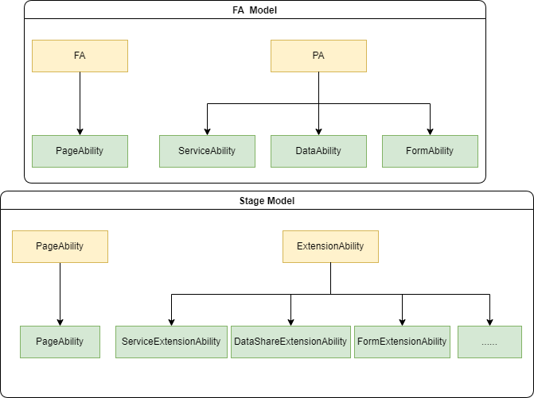
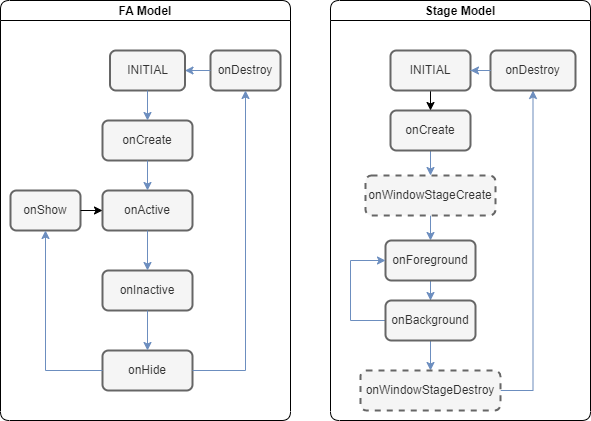

# Ability Framework Overview

An ability is the abstraction of a functionality that an application can provide. It is the minimum unit for the system to schedule applications. An application can contain one or more `Ability` instances.

The ability framework model has two forms.

- FA model, which applies to application development using API version 8 and earlier versions. In the FA model, there are Feature Ability (FA) and Particle Ability (PA). The FA supports Page abilities, and the PA supports Service, Data, and Form abilities. 
- Stage model, which is introduced since API version 9. In the stage model, there are Ability and ExtensionAbility. The ExtensionAbility is further extended to ServiceExtensionAbility, FormExtensionAbility, DataShareExtensionAbility, and more.

The stage model is designed to make it easier to develop complex applications in the distributed environment. The table below lists the design differences between the two models.

| Item          | FA Model                                                      | Stage Model                                               |
| -------------- | ------------------------------------------------------------ | -------------------------------------------------------- |
| Development mode     | Web-like APIs are provided. The UI development is the same as that of the stage model.                    | Object-oriented development mode is provided. The UI development is the same as that of the FA model.            |
| Engine instance      | Each ability in a process exclusively uses a JS VM engine instance.              | Multiple abilities in a process share one JS VM engine instance.      |
| Intra-process object sharing| Not supported                                                    | Supported                                                  |
| Bundle description file    | The `config.json` file is used to describe the HAP and component information. Each component must use a fixed file name.| The `module.json` file is used to describe the HAP and component information. The entry file name can be specified.|
| Component          | Four types of components are provided: Page ability (used for UI page display), Service ability (used to provide services), Data ability (used for data sharing), and Form ability (used to provide widgets).| Two types of components are provided: Ability (used for UI page display) and Extension (scenario-based service extension).  |

In addition, the following differences exist in the development process:

* Different ability types

  

* Different ability lifecycles

  

For details about the two models, see [FA Model Overview](fa-brief.md) and [Stage Model Overview](stage-brief.md).
## Samples
The following sample is provided to help you better understand how to develop abilities:
- [Intra- and Inter-page Navigation](https://gitee.com/openharmony/codelabs/tree/master/Ability/PageAbility)
