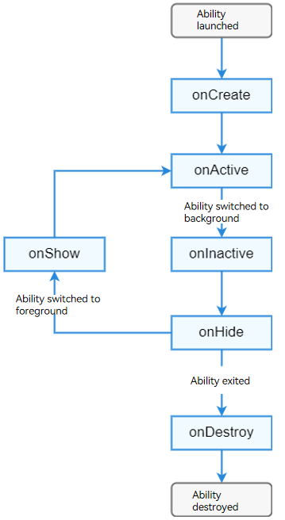

# FA Model Overview

## Overall Architecture
The development of an OpenHarmony application is essentially the development of one or more abilities. By scheduling abilities and managing their lifecycle, OpenHarmony implements application scheduling.

The Feature Ability (FA) model applies to application development using API version 8 and earlier versions. In this model, there are Page, Service, Data, and Form abilities.  
- The Page ability implements the ArkUI and provides the capability of interacting with users.
- The Service ability does not have a UI. It runs in the background and provides custom services for other abilities to invoke. 
- The Data ability does not have a UI. It runs in the background and enables other abilities to insert, delete, and query data.
- The Form ability provides a widget, which is a UI display mode.

## Lifecycle

Among all abilities, the Page ability has the most complex lifecycle, because it has a UI and acts as a touchpoint for interacting with users.
**The following figure shows the lifecycle of the Page ability.**

The other abilities do not involve the foreground/background switchover and the **onShow** callback.
You can override the lifecycle callbacks in **app.js/app.ets** to process application logic.

Currently, the **app.js** file provides only the **onCreate** and **onDestroy** callbacks, and the **app.ets** file provides the full lifecycle callbacks.

## Process and Thread Model
An application exclusively uses an independent process, and an ability exclusively uses an independent thread. When an ability is started for the first time, an application process as well as a thread for this ability is created. After the application is started, other abilities in the application are started, and a thread is created for every of these started abilities. Each ability is bound to an independent JSRuntime instance. In this way, abilities are isolated from each other.

## Samples
The following sample is provided to help you better understand how to develop abilities:

- [`DistributeCalc`: Distributed Calculator (eTS, API version 8)](https://gitee.com/openharmony/app_samples/tree/master/Preset/DistributeCalc)
- [`DistributeGraffiti`: Distributed Graffiti (eTS, API version 8)](https://gitee.com/openharmony/app_samples/tree/master/ability/DistributedGraffiti)

- [Remote FA Startup](https://gitee.com/openharmony/codelabs/tree/master/Distributed/RemoteStartFA)
- [Distributed News App](https://gitee.com/openharmony/codelabs/tree/master/Distributed/NewsDemo)
- [Synced Sketchpad (eTS)](https://gitee.com/openharmony/codelabs/tree/master/Distributed/DistributeDatabaseDrawEts)
- [Distributed Authentication (JS)](https://gitee.com/openharmony/codelabs/tree/master/Distributed/GameAuthOpenH)
- [Distributed Game Controller (eTS)](https://gitee.com/openharmony/codelabs/tree/master/Distributed/HandleGameApplication)
- [Distributed Mail System (eTS)](https://gitee.com/openharmony/codelabs/tree/master/Distributed/OHMailETS)
- [Distributed Jigsaw Puzzle (eTS)](https://gitee.com/openharmony/codelabs/tree/master/Distributed/OpenHarmonyPictureGame)
- [Distributed Control (eTS)](https://gitee.com/openharmony/codelabs/tree/master/Distributed/RemoteControllerETS)
