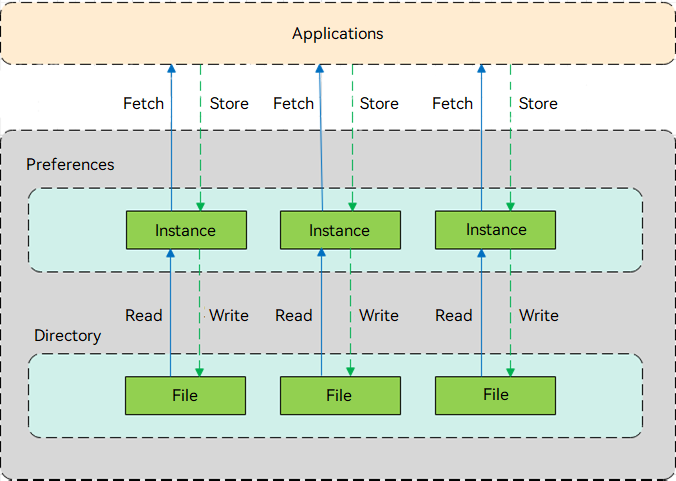

# Preferences Overview

Preferences are used to implement quick access and persistence of the data in the `key-value` structure.

After an application obtains a **Preferences** instance, the data in the instance will be cached in the memory for faster access.

The cached data can also be written to a text file for persistent storage. Since file read and write consume system resources, you are advised to minimize the frequency of reading and writing files.

You do not need to care about the implementation of the database lock mechanism.

## Basic Concepts

- **Key-value structure**

  A type of data structure. The `Key` is the unique identifier for a piece of data, and the `Value` is the specific data being identified.

- **Non-relational database**

  A database not in compliance with the atomicity, consistency, isolation, and durability (ACID) properties of relational data transactions. The data in a non-relational database is independent. The database that organizes data in the `key-value` structure is a non-relational database.

## Working Principles

1. An application can load data from a **Preferences** persistent file to a **Preferences** instance. The system stores the **Preferences** instance in the memory through a static container. Each file of an application or process has only one **Preferences** instance in the memory, till the application removes the instance from the memory or deletes the **Preferences** persistent file.
2. When obtaining a **Preferences** instance, the application can read data from or write data to the instance. The data in the `Preferences` instance can be flushed to its **Preferences** persistent file by calling the **flush()** method.

**Figure 1** Working mechanism

## Constraints

- **Preferences** instances are loaded to the memory. To minimize non-memory overhead, the number of data records stored in a **Preferences** instance cannot exceed 10,000. Delete the instances that are no longer used in a timely manner.
- The `Key` in key-value pairs is of the string type. It cannot be empty or exceed 80 bytes.
- The `Value` of the string type in key-value pairs can be empty, but cannot exceed 8192 bytes if not empty.
