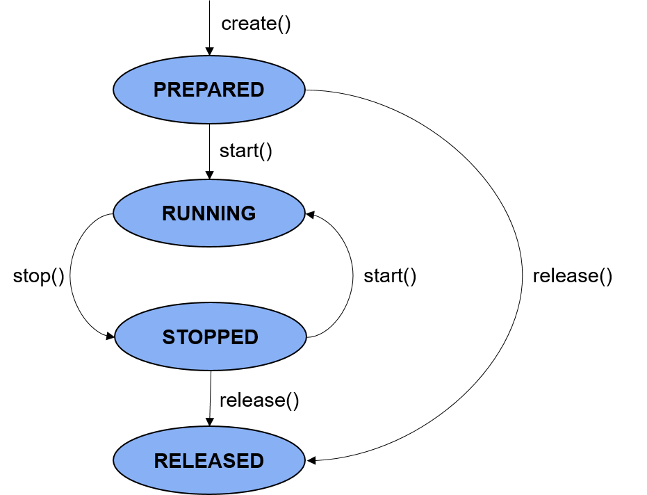

# Audio Capture Development

## When to Use

You can use the APIs provided by **AudioCapturer** to record raw audio files.  

### State Check

During application development, you are advised to use **on('stateChange')** to subscribe to state changes of the **AudioCapturer** instance. This is because some operations can be performed only when the audio capturer is in a given state. If the application performs an operation when the audio capturer is not in the given state, the system may throw an exception or generate other undefined behavior.

For details about the APIs, see [AudioCapturer in Audio Management](../reference/apis/js-apis-audio.md).

**Figure 1** Audio capturer state



## How to Develop

1. Use **createAudioCapturer()** to create an **AudioCapturer** instance.

   Set parameters of the **AudioCapturer** instance in **audioCapturerOptions**. This instance is used to capture audio, control and obtain the recording status, and register a callback for notification.

   ```js
      var audioStreamInfo = {
           samplingRate: audio.AudioSamplingRate.SAMPLE_RATE_44100,
           channels: audio.AudioChannel.CHANNEL_1,
           sampleFormat: audio.AudioSampleFormat.SAMPLE_FORMAT_S16LE,
           encodingType: audio.AudioEncodingType.ENCODING_TYPE_RAW
       }
      
       var audioCapturerInfo = {
           source: audio.SourceType.SOURCE_TYPE_MIC,
           capturerFlags: 1
       }
      
       var audioCapturerOptions = {
           streamInfo: audioStreamInfo,
           capturerInfo: audioCapturerInfo
       }
      
       let audioCapturer = await audio.createAudioCapturer(audioCapturerOptions);
       var state = audioRenderer.state;
   ```

2. (Optional) Use **on('stateChange')** to subscribe to audio renderer state changes.
If an application needs to perform some operations when the audio renderer state is updated, the application can subscribe to the state changes. For more events that can be subscribed to, see [Audio Management](../reference/apis/js-apis-audio.md).

   ```js
    audioCapturer.on('stateChange',(state) => {
    console.info('AudioCapturerLog: Changed State to : ' + state)
    switch (state) {
     case audio.AudioState.STATE_PREPARED:
         console.info('--------CHANGE IN AUDIO STATE----------PREPARED--------------');
         console.info('Audio State is : Prepared');
         break;
     case audio.AudioState.STATE_RUNNING:
         console.info('--------CHANGE IN AUDIO STATE----------RUNNING--------------');
         console.info('Audio State is : Running');
         break;
     case audio.AudioState.STATE_STOPPED:
         console.info('--------CHANGE IN AUDIO STATE----------STOPPED--------------');
         console.info('Audio State is : stopped');
         break;
     case audio.AudioState.STATE_RELEASED:
         console.info('--------CHANGE IN AUDIO STATE----------RELEASED--------------');
         console.info('Audio State is : released');
         break;
     default:
         console.info('--------CHANGE IN AUDIO STATE----------INVALID--------------');
         console.info('Audio State is : invalid');
         break;
     }
    });
   ```

3. Use **start()** to start audio recording.

   The capturer state will be **STATE_RUNNING** once the audio capturer is started. The application can then begin reading buffers.

   ```js
   await audioCapturer.start();
   if (audioCapturer.state == audio.AudioState.STATE_RUNNING) {
       console.info('AudioRecLog: Capturer started');
   } else {
       console.info('AudioRecLog: Capturer start failed');
   }
   ```

4. Use **getBufferSize()** to obtain the minimum buffer size to read.

   ```js
   var bufferSize = await audioCapturer.getBufferSize();
   console.info('AudioRecLog: buffer size: ' + bufferSize);
   ```

5. Read the captured audio data and convert it to a byte stream. Call **read()** repeatedly to read the data until the application wants to stop the recording.  

   The following example shows how to write recorded data into a file.

   ```js
   import fileio from '@ohos.fileio';
      
   const path = '/data/data/.pulse_dir/capture_js.wav';
   let fd = fileio.openSync(path, 0o102, 0o777);
   if (fd !== null) {
       console.info('AudioRecLog: file fd created');
   }
   else{
       console.info('AudioRecLog: file fd create : FAILED');
       return;
   }
      
   fd = fileio.openSync(path, 0o2002, 0o666);
   if (fd !== null) {
       console.info('AudioRecLog: file fd opened in append mode');
   }
      
   var numBuffersToCapture = 150;
   while (numBuffersToCapture) {
       var buffer = await audioCapturer.read(bufferSize, true);
       if (typeof(buffer) == undefined) {
           console.info('read buffer failed');
       } else {
           var number = fileio.writeSync(fd, buffer);
           console.info('AudioRecLog: data written: ' + number);
       }
      
       numBuffersToCapture--;
   }
   ```

6. Once the recording is complete, call **stop()** to stop the recording.

   ```
   await audioCapturer.stop();
   if (audioCapturer.state == audio.AudioState.STATE_STOPPED) {
       console.info('AudioRecLog: Capturer stopped');
   } else {
       console.info('AudioRecLog: Capturer stop failed');
   }
   ```

7. After the task is complete, call **release()** to release related resources.

   ```js
   await audioCapturer.release();
   if (audioCapturer.state == audio.AudioState.STATE_RELEASED) {
       console.info('AudioRecLog: Capturer released');
   } else {
       console.info('AudioRecLog: Capturer release failed');
   }
   ```
