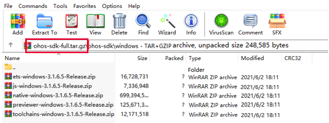
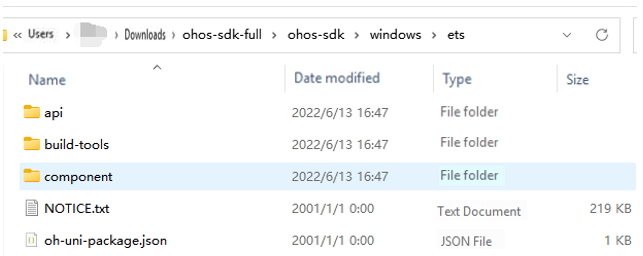
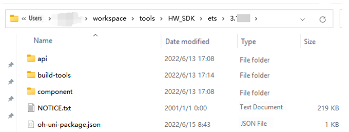
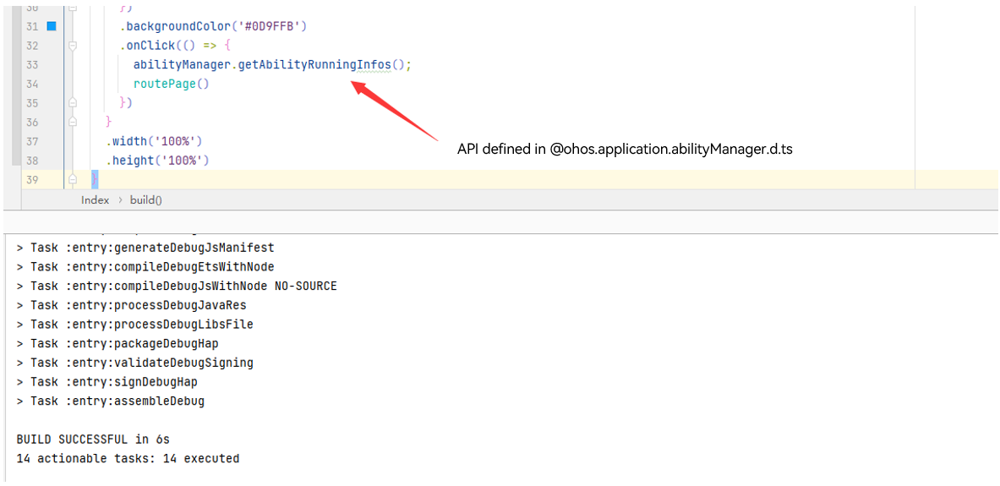

# Guide to Switching to Full SDK

Both the public SDK and full SDK are toolkits for application development. <br>The public SDK is intended for application developers and provided as standard in DevEco Studio. It does not contain system APIs – APIs required by system applications.

The full SDK is intended for original equipment manufacturers (OEMs) and provided separately. It contains system APIs.

The SDK of API version 8 provided in DevEco Studio is a public SDK. If your project depends on any system API, such as the **animator** component, **xcomponent** component, or APIs in **@ohos.application.abilityManager.d.ts**, **@ohos.application.formInfo.d.ts**, or **@ohos.bluetooth.d.ts**, switch to the full SDK by performing the following steps.

> **NOTE**
>
> The screenshots in this document are for reference only.

## Downloading the Full SDK

Manually download the system-specific full SDK package from the mirror. For details, see [Release Notes](../../release-notes/OpenHarmony-v3.2-beta2.md).

## Checking the Local SDK Location

In this example, an eTS project is used. For a JS project, replace **ets** with **js**.

In DevEco Studio, choose **Tools** > **OpenHarmony SDK Manager** to check the location of the local SDK.


## Replacing the SDK

1. Make sure the downloaded SDK is a full SDK.

   a. Verify that the name of the downloaded file contains **sdk-full**.

   

   b. Verify that the SDK contains system APIs (such as APIs defined in **@ohos.application.abilityManager.d.ts**, **@ohos.application.formInfo.d.ts**, and **@ohos.bluetooth.d.ts**).

   Note: The criteria for identifying system APIs are subject to the released API documentation.

2. Replace the SDK. The following uses public-SDK-3.x.x.x for Windows as an example.

    a. Decompress the downloaded full SDK file: `ets-windows-3.x.x.x-Release.zip`

   

   b. Replace the SDK files.

   Back up the local SDK files. (Copy and rename the version directory in the **ets** directory, or copy the entire **ets** directory to another local path.)

   Go to the obtained location of the local installed SDK and back up the files therein.

   

   Note: The name of the backup version directory must be different from the value of **version** field in the **oh-uni-package.json** file. In the example below, the name of the backup version directory is **3.x.x.x_backup**.

   

   The configuration in the **oh-uni-package.json** file is as follows, where the value of `apiVersion` is subject to the API version of the SDK, and the value of `version` is subject to the version number in the SDK file.

   ```
   {
     "apiVersion": "X",
     "displayName": "Ets",
     "meta": {
       "metaVersion": "3.0.0"
     },
     "path": "ets",
     "releaseType": "Release",
     "version": "3.x.x.x"
   }
   ```
   

   Delete all files in the original SDK (3.x.x.x) directory. Failure to do so may result in some files being unable to be overwritten.

   

   Copy the full SDK to the location of the local SDK.

   Copy all files in the **ets** directory in the full SDK to the **ets\*3.x.x.x*** directory in the location of the local SDK.

   Change the value of **version** in the **oh-uni-package.json** file to the current SDK version number.

   

   In the ***3.x.x.x*\build-tools\ets-loader** directory, open the **cmd/powerShell** window and run the `npm install` command to download the **node_modules** dependency package.

   

   

   c. Check for system APIs.
   
   
