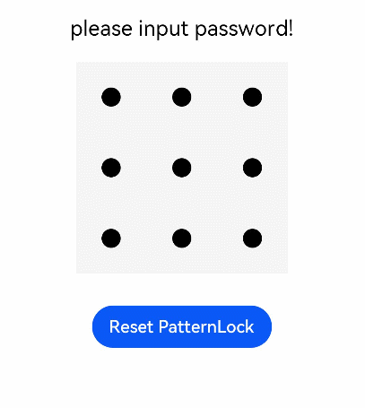

# PatternLock

The **\<PatternLock>** component allows users to use a pattern password for authentication. It enters the input state once being touched, and exits the input state and sends the entered password to the application once the finger leaves the screen.

>  **NOTE**
>
> This component is supported since API version 9. Updates will be marked with a superscript to indicate their earliest API version.

## Child Components

Not supported

##  APIs

PatternLock(controller?: PatternLockController)

**Parameters**

| Name    | Type                                       | Mandatory| Description                                                        |
| ---------- | ----------------------------------------------- | ---- | ------------------------------------------------------------ |
| controller | [PatternLockController](#patternlockcontroller) | No  | Controller of a component to reset the component status.<br>Default value: **null**|

## Attributes

Except for **backgroundColor**, universal attributes are not supported.

| Name           | Type                             | Description                                                        |
| --------------- | ------------------------------------- | ------------------------------------------------------------ |
| sideLength      | [Length](ts-types.md#length) | Width and height (same value) of the component. The minimum value is **0**.<br>Default value: **300vp**|
| circleRadius    | [Length](ts-types.md#length) | Radius of the grid dot.<br>Default value: **14vp**                       |
| regularColor    | [ResourceColor](ts-types.md#resourcecolor) | Fill color of the grid dot in unselected state.<br>Default value: **Color.Black**|
| selectedColor   | [ResourceColor](ts-types.md#resourcecolor) | Fill color of the grid dot in selected state.<br>Default value: **Color.Black**|
| activeColor     | [ResourceColor](ts-types.md#resourcecolor) | Fill color of the grid dot in active state.<br>Default value: **Color.Black**|
| pathColor       | [ResourceColor](ts-types.md#resourcecolor) | Path color.<br>Default value: **Color.Blue**                     |
| pathStrokeWidth | number \| string            | Width of the path stroke. The minimum value is **0**.<br>Default value: **34vp**          |
| autoReset       | boolean                               | Whether to allow the user to reset the component status (that is, clear the input) by touching the component again after the input is complete. The value **true** means that the user can reset the component status by touching the component again after the input is complete, and **false** means the opposite.<br>Default value: **true**|

## Events

In addition to the [universal events](ts-universal-events-click.md), the following events are supported.

| Name                                      | Description                                      |
| ---------------------------------------- | ---------------------------------------- |
| onPatternComplete(callback: (input: Array\<number\>) => void) | Invoked when the pattern password input is complete.<br>**input** is an array of digits that represent the connected dots in the pattern (0 to 8) and are arranged in the same sequence as the dots are connected.|

## PatternLockController

Implements the controller bound to the **\<PatternLock>** component for resetting the component status.

### Objects to Import

```typescript
patternLockController: PatternLockController = new PatternLockController()
```

### reset

reset(): void

Resets the component status.

##  Example

```ts
// xxx.ets
@Entry
@Component
struct PatternLockExample {
  @State passwords: Number[] = []
  @State message: string = 'please input password'
  private patternLockController: PatternLockController = new PatternLockController()
  
  build() {
    Flex({ direction: FlexDirection.Column, alignItems: ItemAlign.Center, justifyContent: FlexAlign.Center }) {
      Text(this.message).textAlign(TextAlign.Center)
      PatternLock(this.patternLockController)
        .sideLength(150)
        .circleRadius(7)
        .pathStrokeWidth(17)
        .backgroundColor(Color.White)
        .autoReset(true)
        .onPatternComplete((input: Array<number>) => {
          if (input == null || input == undefined || input.length < 5) {
            this.message = 'The password length needs to be greater than 5.'
            return
          }
          if (this.passwords.length > 0) {
            if (this.passwords.toString() == input.toString()) {
              this.passwords = input
              this.message = 'Set password successfully: ' + this.passwords.toString()
            } else {
              this.message = 'Inconsistent passwords, please enter again.'
            }
          } else {
            this.passwords = input
            this.message = "Please enter again."
          }
        })
      Button('reset button').margin(30).onClick(() => {
        this.patternLockController.reset()
        this.passwords = []
        this.message = 'Please input password'
      })
    }.width('100%').height('100%')
  }
}
```


