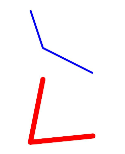

# Polyline

The **\<Polyline>** component is used to draw a polyline.

>  **NOTE**
>
>  This component is supported since API version 7. Updates will be marked with a superscript to indicate their earliest API version.


## Child Components

Not supported


## APIs

Polyline(value?: {width?: string | number, height?: string | number})

**Parameters**

| Name| Type| Mandatory| Default Value| Description|
| -------- | -------- | -------- | -------- | -------- |
| width | string \| number | No| 0 | Width.|
| height | string \| number | No| 0 | Height.|


## Attributes

In addition to the [universal attributes](ts-universal-attributes-size.md), the following attributes are supported.

| Name| Type| Default Value| Description|
| -------- | -------- | -------- | -------- |
| points | Array&lt;Point&gt; | [] | List of coordinates that the polyline passes through.|
| fill | [ResourceColor](ts-types.md) | Color.Black | Color of the fill area.|
| fillOpacity | number \| string \| [Resource](ts-types.md#resource)| 1 | Opacity of the fill area.|
| stroke | [ResourceColor](ts-types.md) | - | Stroke color.|
| strokeDashArray | Array&lt;Length&gt; | [] | Stroke dashes.|
| strokeDashOffset | number \| string | 0 | Offset of the start point for drawing the stroke.|
| strokeLineCap | [LineCapStyle](ts-appendix-enums.md#linecapstyle) | LineCapStyle.Butt | Cap style of the stroke.|
| strokeLineJoin | [LineJoinStyle](ts-appendix-enums.md#linejoinstyle) | LineJoinStyle.Miter | Join style of the stroke.|
| strokeMiterLimit | number \| string | 4 | Limit value when the sharp angle is drawn as a miter.|
| strokeOpacity | number \| string \| [Resource](ts-types.md#resource)| 1 | Stroke opacity.<br>**NOTE**<br>The value range is [0.0, 1.0]. If the set value is less than 0.0, **0.0** will be used. If the set value is greater than 1.0, **1.0** will be used.|
| strokeWidth | Length | 1 | Stroke width.|
| antiAlias | boolean | true | Whether anti-aliasing is enabled.|

## Point

Describes the coordinates of a point.

| Name     | Type            | Description                                                        |
| --------- | -------------------- | ------------------------------------------------------------ |
| Point | [number, number] | Coordinates of a point. The first parameter is the x-coordinate, and the second parameter is the y-coordinate (relative coordinate).|

## Example

```ts
// xxx.ets
@Entry
@Component
struct PolylineExample {
  build() {
    Column({ space: 10 }) {
      // Draw a polyline in a 100 x 100 rectangle. The start point is (0, 0), the end point is (100, 100), and the passing point is (20,60).
      Polyline({ width: 100, height: 100 })
        .points([[0, 0], [20, 60], [100, 100]])
        .fillOpacity(0)
        .stroke(Color.Blue)
        .strokeWidth(3)
      // Draw a polyline in a 100 x 100 rectangle. The start point is (20, 0), the end point is (100, 90), and the passing point is (0,100).
      Polyline()
        .width(100)
        .height(100)
        .fillOpacity(0)
        .stroke(Color.Red)
        .strokeWidth(8)
        .points([[20, 0], [0, 100], [100, 90]])
          // Set the join style of the stroke to a round corner.
        .strokeLineJoin(LineJoinStyle.Round)
          // Set the cap style of the stroke to a half circle.
        .strokeLineCap(LineCapStyle.Round)
    }.width('100%')
  }
}
```


