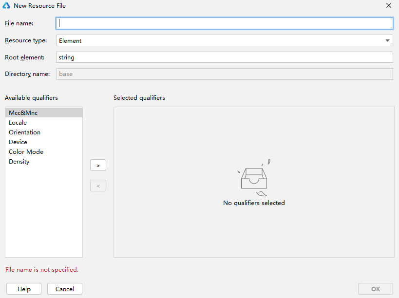
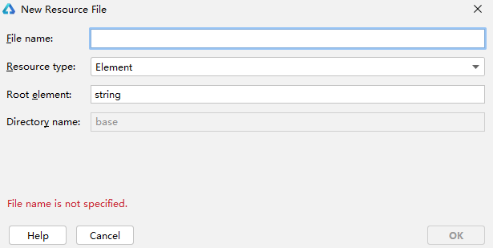

# Resource File Categories


## resources Directory

All the application resource files, such as strings, images, and audio files, are stored in the **resources** directory, allowing you to easily access, use, and maintain them. The **resources** directory consists of two types of sub-directories: the **base** sub-directory and qualifiers sub-directories, and the **rawfile** sub-directory. For details, see Categories of the **resources** directory.

Example of the **resources** directory:

```
resources
|---base  // Default sub-directory
|   |---element
|   |   |---string.json
|   |---media
|   |   |---icon.png
|---en_GB-vertical-car-mdpi // Example of a qualifiers sub-directory, which needs to be created on your own
|   |---element
|   |   |---string.json
|   |---media
|   |   |---icon.png
|---rawfile  // Default sub-directory
```

**Table 1** Categories of the **resources** directory

| Category    | base and Qualifiers Sub-directories      | rawfile Sub-directory                    |
| ----------- | ---------------------------------------- | ---------------------------------------- |
| Structure   | Sub-directories are structured in two levels. The directory name must comply with specified naming conventions so that its target resource file in the correct directory can be matched based on the device status.<br>  The **base** sub-directory and qualifiers sub-directories are the first level of sub-directories under **resources**.<br>- The **base** sub-directory is generated by default. If no qualifiers sub-directories in the **resources** directory of the application match the device status, the resource file in the **base** sub-directory will be automatically referenced.<br>- You need to create qualifiers sub-directories on your own. Each directory name consists of one or more qualifiers that represent the application scenarios or device characteristics. For details, see [Qualifiers Sub-directories](#qualifiers-sub-directories).<br>Resource group sub-directories are located at the second level of sub-directories to store basic elements such as strings, colors, and boolean values, as well as resource files such as media, animations, and layouts. For details, see [Resource Group Sub-directories](#resource-group-sub-directories). | You can create multiple levels of sub-directories with custom directory names. They can be used to store various resource files.<br>However, resource files in the **rawfile** sub-directory will not be matched based on the device status. |
| Compilation | Resource files in the sub-directories are compiled into binary files, and each resource file is assigned an ID. | Resource files in the sub-directory are directly packed into the application without being compiled, and no IDs will be assigned to the resource files. |
| Reference   | Resource files in the sub-directories are referenced based on the resource type and resource name. | Resource files in the sub-directories are referenced based on the specified file path and file name. |


## Qualifiers Sub-directories

The name of a qualifiers sub-directory consists of one or more qualifiers that represent the application scenarios or device characteristics, covering the mobile country code (MCC), mobile network code (MNC), language, script, country or region, screen orientation, device type, color mode, and screen density. The qualifiers are separated using underscores (_) or hyphens (-). When creating a qualifiers sub-directory, you need to understand the directory naming conventions and the rules for matching qualifiers sub-directories and the device status.

**Naming Conventions for Qualifiers Sub-directories**

- Qualifiers are ordered in the following sequence: *MCC*MNC-language_script_country/region-screen orientation-device type-color mode-screen density_. You can select one or multiple qualifiers to name your sub-directory based on your application scenarios and device characteristics.

- Separation between qualifiers: The language, script, and country/region qualifiers are separated using underscores (\_); the MNC and MCC qualifiers are also separated using underscores (\_); other qualifiers are separated using hyphens (-). For example, **zh_Hant_CN** and **zh_CN-car-ldpi**.

- Value range of qualifiers: The value of each qualifier must meet the requirements. Otherwise, the resource files in the sub-directory cannot be matched.

  **Table 2** Requirements for qualifier values

  | Qualifier Type     | Description and Value Range              |
  | ------------------ | ---------------------------------------- |
  | MCC&amp;MNC        | Indicates the MCC and MNC, which are obtained from the network where the device is registered. The MCC can be either followed by the MNC with an underscore (*) in between or be used independently. For example, **mcc460** represents China, and **mcc460*mnc00** represents China Mobile.<br>For details about the value range, refer to **ITU-T E.212** (the international identification plan for public networks and subscriptions). |
  | Language           | Indicates the language used by the device. The value consists of two or three lowercase letters, for example, **zh** indicates Chinese, **en** indicates English, and **mai** indicates Maithili.<br>For details about the value range, refer to **ISO 639** (codes for the representation of names of languages). |
  | Script             | Indicates the script type used by the device. The value starts with one uppercase letter followed by three lowercase letters, for example, **Hans** indicates simplified Chinese and **Hant** indicates traditional Chinese.<br>For details about the value range, refer to **ISO 15924** (codes for the representation of names of scripts). |
  | Country/Region     | Indicates the country or region where a user is located. The value consists of two or three uppercase letters or three digits, for example, **CN** indicates China and **GB** indicates the United Kingdom.<br>For details about the value range, refer to **ISO 3166-1** (codes for the representation of names of countries and their subdivisions). |
  | Screen orientation | Indicates the screen orientation of the device. The value can be:<br>- **vertical**: portrait orientation<br>- **horizontal**: landscape orientation |
  | Device type        | Indicates the device type. The value can be:<br>- **car**: head units<br>- **tv**: smart TVs<br>- **wearable**: wearables |
  | Color mode         | Indicates the color mode of the device. The value can be:<br>- **dark**: dark mode<br>- **light**: light mode |
  | Screen density     | Indicates the screen density of the device, in dpi. The value can be:<br>- **sdpi**: screen density with small-scale dots per inch (SDPI). This value is applicable for devices with a DPI range of (0, 120].<br>- **mdpi**: screen density with medium-scale dots per inch (MDPI). This value is applicable for devices with a DPI range of (120, 160].<br>- **ldpi**: screen density with large-scale dots per inch (LDPI). This value is applicable for devices with a DPI range of (160, 240].<br>- **xldpi**: screen density with extra-large-scale dots per inch (XLDPI). This value is applicable for devices with a DPI range of (240, 320].<br>- **xxldpi**: screen density with extra-extra-large-scale dots per inch (XXLDPI). This value is applicable for devices with a DPI range of (320, 480].<br>- **xxxldpi**: screen density with extra-extra-extra-large-scale dots per inch (XXXLDPI). This value is applicable for devices with a DPI range of (480, 640]. |

**Rules for Matching Qualifiers Sub-directories and Device Resources**

- Qualifiers are matched with the device resources in the following priorities: MCC&amp;MNC &gt; locale (options: language, language_script, language_country/region, and language_script_country/region) &gt; screen orientation &gt; device type &gt; color mode &gt; screen density

- If the qualifiers sub-directories contain the **MCC, MNC, language, script, screen orientation, device type, and color mode** qualifiers, their values must be consistent with the current device status so that the sub-directories can be used for matching the device resources. For example, the qualifiers sub-directory **zh_CN-car-ldpi** cannot be used for matching the resource files labeled **en_US**.


## Resource Group Sub-directories

You can create resource group sub-directories (including element, media, animation, layout, graphic, and profile) in the **base** and qualifiers sub-directories to store resource files of specific types. For details, see Resource group sub-directories.

**Table 3** Resource group sub-directories

| Resource Group Sub-directory | Description                                                  | Resource File                                                |
| ---------------------------- | ------------------------------------------------------------ | ------------------------------------------------------------ |
| element                      | Element resources. Each type of data is represented by a JSON file. The options are as follows:<br>- **boolean**: boolean data<br>- **color**: color data<br>- **float**: floating-point data<br>- **intarray**: array of integer<br>- **integer**: integer data<br>- **pattern**: pattern data<br>- **plural**: plural form data<br>- **strarray**: array of strings<br>- **string**: string data | It is recommended that files in the **element** sub-directory be named the same as the following files, each of which can contain only data of the same type:<br>- boolean.json<br>- color.json<br>- float.json<br>- intarray.json<br>- integer.json<br>- pattern.json<br>- plural.json<br>- strarray.json<br>- string.json |
| media                        | Media resources, including non-text files such as images, audios, and videos. | The file name can be customized, for example, **icon.png**.  |
| profile                      | Other types of files, which are stored in their raw formats. | The file name can be customized.                             |

### Media Resource Types

Table 4 Image resource types
| Format| File Name Extension|
| -------- | -------- |
| JPEG | .jpg |
| PNG | .png |
| GIF | .gif |
| SVG | .svg |
| WEBP | .webp |
| BMP | .bmp |

Table 5 Audio and video resource types
| Format| File Name Extension|
| -------- | -------- |
| H.263 | .3gp <br>.mp4 |
| H.264 AVC <br> Baseline Profile (BP) | .3gp <br>.mp4 |
| MPEG-4 SP | .3gp |
| VP8 | .webm <br> .mkv |
## Creating a Resource File

You can create a sub-directory and its files under the **resources** directory based on the above descriptions of the qualifiers sub-directories and resource group sub-directories.

DevEco Studio provides a wizard for you to create resource directories and resource files.

- Creating a Resource Directory and Resource File

  Right-click the **resources** directory and choose **New > Resource File**.

  If no qualifier is selected, the file is created in a resource type sub-directory under **base**. If one or more qualifiers are selected, the system automatically generates a sub-directory and creates the file in this sub-directory.

  The created sub-directory is automatically named in the format of **Qualifiers.Resource type**. For example, if you create a sub-directory by setting **Orientation** to **Vertical** and **Resource type** to **Graphic**, the system automatically generates a sub-directory named **vertical.graphic**.

  

- Creating a Resource Directory

  Right-click the **resources** directory and choose **New > Resource Directory**. This operation creates a sub-directory only.

  Select a resource group type and set qualifiers. Then the system automatically generates the sub-directory name. The sub-directory is automatically named in the format of **Qualifiers.Resource group**. For example, if you create a sub-directory by setting **Orientation** to **Vertical** and **Resource type** to **Graphic**, the system automatically generates a sub-directory named **vertical.graphic**.

  

- Creating a Resource File

  Right-click a sub-directory under **resources** and choose **New > XXX Resource File**. This operation creates a resource file under this sub-directory.

  For example, you can create an element resource file in the **element** sub-directory.

  
