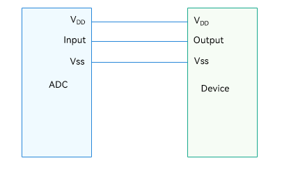
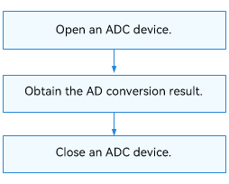

# ADC

## Overview

### Function

An analog-to-digital converter (ADC) is a device that converts analog signals into digital signals.

The ADC APIs provide a set of common functions for ADC data transfer, including:
-  Opening or closing an ADC device
-  Obtaining the analog-to-digital (AD) conversion result

### Basic Concepts

The ADC converts analog parameters into digital parameters for easy storage and computing. The technical specifications of the ADC include the following:

- Resolution
  
  The number of binary bits that can be converted by an ADC. A greater number of bits indicates a higher resolution.
- Conversion error
  
  Difference between the actual and theoretical digital values output by an ADC. It is expressed by a multiple of the least significant bit. Generally, the maximum output error is used.
- Transition time
  
  Time required by an ADC to perform a complete conversion.

### Working Principles

In the Hardware Driver Foundation (HDF), the ADC module uses the unified service mode for API adaptation. In this mode, a service is used as the ADC manager to handle external access requests in a unified manner. The unified service mode applies when the system has multiple device objects of the same type. If the independent service mode is used in this case, more device nodes need to be configured and more memory resources will be consumed.

The ADC module is divided into the following layers:

- Interface layer: provides APIs for opening or closing a device and writing data.
- Core layer: provides the capabilities of binding, initializing, and releasing devices.
- Adaptation layer: implements driver-specific functions.

In addition to the power and ground cables, the ADC requires only one cable to connect to the target device. The figure below shows the physical connection.

**Figure 1** ADC physical connection




### Constraints

Currently, the ADC module supports only the kernels (LiteOS) of mini and small systems.

## Usage Guidelines

### When to Use

An ADC is usually used to convert an analog voltage into a digital parameter, for example, it is used with a microphone to collect sound, used with an NTC resistor to measure temperature, or converts the output of analog sensors into digital parameters.

### Available APIs

The table below describes the APIs of the ADC module. For more details, see API Reference.

**Table 1** APIs of the ADC driver


| API  | Description            |
| -------- | ---------------- |
| AdcOpen  | Opens an ADC device.     |
| AdcClose | Closes an ADC device.     |
| AdcRead  | Obtains the AD conversion result.|

### How to Develop

The figure below shows the general development process.

 **Figure 2** Process of using ADC APIs 




#### Opening an ADC Device.

Call **AdcOpen** to open an ADC device.

```c
DevHandle AdcOpen(int16_t number);
```

**Table 2** Description of AdcOpen


| Parameter      | Description         |
| ---------- | ----------------- |
| number     | ADC device number.        |
| **Return Value**| **Description**   |
| NULL       | The operation failed.  |
| Device handle  | The operation is successful. The handle of the ADC device opened is returned.|

Example: Open device 1 of the two ADCs (numbered 0 and 1) in the system.

```c
DevHandle adcHandle = NULL; /* ADC device handle /

/* Open ADC device 1. */
adcHandle = AdcOpen(1);
if (adcHandle == NULL) {
    HDF_LOGE("AdcOpen: failed\n");
    return;
}
```

#### Obtaining the AD Conversion Result

```c
int32_t AdcRead(DevHandle handle, uint32_t channel, uint32_t *val);
```

**Table 3** Description of AdcRead


| Parameter      | Description      |
| ---------- | -------------- |
| handle     | ADC device handle.   |
| channel    | ADC device channel number. |
| val        | Pointer to the AD conversion result.    |
| **Return Value**| **Description**|
| 0          | The operation is successful.      |
| Negative value      | The operation failed.      |

Example: Obtain the AD conversion result of channel 1.

```c
uint32_t value;
int32_t ret;

ret = AdcRead(adcHandle, 1, &value);
if (ret != 0) {
    HDF_LOGE("ADC read fail!\n");
    return;
}
```

#### Closing an ADC Device

Call **AdcClose** to close the ADC device after the ADC communication is complete.
```c
void AdcClose(DevHandle handle); 
```
**Table 4** Description of AdcClose


| Parameter  | Description   |
| ------ | ----------- |
| handle | ADC device handle.|
| **Return Value**| **Description** |
| N/A    | N/A         |

Example:

```c
AdcClose(adcHandle); /* Close the ADC device. */
```

### Example

This following example shows how to use ADC APIs to manage an ADC device on a Hi3516D V300 board.

The basic hardware information is as follows:

-   SoC: hi3516dv300

-   The potentiometer is connected to channel 1 of ADC device 0.

Perform continuous read operations on the ADC device to check whether the ADC is functioning.

Example:

```c
#include "adc_if.h"          /* Header file for ADC APIs */
#include "hdf_log.h"         /* Header file for log APIs */

/* Define device 0, channel 1. */
#define ADC_DEVICE_NUM 0
#define ADC_CHANNEL_NUM 1

/* Main entry of ADC routines. */
static int32_t TestCaseAdc(void)
{
    int32_t i;
    int32_t ret;
    DevHandle adcHandle;
    uint32_t readBuf[30] = {0};

    /* Open the ADC device. */
    adcHandle = AdcOpen(ADC_DEVICE_NUM);
    if (adcHandle == NULL) {
        HDF_LOGE("%s: Open ADC%u fail!", __func__, ADC_DEVICE_NUM);
        return -1;
    }

    /* Perform 30 times of AD conversions continuously and read the conversion results. */
    for (i = 0; i < 30; i++) {
        ret = AdcRead(adcHandle, ADC_CHANNEL_NUM, &readBuf[i]);
        if (ret != HDF_SUCCESS) {
            HDF_LOGE("%s: Failed to read ADC!:%d", __func__, ret);
            AdcClose(adcHandle);
            return -1;
        }
    }
    HDF_LOGI("%s: ADC read successful!", __func__);

    /* Close the ADC device. */
    AdcClose(adcHandle);

    return 0;
}
```
