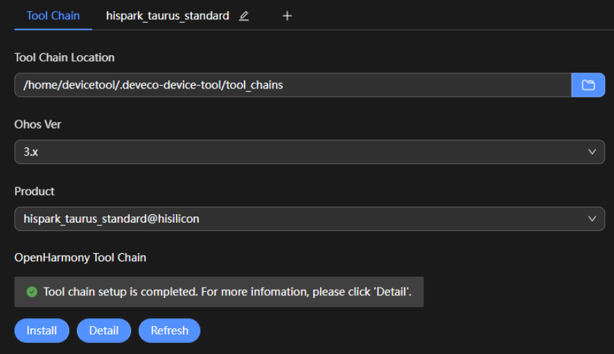
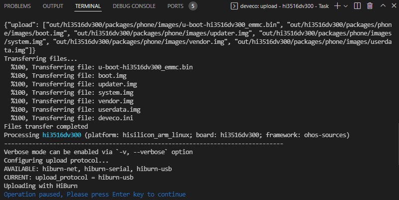
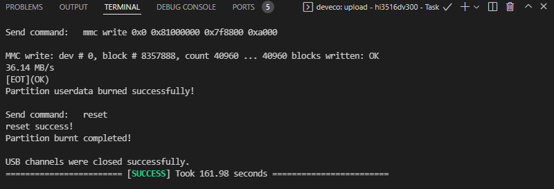

# Getting Started with the Standard System with Hi3516 (IDE Mode)

>  **NOTE**
>
> Since OpenHarmony 3.2, the standard system does not perform adaptation verification for the Hi3516D V300 development board. You are advised to use RK3568 to develop standard-system devices.
>
> If you still need to use Hi3516DV300 to develop standard-system devices, adaptation may fail. In this case, contact the chip supplier to obtain the adaptation guide or complete adaptation by yourself.

In addition to the small system, the Hi3516D V300 development board also supports the standard system. This topic describes how to develop the standard system on Hi3516DV300 by using DevEco Device Tool.


The following exemplifies how to run the first program on the development board. The created program outputs the message "Hello World!" .


Before development, complete the following preparations:


- [Setting Up the Development Environment](quickstart-ide-env--win.md)

- [Creating a Project and Obtaining Source Code](quickstart-ide-import-project.md)


## Writing a Hello World Program


### Example Directory


```
applications/sample/hello
 │── BUILD.gn
 │── include
 │   └── helloworld.h
 │── src
 │   └── helloworld.c
 ├── bundle.json
 build
 └── subsystem_config.json
 productdefine/common
 └── products 
     └── Hi3516DV300.json
```


### How to Develop

Perform the steps below in the source code directory:

1. Create a directory and write the service code.
   

Create the **applications/sample/hello/src/helloworld.c** directory and file whose code is shown in the following example. You can customize the content to be printed. For example, you can change **World** to **OHOS**. Declare the string printing function **HelloPrint** in the **helloworld.h** file. You can use either C or C++ to develop a program.


   ```
   #include <stdio.h>
   #include "helloworld.h"
   int main(int argc, char **argv)
   {
       HelloPrint();
       return 0;
   }
   void HelloPrint()
   {
       printf("\n\n");
       printf("\n\t\tHello World!\n");
       printf("\n\n");
   }
   ```

Add the header file **applications/sample/hello/include/helloworld.h**. The sample code is as follows:


   ```
   #ifndef HELLOWORLD_H
   #define HELLOWORLD_H
   #ifdef __cplusplus
   #if __cplusplus
   extern "C" {
   #endif
   #endif
   void HelloPrint();
   #ifdef __cplusplus
   #if __cplusplus
   }
   #endif
   #endif
   #endif // HELLOWORLD_H
   ```

2. Create a build file.
   1. Create the **applications/sample/hello/BUILD.gn** file. The file content is as follows:
      
       ```
       import("//build/ohos.gni") # Import the build template.
       ohos_executable("helloworld") {# Executable module.
         sources = [       # Source code of the module.
           "src/helloworld.c"
         ]
         include_dirs = [  # Directory of header files on which the module depends.
           "include" 
         ]
         cflags = []
         cflags_c = []
         cflags_cc = []
         ldflags = []
         configs = []
         deps =[]    # Internal dependencies of the component.
         part_name = "hello"    # Component name. This parameter is mandatory.
         install_enable = true # Whether to install the software by default. This parameter is optional. By default, the software is not installed.
       }
       ```
   2. Create the **applications/sample/hello/bundle.json** file and add the description of the **sample** component. The content is as follows:
      
       ```
       {
           "name": "@ohos/hello",
           "description": "Hello world example.",
           "version": "3.1",
           "license": "Apache License 2.0",
           "publishAs": "code-segment",
           "segment": {
               "destPath": "applications/sample/hello"
           },
           "dirs": {},
           "scripts": {},
           "component": {
               "name": "hello",
               "subsystem": "sample",
               "syscap": [],
               "features": [],
               "adapted_system_type": [ "mini", "small", "standard" ],
               "rom": "10KB",
               "ram": "10KB",
               "deps": {
                   "components": [],
                   "third_party": []
               },
               "build": {
                   "sub_component": [
                       "//applications/sample/hello:helloworld"
                   ],
                   "inner_kits": [],
                   "test": []
               }
           }
       }
       ```

       The **bundle.json** file consists of two parts. The first part describes the information about the subsystem to which the component belongs, and the second part defines the build configuration for the component. When adding a component, you must specify the **sub_component** of the component. If there are APIs provided for other components, add them in **inner_kits**. If there are test cases, add them in **test**.

3. Modify the subsystem configuration file.

   Add the configuration of the new subsystem to the **build/subsystem_config.json** file.


   ```
   "sample": {
       "path": "applications/sample/hello",
       "name": "sample"
     },
   ```

4. Modify the product configuration file.

   In the **productdefine/common/products/Hi3516DV300.json** file, add the **hello** part after the existing part.

   >  **NOTE**
   > In this example, the OpenHarmony-v3.1-Release version is used, where the Hi3516 configuration file is **productdefine/common/products/Hi3516DV300.json**. In OpenHarmony-v3.2-Beta2 and later versions, the Hi3516 configuration file is **vendor/hisilicon/Hi3516DV300/config.json**.


   ```
       "usb:usb_manager_native":{},
       "applications:prebuilt_hap":{},
       "sample:hello":{},
       "wpa_supplicant-2.9:wpa_supplicant-2.9":{},
   ```


## Building Source Code

With DevEco Device Tool, you can easily build source code of the Hi3516DV300 development board, thanks to its productivity-boosting features, such as the compiler toolchain, detection of the build environment dependencies, and one-click installation of the dependencies.

>  **NOTE**
>
> The build environment of Hi3516DV300 is Ubuntu.

1. Click **Project Settings** on the menu bar to access the Hi3516DV300 project configuration page.
   
   

2. On the **Tool Chain** tab page, DevEco Device Tool automatically checks whether the dependent compiler toolchain is complete. If a message is displayed indicating that some tools are missing, click **Install** to automatically install the required tools.
   
   

3. Install the toolchain related to Hi3516DV300. Certain tools may require the root access to install. In this case, enter the user password in the **TERMINAL** window.

   >  **NOTE**
   >
   > - If pip fails to be installed, [change the Python source](https://device.harmonyos.com/en/docs/documentation/guide/ide-set-python-source-0000001227639986) and try again.
   > - If APT fails to be installed, [change the APT source](https://device.harmonyos.com/en/docs/documentation/guide/faq-toolchain-install-0000001301623822) and try again.

   

   After the toolchain is automatically installed, the figure below is displayed.

   

4. On the **hispark_taurus_standard** tab page, set **build_type**, whose default value is **debug**.
   
   

5. Choose **PROJECT TASKS** > **hispark_taurus_standard** > **Build** to start building.
   
   

6. Wait until **SUCCESS** is displayed in the **TERMINAL** window, indicating that the build is complete.
   
   

   After the compilation is complete, go to the **out** directory of the project to view the generated files and perform burning operations.


## Burning an Image

Burning is the process of downloading compiled program files to a development board to provide a basis for subsequent debugging. With the one-click burning function of DevEco Device Tool, you can burn images on development boards quickly and efficiently.

The images of Hi3516DV300 are burnt in the Windows environment. After burning is initiated, DevEco Device Tool copies the target program files generated in the Ubuntu environment to the specified Windows directory in remote mode, and then burns the program files to Hi3516DV300 using the Windows burning tool.

Hi3516DV300 supports burning for the standard system through the USB port and network port. This topic describes how to burn source code through the USB port.


### Prerequisites

- The serial port driver has been installed on Hi3516DV300. For details, see [Installing the Serial Port Driver on the Hi3516D V300 Development Board](https://device.harmonyos.com/en/docs/documentation/guide/hi3516_hi3518-drivers-0000001050743695).

- The USB port driver has been installed on Hi3516DV300. For details, see [Installing the USB Port Driver on the Hi3516D V300 Development Board](https://device.harmonyos.com/en/docs/documentation/guide/usb_driver-0000001058690393).


### Procedure

1. Connect the computer and the target development board through the serial port and USB port. For details, see [Hi3516 Development Board](quickstart-appendix-hi3516.md).

2. In DevEco Device Tool, choose **REMOTE DEVELOPMENT** > **Local PC** to check the connection status between the remote computer (Ubuntu build environment) and the local computer (Windows build environment).
   - If  is displayed on the right of **Local PC**, the remote computer is connected to the local computer. In this case, no further action is required.
   - If  is displayed, click the connect icon. During the connection, DevEco Device Tool will restart. Therefore, to avoid task interruptions, do not connect to DevEco Device Tool when downloading or building source code.

   

3. Click **Project Settings** on the menu bar to access the Hi3516DV300 project configuration page.
   
   

4. On the **Tool Chain** tab page, set the Uploader burning tool. You can click **Install** on this page to install the tool online.
   
   

5. On the **hispark_taurus_standard** tab page, set the burning options. The settings are automatically saved.

   - **upload_partitions_profile**: Select the burning profile file (preset by default), which specifies the files to be burnt, start address and length of the partition, and other burning settings. In addition, select **Enable to use upload_partitions_profile**.
      >  **NOTE**
      >
      > In the burning profile file, you can change the start address and length of the partition based on the size of the files to be burnt. Make sure the size of the partition is greater than that of the files to be burnt and the partition addresses of the files do not overlap.
      > 
      > If this is the first time you burn files to the development board, select **Enable to use upload_partitions_profile for upload** so that the upload_partitions file will be automatically generated. Afterward, select **Enable to use upload_partitions_profile for upload** only when you need to generate a new **upload_partitions** file.
   - **upload_protocol**: Select the burning protocol **hiburn-usb**.
   - **upload_port**: Select the serial port number obtained.

   

6. Click **Upload** under **hispark_taurus_standard**.
   
   

   When the "Operation paused, Please press Enter key to continue" message is displayed, which indicates that the transfer is complete, press **Enter** to start burning.

   

7. When the following information is displayed in the **TERMINAL** window, press and hold the **Update** key within 15 seconds, remove and insert the USB cable, and then release the **Update** key to start burning.
   
   

   When the "SUCCESS" message is displayed, it indicates that the burning is successful.

   

8. When the burning is successful, perform the operations in "Running" to start the system.


## Running an Image


### Starting the System

After the burning is complete, perform the following steps to start the system:

>  **NOTE**
>
> This operation procedure is required only if this is the first time you burn an image for the standard system.

1. In DevEco Device Tool, click **Monitor** to open the serial port tool.
   
   

2. Restart the development board. Before the autoboot countdown ends, press any key to enter the system.
   
   

3. Run the following commands to set system boot parameters:
   
   ```shell
   setenv bootargs 'mem=640M console=ttyAMA0,115200 mmz=anonymous,0,0xA8000000,384M clk_ignore_unused rootdelay=10 hardware=Hi3516DV300 init=/init root=/dev/ram0 rw blkdevparts=mmcblk0:1M(boot),15M(kernel),20M(updater),2M(misc),3307M(system),256M(vendor),-(userdata)';
   ```

   
   ```shell
   setenv bootcmd 'mmc read 0x0 0x82000000 0x800 0x4800; bootm 0x82000000'
   ```

   

4. Save the parameter settings.
   
   ```shell
   save
   ```

   

5. Restart the development board to start the system.
   
   ```shell
   reset
   ```

   


### Running a Hello World Program

After the system is started, start the serial port tool, run the **helloworld** command in any directory, and press **Enter**. If the message "Hello World!" is displayed, the program runs successfully.


### Next

Congratulations! You have finished all steps! Proceed to [develop a sample](../guide/device-clock-guide.md) to better familiarize yourself with OpenHarmony development.
