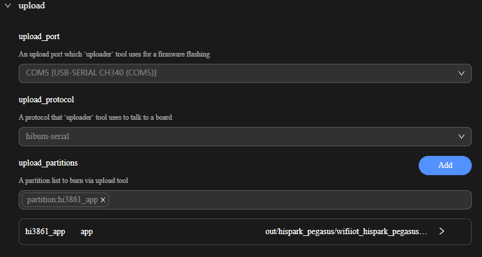

# Burning

Burning is the process of downloading compiled program files to a development board to provide a basis for subsequent debugging. With the one-click burning function of DevEco Device Tool, you can burn images on development boards quickly and efficiently.

Hi3861 V100 supports burning through the serial port. To burn source code through the serial port in Windows, perform the following steps:

## Importing Source Code

After the building is complete, ensure that you can [remotely access the Ubuntu environment from Windows](quickstart-lite-env-setup.md). Then, perform the following steps to import the source code before burning:

1. Open DevEco Device Tool, go to the home page, and click **Import Project** to open your project or source code.

   

2. Select the root directory of the OpenHarmony source code (in Ubuntu), select **Import OpenHarmony Source**, and click **Import**.

   >  **NOTE**
   > Make sure the selected directory does not contain Chinese characters or spaces.

   

3. On the **Import Project** page, select a product, and the SoC, board, company, and kernel fields will be automatically populated. Then, select the OpenHarmony source code version for **Ohos Ver**.

   

4. Click **Open** to open the project or source code.

## Burning

After the source code is imported, perform the following steps:

1. Connect the computer and the target development board through the USB port. For details, see [Introduction to the Hi3861 Development Board](quickstart-lite-introduction-hi3861.md).

2. If your computer does not have the USB-to-serial adapter driver, install it by following the instructions in [Installing the USB-Serial Adapter Driver](https://device.harmonyos.com/en/docs/documentation/guide/hi3861-drivers-0000001058153433).

3. In DevEco Device Tool, choose **REMOTE DEVELOPMENT** > **Local PC** to check the connection status between the remote computer (Ubuntu build environment) and the local computer (Windows build environment).

   - If  is displayed on the right of **Local PC**, the remote computer is connected to the local computer. In this case, no further action is required.
   - If  is displayed, click the connect icon. During the connection, DevEco Device Tool will restart. Therefore, to avoid task interruptions, do not connect to DevEco Device Tool when downloading or building source code.

   

4. Click **Project Settings** on the menu bar to access the Hi3861 V100 project configuration page.

   

5. On the **Tool Chain** tab page, set the Uploader burning tool. You can click **Install** on this page to install the tool online.

   

6. On the **hi3861** tab page, set the burning options.

   - **upload_port**: Select the serial port number obtained.
   - **upload_protocol**: Select the burning protocol **hiburn-serial**.
   - **upload_partitions**: Select the file for burning. To modify the burning settings for a specific file, click  next to the file.

   

7. When you finish modifying, click **Save** on the top.

8. Click **Open** to open the project file. Then, choose **PROJECT TASKS** > **hi3861** > **Upload** to start burning.

   

9. When the following information is displayed, press the RST key on the development board within 15 seconds to restart it.

   

   Wait until the burning is complete. When the following message is displayed, the burning is successful.
   
   
