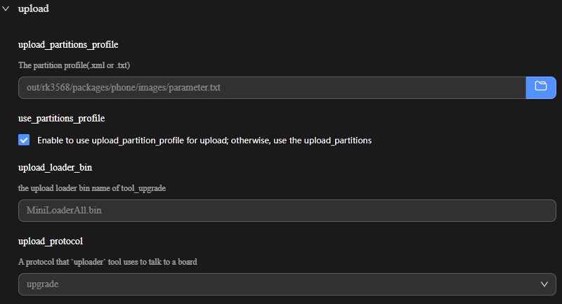

# Burning

Burning is the process of downloading compiled program files to a development board to provide a basis for subsequent debugging. With the one-click burning function of DevEco Device Tool, you can burn images on development boards quickly and efficiently.

For the RK3568 development board, image files are burnt in Windows.

## Importing Source Code

After the building is complete, ensure that you can [remotely access the Ubuntu environment from Windows](quickstart-standard-env-setup.md). Then, perform the following steps to import the source code before burning:

1. Open DevEco Device Tool, go to the home page, and click **Import Project** to open your project or source code.

   

2. Select the root directory of the OpenHarmony source code (in Ubuntu), select **Import OpenHarmony Source**, and click **Import**.

   >  **NOTE** 
   > Make sure the selected directory does not contain Chinese characters or spaces.

   

3. On the **Import Project** page, select a product, and the SoC, board, company, and kernel fields will be automatically populated. Then, select the OpenHarmony source code version for **Ohos Ver**.

   

4. Click **Open** to open the project or source code.

## Burning

After the source code is imported, perform the following steps:

1. [Download](https://gitee.com/hihope_iot/docs/blob/master/HiHope_DAYU200/%E7%83%A7%E5%86%99%E5%B7%A5%E5%85%B7%E5%8F%8A%E6%8C%87%E5%8D%97/windows/DriverAssitant_v5.1.1.zip) and install **DriverInstall.exe**.

   >  **NOTE** 
   >
   > If the burning tool of an earlier version has been installed, uninstall it first.

2. Connect the computer and the target development board through the USB port. For details, see [Introduction to the RK3568 Development Board](quickstart-standard-board-introduction-rk3568.md).

3. In DevEco Device Tool, choose **REMOTE DEVELOPMENT** > **Local PC** to check the connection status between the remote computer (Ubuntu build environment) and the local computer (Windows build environment).

   - If  is displayed on the right of **Local PC**, the remote computer is connected to the local computer. In this case, no further action is required.
   - If  is displayed, click the connect icon. During the connection, DevEco Device Tool will restart. Therefore, to avoid task interruptions, do not connect to DevEco Device Tool when downloading or building source code.

   

4. Click **Project Settings** on the menu bar to access the RK3568 project configuration page.

   

5. On the **Tool Chain** tab page, set the Uploader burning tool. You can click **Install** on this page to install the tool online.

   

6. On the **hh_scdy200** tab page, set the burning options.

   - **upload_partitions_profile**: Select the burning profile file, which specifies the files to be burnt, start address and length of the partition, and other burning settings. In addition, select **Enable to use upload_partitions_profile**.

     >  **NOTE** 
     >
     > In the burning profile file, you can change the start address and length of the partition based on the size of the files to be burnt. Make sure the size of the partition is greater than that of the files to be burnt and the partition addresses of the files do not overlap.
     >
     > If this is the first time you burn files to the development board, select **Enable to use upload_partitions_profile for upload** so that the upload_partitions file will be automatically generated. Afterward, select **Enable to use upload_partitions_profile for upload** only when you need to generate a new **upload_partitions** file.

   - **upload_protocol**: Select the burning protocol **upgrade**.

     

7. When you finish modifying, click **Save** on the top.

8. Choose **PROJECT TASKS** > **hh_scdy200** > **Upload** to start burning.

   

9. If the message "Operation paused, Please press Enter key to continue" is displayed, press **Enter**.

   >  **NOTE** 
   >
   > If the message "The board is not in Loader mode. Please Hold on the VOL+key..." is displayed, place the development board in Loader mode as follows: Press and hold the Volume+ key for 3 seconds, press the RESET key, wait for 3 seconds, and then release the Volume+ key.

   Wait until the burning is complete. If the following message is displayed, the burning is successful.

   
