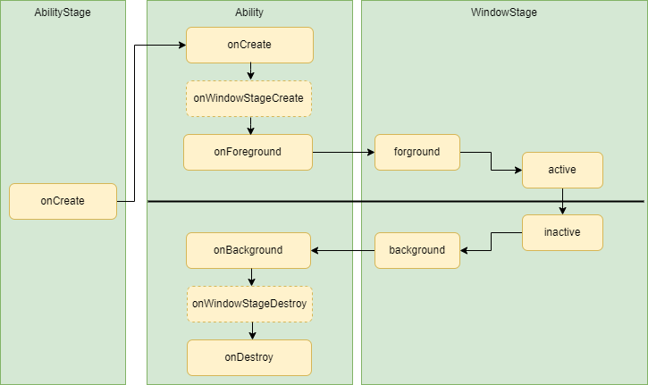

# Stage模型综述

## 设计思想

​        Stage模型的设计，主要是为了解决FA模型无法解决的开发场景问题，方便开发者更加方便地开发出分布式环境下的复杂应用。

​        Stage模型的设计思想如下图所示。

​        Stage模型的设计基于如下三个出发点：

- **应用的能力与系统总体功能和功耗的平衡**

  ​         在系统运行过程中，前台应用的资源占用会被优先保障，与此同时由于应用能力不同而产生的功耗，也需要符合系统整体功耗的要求。Stage模型通过Ability与UI分离、严格的后台管控、基于场景的服务机制及单进程模型来达成这种应用能力与整体系统功耗的平衡。

- **原生支持组件级的迁移和协同**

  ​        OpenHarmony是原生支持分布式的操作系统，应用框架需要从架构设计上使得组件更易于实现迁移和协同。Stage模型通过Ability与UI分离及UI展示与服务能力合一等模型特性，实现这一设计目标。

- **支持多设备和多窗口形态的特点**

  ​        为了支持多种设备形态和更易于实现多种不同的窗口形态，需要组件管理服务和窗口管理服务在架构层面上是解耦的，从而方便裁剪，更有利于定制不同的窗口形态。Stage模型通过重新定义了Ability生命周期定义和设计组件管理服务和窗口管理服务的单向依赖解决这一问题。

## 基本概念

​        下图展示了Stage模型中的基本概念。

-  **HAP**：即HarmonyAbilityPackage，OpenHarmony应用编译、分发、加载的基本单位，也称为module，每个HAP都有一个应用内唯一的名称，称为moduleName；
-  **Bundle**：通过appid标识的OpenHarmony应用，Bundle可以包含多个HAP，每个应用都有一个bundleName，但是bundleName并不能唯一标识一个应用，appid中包含bundleName以及其他的更多信息，能够唯一标识一个应用；
-  **AbilityStage**：对应HAP的运行期类，在HAP首次加载到进程中时创建，运行期开发者可见；
-  **Application**：对应Bundle的运行期类，运行期开发者不可见；
-  **Context**：提供运行期开发者可以调用的各种能力，Ability组件和各种ExtensionAbility都有各自不同的context类，他们都继承自基类Context，基类提供包名、moduleName、路径等信息；
-  **Ability**：提供生命周期回调，持有AbilityContext，支持组件迁移/协同;
-  **ExtensionAbility**：基于场景的服务扩展能力统称，系统定义了多种基于场景的ExtensionAbility类，它们持有各自的ExtensionContext;
-  **WindowStage**：本地窗口管理器；
-  **Window**：窗口 管理器管理的基本单元，持有一个ArkUI引擎实例；
-  **ArkUI Page**：方舟开发框架页面。

## 生命周期

​        Ability及AbilityStage的生命周期是应用的基本流程中最重要的概念。在[Ability框架概述](ability-brief.md)中，给出了FA模型与Stage模型的生命周期对比，这里重点对Ability生命周期切换以及和AbilityStage、WindowStage之间的调度关系进行介绍。

​        为了实现多设备形态上的裁剪和多窗口的可扩展性，OpenHarmony对组件管理和窗口管理进行了解耦。Stage模型定义Ability组件的生命周期，只包含创建、销毁、前后台等状态，而将与界面相关内容强相关的获焦、失焦状态放在WindowStage之中，从而实现Ability与窗口之间的弱耦合；在服务侧，窗口管理服务依赖于组件管理服务，前者通知后者前后台变化，这样组件管理服务仅感知前后台变化，不感知焦点变化。

​	需要注意的是，在Ability中存在两个与WindowStage相关的生命周期状态onWindowStageCreate和onWindowStageDestroy，这两个生命周期状态的变化仅存在于具有窗口显示能力的设备中。前者表示WindowStage已经创建完成，开发者可以通过执行loadContent的操作设置Ability需要加载的页面；后者在WindowStage销毁后调用，从而便于开发者对资源进行释放。

## Ability组件实例与任务

​        Ability组件有三种启动类型：

+ **Singleton**：应用进程中只存在一个该类型的Ability实例，如下图Ability1；

+ **Standard**：每次startAbility调用，都会在应用进程中创建一个该类型的实例，如下图Ability2的两个实例；

+ **Specified**：允许开发者在系统创建AbilityRecord之前，为该实例创建一个key，后续每次创建该类型的Ability实例都会询问应用使用哪个key对应的Ability实例，来响应startAbility请求，如下图Ability3。

​        每个Ability实例都对应了一个Launcher Recent中看到的Mission(任务)。

​        每个Ability实例对应的Mission都留有该Ability实例的快照，Ability实例销毁后，Mission中的会保留Ability的类的信息和快照，直到用户删除，或者超过存储上限。

 

## ExtensionAbility机制

​        不同于用于页面展示的Ability，ExtensionAbility提供的是一种受限的服务运行环境。ExtensionAbility具有如下特点：

- 独立于主进程的单独进程运行，与主进程无IPC，共享一个存储沙箱；

- 独立的Context提供基于业务场景的api能力；

- 由系统触发创建，应用不能直接创建；

- ExtensionAbility和进程的生命周期受系统管理。

​        下图以卡片服务使用场景为例进行展示，系统提供了FormExtensionAbility基类，开发者通过派生提供卡片的具体信息。FormExtensionAbility实例及其所在的ExtensionAbility进程的整个生命周期，都是由系统服务FormManagerService进行管理。

## 进程模型

​        OpenHarmony系统中的应用均满足单进程模型。所谓的单进程模型，是指不允许应用配置多进程，应用中所有的进程都是由系统创建和管理的。每个应用至多并存三类进程：

- 主进程：运行所有的Ability组件、页面和业务逻辑；

- Extension进程：运行应用中的ExtensionAbility派生类，该进程由系统中的特定场景的服务管理其生命周期；

- Render进程：专门为webview创建的进程，用于加载webview的渲染库。

  下图展示了应用的进程模型。

  
## 相关实例
针对Stage模型下的Ability开发，有以下相关实例可供参考：
- [`MissionManager`：系统任务管理（eTS）（API9）（Full SDK）](https://gitee.com/openharmony/applications_app_samples/tree/master/ability/MissionManager)
- [`Launcher`：仿桌面应用（eTS）（API9）（Full SDK）](https://gitee.com/openharmony/applications_app_samples/tree/master/ability/Launcher)
