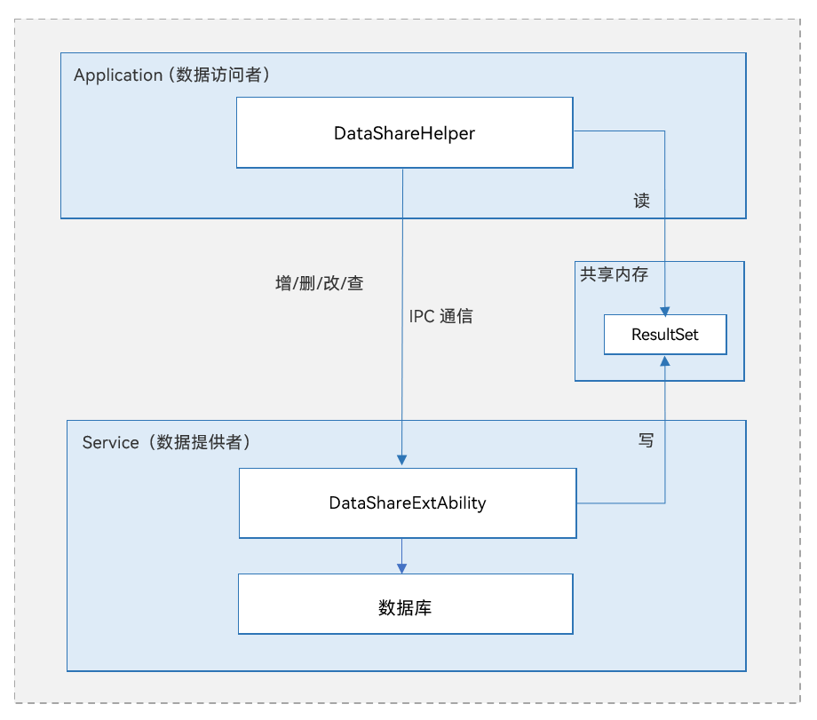

# 数据共享概述

## 数据共享简介

DataShare即数据共享模块，用于应用管理其自身数据，也提供了向其他应用共享以及管理其数据的方法。目前仅支持同个设备上应用之间的数据共享。

在许多应用场景中都需要用到数据共享，比如将电话簿、短信、媒体库中的数据共享给其他应用等。当然，不是所有的数据都允许其他应用访问，比如帐号、密码等；有些数据也只允许其他应用查询而不允许其删改，比如短信等。所以对于各种数据共享场景，DataShare这样一个安全、便捷的可以跨应用的数据共享机制是十分必需的。

对于数据提供者来说，无需进行繁琐的封装，可直接使用DataShare框架实现向其他应用共享数据；对于数据访问方来说，因DataShare的访问方式不会因数据提供的方式而不同，所以只需要学习和使用一套接口即可，大大减少了学习时间和开发难度。

## 基本概念

在进行应用的开发前，开发者应了解以下基本概念：

- **数据提供方**

  提供数据及实现相关业务的应用程序，也称为生产者或服务端。

- **数据访问方**

  访问数据提供方所提供的数据或业务的应用程序，也称为消费者或客户端。

- **数据集**

  用户要插入的数据集合，可以是一条或多条数据。数据集以键值对的形式存在，键为字符串类型，值支持数字、字符串、布尔值、无符号整型数组等多种数据类型。

- **结果集**
  
  用户查询之后的结果集合，其提供了灵活的数据访问方式，以便用户获取各项数据。
  
- **谓词**
  
  用户访问数据库中的数据所使用的筛选条件，经常被应用在更新数据、删除数据和查询数据中等场景。

## 运作机制

**图 1**  DataShare运作机制

- DataShareExtAbility模块为数据提供方，实现跨应用数据共享的相关业务。
- DataShareHelper模块为数据访问方，提供各种访问数据的接口，包括增删改查等。
- 数据访问方与提供方通过IPC进行通信，数据提供方可以通过数据库实现，也可以通过其他数据存储方式实现。

- ResultSet模块通过共享内存实现，用于存储查询数据得到的结果集，并提供了遍历结果集的方法。

## 约束与限制

- DataShare受到数据提供方所使用数据库的一些限制。例如支持的数据模型、Key的长度、Value的长度、每个应用程序支持同时打开数据库的最大数量等，都会受到使用的数据库的限制。

- 因DataShare内部实现依赖于IPC通信，所以数据集、谓词、结果集等的载荷受到IPC通信的约束与限制。
