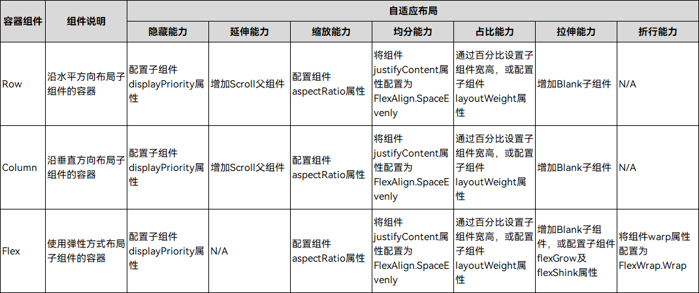

# 布局简介

布局可以分为自适应布局和响应式布局，二者的介绍如下表所示。

| 名称 | 简介 |
| -------- | -------- |
| 自适应布局 | 当外部容器大小发生变化时，元素可以**根据相对关系自动变化**以适应外部容器变化的布局能力。相对关系如占比、固定宽高比、显示优先级等。当前自适应布局能力有7种：[拉伸能力](adaptive-layout.md#拉伸能力)、[均分能力](adaptive-layout.md#均分能力)、[占比能力](adaptive-layout.md#占比能力)、[缩放能力](adaptive-layout.md#缩放能力)、[延伸能力](adaptive-layout.md#延伸能力)、[隐藏能力](adaptive-layout.md#隐藏能力)、[折行能力](adaptive-layout.md#折行能力)。自适应布局能力可以实现界面显示随外部容器大小连续变化。 |
| 响应式布局 | 当外部容器大小发生变化时，元素可以**根据断点、栅格或特定的特征（如屏幕方向、窗口宽高等）自动变化**以适应外部容器变化的布局能力。当前响应式布局能力有3种：[断点](responsive-layout.md#断点)、[媒体查询](responsive-layout.md#媒体查询)、[栅格布局](responsive-layout.md#栅格布局)。响应式布局可以实现界面随外部容器大小有级不连续变化，通常不同特征下的界面显示会有较大的差异。 |

自适应布局和响应式布局常常需要借助容器类组件实现，或与容器类组件搭配使用。

- 自适应布局常常需要借助[Row组件](https://gitee.com/openharmony/docs/blob/master/zh-cn/application-dev/reference/arkui-ts/ts-container-row.md)、[Column组件](https://gitee.com/openharmony/docs/blob/master/zh-cn/application-dev/reference/arkui-ts/ts-container-column.md)或[Flex组件](https://gitee.com/openharmony/docs/blob/master/zh-cn/application-dev/reference/arkui-ts/ts-container-flex.md)实现。
  
  
  
- 响应式布局常常与[GridRow组件](https://gitee.com/openharmony/docs/blob/master/zh-cn/application-dev/reference/arkui-ts/ts-container-gridrow.md)、[Grid组件](https://gitee.com/openharmony/docs/blob/master/zh-cn/application-dev/reference/arkui-ts/ts-container-grid.md)、[List组件](https://gitee.com/openharmony/docs/blob/master/zh-cn/application-dev/reference/arkui-ts/ts-container-list.md)、[Swiper组件](https://gitee.com/openharmony/docs/blob/master/zh-cn/application-dev/reference/arkui-ts/ts-container-swiper.md)或[Tabs组件](https://gitee.com/openharmony/docs/blob/master/zh-cn/application-dev/reference/arkui-ts/ts-container-tabs.md)搭配使用。
  
  
  
  

接下来将依次介绍自适应布局和响应式布局，同时结合实际，通过典型布局场景以及典型页面场景详细介绍两种布局能力的用法。

## 相关实例

针对一次开发，多端部署，有以下相关实例可供参考：

- [`MusicAlbum`：一多音乐专辑主页（eTS）（API9）](https://gitee.com/openharmony/applications_app_samples/tree/master/MultiDeviceAppDev/MusicAlbum)
- [`AppMarket`：一多应用市场首页（eTS）（API9）](https://gitee.com/openharmony/applications_app_samples/tree/master/MultiDeviceAppDev/AppMarket)
- [`AdaptiveCapabilities`：多设备自适应能力（eTS）（API9）](https://gitee.com/openharmony/applications_app_samples/tree/master/MultiDeviceAppDev/AdaptiveCapabilities)
- [`JsAdaptiveCapabilities`：多设备自适应能力（JS）（API8）](https://gitee.com/openharmony/applications_app_samples/tree/master/MultiDeviceAppDev/JsAdaptiveCapabilities)
- [一次开发多端部署（eTS）（API8）](https://gitee.com/openharmony/codelabs/tree/master/ETSUI/MultiDeploymentEts)

