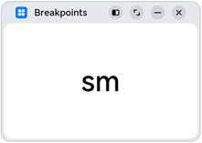
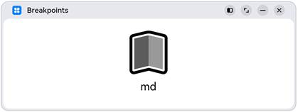
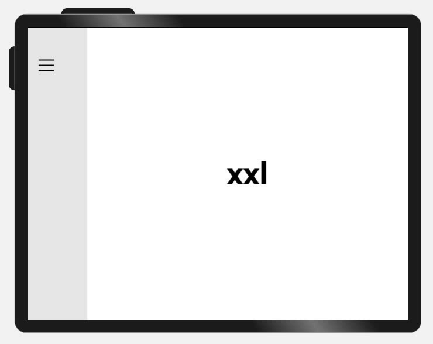
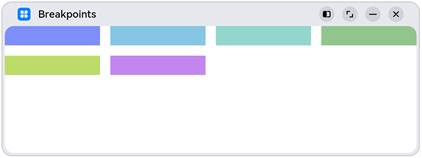
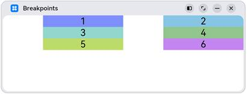
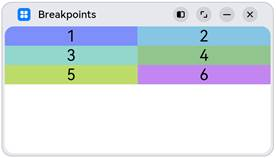
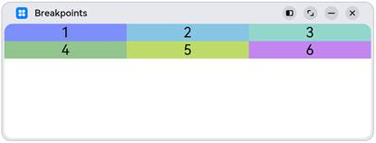
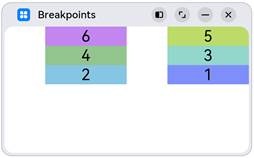
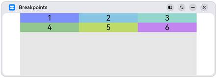

# 响应式布局


自适应布局可以保证窗口尺寸在一定范围内变化时，页面的显示是正常的。但是将窗口尺寸变化较大时（如窗口宽度从400vp变化为1000vp），仅仅依靠自适应布局可能出现图片异常放大或页面内容稀疏、留白过多等问题，此时就需要借助响应式布局能力调整页面结构。


响应式布局是指页面内的元素可以根据特定的特征（如窗口宽度、屏幕方向等）自动变化以适应外部容器变化的布局能力。响应式布局中最常使用的特征是窗口宽度，可以将窗口宽度划分为不同的范围（下文中称为断点）。当窗口宽度从一个断点变化到另一个断点时，改变页面布局（如将页面内容从单列排布调整为双列排布甚至三列排布等）以获得更好的显示效果。


当前OpenHarmony提供了如下三种响应式布局能力，后文中我们将依次展开介绍。


  | 响应式布局能力 | 简介 | 
| -------- | -------- |
| [断点](#断点) | 将窗口宽度划分为不同的范围（即断点），监听窗口尺寸变化，当断点改变时同步调整页面布局。 | 
| [媒体查询](#媒体查询) | 媒体查询支持监听窗口宽度、横竖屏、深浅色、设备类型等多种媒体特征，当媒体特征发生改变时同步调整页面布局。 | 
| [栅格布局](#栅格布局) | 栅格组件将其所在的区域划分为有规律的多列，通过调整不同断点下的栅格组件的参数以及其子组件占据的列数等，实现不同的布局效果。 | 


## 断点

断点以应用窗口宽度为切入点，将应用窗口在宽度维度上分成了几个不同的区间即不同的断点，在不同的区间下，开发者可根据需要实现不同的页面布局效果。具体的断点如下所示。

  | 断点名称 | 取值范围（vp） | 
| -------- | -------- |
| xs | [0,&nbsp;320） | 
| sm | [320,&nbsp;520) | 
| md | [520,&nbsp;840) | 
| lg | [840,&nbsp;+∞) | 

>  **说明：**
> - 以设备屏幕宽度作为参照物，也可以实现类似的效果。考虑到应用可能以非全屏窗口的形式显示，以应用窗口宽度为参照物更为通用。
> 
> - 开发者可以根据实际使用场景决定适配哪些断点。如xs断点对应的一般是智能穿戴类设备，如果确定某页面不会在智能穿戴设备上显示，则可以不适配xs断点。

OpenHarmony提供了多种方法，判断应用当前处于何种断点，进而可以调整应用的布局。常见的监听断点变化的方法如下所示：

- 获取窗口对象并监听窗口尺寸变化

- 通过媒体查询监听应用窗口尺寸变化

- 借助栅格组件能力监听不同断点的变化

本小节中，先介绍如何通过窗口对象监听断点变化，后续的媒体查询及栅格章节中，将进一步展开介绍另外两种方法。

通过窗口对象监听断点变化的核心是获取窗口对象及注册窗口尺寸变化的回调函数。

1. 在Ability的[onWindowStageCreate](https://gitee.com/openharmony/docs/blob/master/zh-cn/application-dev/ability/stage-ability.md)生命周期回调中，获取并记录[窗口](https://gitee.com/openharmony/docs/blob/master/zh-cn/application-dev/reference/apis/js-apis-window.md)对象。
   
   ```
   // MainAbility.ts
   import window from '@ohos.window'
   
   export default class MainAbility extends Ability {
     ...
     onWindowStageCreate(windowStage) {
       window.getTopWindow(this.context).then((windowObj) => {
         AppStorage.SetOrCreate('windowObj', windowObj)
       })
     }
     ...
   }
   ```

2. 在页面中，通过窗口对象获取启动时的应用窗口宽度，同时注册回调函数监听窗口尺寸变化。
   
   ```
   @Entry
   @Component
   struct Index {
     @State private currentBreakpoint: string = 'sm'
    
     private updateBreakpoint(windowWidth) {
       if (windowWidth < 320) {
         this.currentBreakpoint = 'xs'
         return
       }
       if (windowWidth < 520) {
         this.currentBreakpoint = 'sm'
         return
       }
       if (windowWidth < 840) {
         this.currentBreakpoint = 'md'
         return
       }
       this.currentBreakpoint = 'lg'
     }
   
     aboutToAppear() {
       let windowObj: window.Window = AppStorage.Get('windowObj')
       // 获取应用启动时的窗口尺寸
       windowObj.getProperties().then((windowProperties) => {
         this.updateBreakpoint(px2vp(windowProperties.windowRect.width))
       })
   
       // 注册回调函数，监听窗口尺寸变化 
       windowObj.on('windowSizeChange', (data) => {
         this.updateBreakpoint(px2vp(data.width))
       });
     }
   
     aboutToDisappear() {
       let windowObj: window.Window = AppStorage.Get('windowObj')
       windowObj.off('windowSizeChange')
     }
   
     build() {
       Flex({justifyContent: FlexAlign.Center, alignItems: ItemAlign.Center}) {
         Text(this.currentBreakpoint).fontSize(50).fontWeight(FontWeight.Medium)
       }
       .width('100%')
       .height('100%')
     }
   }
   ```

3. 运行及验证效果。
     | | | |
   | -------- | -------- | -------- |
   |  |  |  | 


## 媒体查询


在实际应用开发过程中，开发者常常需要针对不同类型设备或同一类型设备的不同状态来修改应用的样式。媒体查询提供了丰富的媒体特征监听能力，可以监听应用显示区域变化、横竖屏、深浅色、设备类型等等，因此在应用开发过程中使用的非常广泛。


本小节仅介绍**媒体查询跟断点的结合**，即如何借助媒体查询能力，监听断点的变化，读者可以自行查阅官网中关于[媒体查询](https://gitee.com/openharmony/docs/blob/master/zh-cn/application-dev/ui/ui-ts-layout-mediaquery.md)的相关介绍了解更详细的用法。


>  **说明：**
> 类Web开发范式，支持在js文件和css文件中使用媒体查询，请查看[js媒体查询](https://gitee.com/openharmony/docs/blob/master/zh-cn/application-dev/reference/apis/js-apis-mediaquery.md)和[css媒体查询](https://gitee.com/openharmony/docs/blob/master/zh-cn/application-dev/reference/arkui-js/js-components-common-mediaquery.md)了解详细用法。


**示例：**


通过媒体查询，监听应用窗口宽度变化，获取当前应用所处的断点值。


  | | | |
| -------- | -------- | -------- |
|  |  |  | 


```
// common/breakpointsystem.ets
// 对通过媒体查询监听断点的功能做简单的封装，方便后续使用
import mediaquery from '@ohos.mediaquery';

export class BreakpointType<T> {
  sm: T
  md: T
  lg: T
  constructor(sm: T, md: T, lg: T) {
    this.sm = sm
    this.md = md
    this.lg = lg
  }
  GetValue(currentBreakpoint: string) {
    if (currentBreakpoint === 'sm') {
      return this.sm
    }
    if (currentBreakpoint === 'md') {
      return this.md
    }
    if (currentBreakpoint === 'lg') {
      return this.lg
    }
    return undefined
  }
}

export class BreakpointSystem {
  private currentBreakpoint: string = 'md'
  private smListener: mediaquery.MediaQueryListener
  private mdListener: mediaquery.MediaQueryListener
  private lgListener: mediaquery.MediaQueryListener

  private updateCurrentBreakpoint(breakpoint: string) {
    if (this.currentBreakpoint !== breakpoint) {
      this.currentBreakpoint = breakpoint
      AppStorage.Set<string>('currentBreakpoint', this.currentBreakpoint)
    }
  }
  private isBreakpointSM = (mediaQueryResult) => {
    if (mediaQueryResult.matches) {
      this.updateCurrentBreakpoint('sm')
    }
  }
  private isBreakpointMD = (mediaQueryResult) => {
    if (mediaQueryResult.matches) {
      this.updateCurrentBreakpoint('md')
    }
  }
  private isBreakpointLG = (mediaQueryResult) => {
    if (mediaQueryResult.matches) {
      this.updateCurrentBreakpoint('lg')
    }
  }

  public register() {
    this.smListener = mediaquery.matchMediaSync("(320vp<width<520vp)")
    this.smListener.on("change", this.isBreakpointSM)
    this.mdListener = mediaquery.matchMediaSync("(520vp<width<840vp)")
    this.mdListener.on("change", this.isBreakpointMD)
    this.lgListener = mediaquery.matchMediaSync("(840vp<width)")
    this.lgListener.on("change", this.isBreakpointLG)
  }

  public unregister() {
    this.smListener.off("change", this.isBreakpointSM)
    this.mdListener.off("change", this.isBreakpointMD)
    this.lgListener.off("change", this.isBreakpointLG)
  }
}

// MediaQuerySample.ets
import { BreakpointSystem, BreakpointType } from '../common/breakpointsystem'

@Entry
@Component
struct MediaQuerySample {
  @StorageLink('currentBreakpoint') private currentBreakpoint: string = "md";
  @State private icon: Resource = $r('app.media.md')
  private breakpointSystem: BreakpointSystem = new BreakpointSystem()

  aboutToAppear() {
    this.breakpointSystem.register()
  }

  aboutToDisappear() {
    this.breakpointSystem.unregister()
  }
  build() {
    Flex({ direction: FlexDirection.Column, alignItems: ItemAlign.Center, justifyContent: FlexAlign.Center }) {
      Image(new BreakpointType($r('app.media.sm'), $r('app.media.md'), $r('app.media.lg')).GetValue(this.currentBreakpoint))
        .height(100)
        .width(100)
        .objectFit(ImageFit.Contain)

      Text(this.currentBreakpoint)
        .fontSize(24)
        .margin(10)
    }
    .width('100%')
    .height('100%')
  }
}
```


## 栅格布局

### 简介

栅格是多设备场景下通用的辅助定位工具，通过将空间分割为有规律的栅格。栅格可以显著降低适配不同屏幕尺寸的设计及开发成本，使得整体设计和开发流程更有秩序和节奏感，同时也保证多设备上应用显示的协调性和一致性，提升用户体验。


  栅格的样式由Margin、Gutter、Columns三个属性决定。
- Margin是相对应用窗口、父容器的左右边缘的距离，决定了内容可展示的整体宽度。

- Gutter是相邻的两个Column之间的距离，决定内容间的紧密程度。

- Columns是栅格中的列数，其数值决定了内容的布局复杂度。

单个Column的宽度是系统结合Margin、Gutter和Columns自动计算的，不需要也不允许开发者手动配置。

栅格布局就是栅格结合了断点，实现栅格布局能力的组件叫栅格组件。在实际使用场景中，可以根据需要配置不同断点下栅格组件中元素占据的列数，同时也可以调整Margin、Gutter、Columns的取值，从而实现不同的布局效果。

  | sm断点 | md断点 | 
| -------- | -------- |
|  |  | 

>  **说明：**
> - ArkUI在API 9对栅格组件做了重构，推出了新的栅格组件[GridRow](https://gitee.com/openharmony/docs/blob/master/zh-cn/application-dev/reference/arkui-ts/ts-container-gridrow.md)和[GridCol](https://gitee.com/openharmony/docs/blob/master/zh-cn/application-dev/reference/arkui-ts/ts-container-gridcol.md)，同时原有的[GridContainer组件](https://gitee.com/openharmony/docs/blob/master/zh-cn/application-dev/reference/arkui-ts/ts-container-gridcontainer.md)及[栅格设置](https://gitee.com/openharmony/docs/blob/master/zh-cn/application-dev/reference/arkui-ts/ts-universal-attributes-grid.md)已经废弃。
> 
> - 本文中提到的栅格组件，如无特别说明，都是指GridRow和GridCol组件。


### 栅格组件的断点

栅格组件提供了丰富的断点定制能力。

**（一）开发者可以修改断点的取值范围，支持启用最多6个断点。**

- 基于本文断点小节介绍的推荐值，栅格组件默认提供xs、sm、md、lg四个断点。

- 栅格组件支持开发者修改断点的取值范围，除了默认的四个断点，还支持开发者启用xl和xxl两个额外的断点。

>  **说明：**
> 断点并非越多越好，通常每个断点都需要开发者“精心适配”以达到最佳显示效果。

**示例1：**

修改默认的断点范围，同时启用xl和xxl断点。

图片右下角显示了当前设备屏幕的尺寸（即应用窗口尺寸），可以看到随着窗口尺寸发生变化，栅格的断点也相应发生了改变。（为了便于理解，下图中将设备的DPI设置为160，此时1vp=1px）


```
@Entry
@Component
struct GridRowSample1 {
  @State private currentBreakpoint: string = 'unknown'
  build() {
    // 修改断点的取值范围同时启用更多断点，注意，修改的断点值后面必须加上vp单位。
    GridRow(breakpoints: {value: ['600vp', '700vp', '800vp', '900vp', '1000vp'],
      reference: BreakpointsReference.WindowSize}}) {
      GridCol({span:{xs: 12, sm: 12, md: 12, lg:12, xl: 12, xxl:12}}) {
        Flex({ direction: FlexDirection.Column, alignItems: ItemAlign.Center, justifyContent: FlexAlign.Center }) {
          Text(this.currentBreakpoint).fontSize(50).fontWeight(FontWeight.Medium)
        }
      }
    }.onBreakpointChange((currentBreakpoint: string) => {
      this.currentBreakpoint = currentBreakpoint
    })
  }
}
```

**（二）栅格断点默认以窗口宽度为参照物，同时还允许开发者配置为以栅格组件本身的宽度为参照物。**

栅格既可以用于页面整体布局的场景，也可以用于页面局部布局的场景。考虑到在实际场景中，存在应用窗口尺寸不变但是局部区域尺寸发生了变化的情况，栅格组件支持以自身宽度为参照物响应断点变化具有更大的灵活性。

**示例2：**

以栅格组件宽度为参考物响应断点变化。满足窗口尺寸不变，而部分内容区需要做响应式变化的场景。

为了便于理解，下图中自定义预览器的设备屏幕宽度设置为650vp。示例代码中将侧边栏的变化范围控制在[100vp, 600vp]，那么右侧的栅格组件宽度相对应在[550vp, 50vp]之间变化。根据代码中对栅格断点的配置，栅格组件宽度发生变化时，其断点相应的发生改变。




```
@Entry
@Component
struct GridRowSample2 {
  @State private currentBreakpoint: string = 'unknown';
  build() {
    // 用户可以通过拖拽侧边栏组件中的分隔线，调整侧边栏和内容区的宽度。
    SideBarContainer(SideBarContainerType.Embed)
    {
      // 侧边栏，尺寸变化范围 [100vp, 600vp]
      Column(){}.width('100%').backgroundColor('#19000000')

      // 内容区，尺寸变化范围 [550vp, 50vp]
      GridRow({breakpoints: {value: ['100vp', '200vp', '300vp', '400vp', '500vp'],
        reference: BreakpointsReference.ComponentSize}}) {
        GridCol({span:{xs: 12, sm: 12, md: 12, lg:12, xl: 12, xxl:12}}) {
          Flex({ direction: FlexDirection.Column, alignItems: ItemAlign.Center, justifyContent: FlexAlign.Center }) {
            Text(this.currentBreakpoint).fontSize(50).fontWeight(FontWeight.Medium)
          }
        }
      }.onBreakpointChange((currentBreakpoint: string) => {
        this.currentBreakpoint = currentBreakpoint;
      }).width('100%')
    }
    // 侧边栏拖拽到最小宽度时，不自动隐藏
    .autoHide(false)
    .sideBarWidth(100)
    // 侧边栏的最小宽度
    .minSideBarWidth(100)
    // 侧边栏的最大宽度
    .maxSideBarWidth(600)
  }
}
```

**（三）栅格组件的断点发生变化时，会通过onBreakPointChange事件通知开发者。**

在之前的两个例子中，已经演示了onBreakpointChange事件的用法，此处不再赘述。


### 栅格组件的columns、gutter和margin


栅格组件columns默认为12列，gutter默认为0，同时支持开发者根据实际需要定义不同断点下的columns数量以及gutter长度。特别的，在栅格组件实际使用过程中，常常会发生多个元素占据的列数相加超过总列数而折行的场景。栅格组件还允许开发者分别定义水平方向的gutter（相邻两列之间的间距）和垂直方向的gutter（折行时相邻两行之间的间距）。


  考虑到[组件通用属性](https://gitee.com/openharmony/docs/blob/master/zh-cn/application-dev/reference/arkui-ts/ts-universal-attributes-size.md)中已经有margin和padding，栅格组件不再单独提供额外的margin属性，直接使用通用属性即可。借助margin或者padding属性，均可以控制栅格组件与父容器左右边缘的距离，但是二者也存在一些差异：
- margin区域在栅格组件的边界外，padding区域在栅格组件的边界内。

- 栅格组件的backgroundColor会影响padding区域，但不会影响margin区域。


总的来讲，margin在组件外而padding在组件内，开发者可以根据实际需要进行选择及实现目标效果。

**示例3：**


不同断点下，定义不同的columns和gutter。


  | sm | md | lg | 
| -------- | -------- | -------- |
|  |  |  | 


```
@Entry
@Component
struct GridRowSample3 {
  private bgColors: ResourceColor[] = [
     $r('sys.color.ohos_id_color_palette_aux1'),
     $r('sys.color.ohos_id_color_palette_aux2'),
     $r('sys.color.ohos_id_color_palette_aux3'),
     $r('sys.color.ohos_id_color_palette_aux4'),
     $r('sys.color.ohos_id_color_palette_aux5'),
     $r('sys.color.ohos_id_color_palette_aux6')
  ]
  build() {
    // 配置不同断点下columns和gutter的取值
    GridRow({columns: {sm: 4, md: 8, lg: 12},
      gutter: {x: {sm: 8, md: 16, lg: 24}, y: {sm: 8, md: 16, lg: 24}}}) {
      ForEach(this.bgColors, (bgColor)=>{
        GridCol({span: {sm: 2, md: 2, lg: 2}}) {
          Row().backgroundColor(bgColor).height(30)
        }
      })
    }
  }
}
```


**示例4：**


通过通用属性margin或者padding，均可以控制栅格组件与其父容器左右两侧的距离，但padding区域计算在栅格组件内而margin区域计算在栅格组件外。此外，借助onBreakpointChange事件，还可以改变不同断点下margin或padding值。


```
@Entry
@Component
struct GridRowSample4 {
  @State private gridMargin: number = 0
  build() {
    Column() {
      Row().width('100%').height(30)

      // 使用padding控制栅格左右间距
      GridRow() {
        GridCol({span:{xs: 12, sm: 12, md: 12, lg:12}}) {
          Flex({ direction: FlexDirection.Column, alignItems: ItemAlign.Center, justifyContent: FlexAlign.Center }) {
            Text("padding").fontSize(24).fontWeight(FontWeight.Medium)
          }.backgroundColor('#19000000')
        }
      }
      .height(50)
      .borderWidth(2)
      .borderColor('#F1CCB8')
      .padding({left: this.gridMargin, right: this.gridMargin})
      // 借助断点变化事件配置不同断点下栅格组件的左右间距值
      .onBreakpointChange((currentBreakpoint: string) => {
        if (currentBreakpoint === 'lg' || currentBreakpoint === 'md') {
          this.gridMargin = 24
        } else {
          this.gridMargin = 12
        }
      })

      Row().width('100%').height(30)

      // 使用margin控制栅格左右间距
      GridRow() {
        GridCol({span:{xs: 12, sm: 12, md: 12, lg:12}}) {
          Flex({ direction: FlexDirection.Column, alignItems: ItemAlign.Center, justifyContent: FlexAlign.Center }) {
            Text("margin").fontSize(24).fontWeight(FontWeight.Medium)
          }.backgroundColor('#19000000')
        }
      }
      .height(50)
      .borderWidth(2)
      .borderColor('#F1CCB8')
      .margin({left: this.gridMargin, right: this.gridMargin})
    }
  }
}
```


### 栅格组件的span、offset和order


栅格组件（GridRow）的直接孩子节点只可以是栅格子组件（GridCol），GridCol组件支持配置span、offset和order三个参数。这三个参数的取值按照"xs -&gt; sm -&gt; md -&gt; lg -&gt; xl -&gt; xxl"的向后方向具有继承性（不支持向前方向的继承性），例如将sm断点下span的值配置为3，不配置md断点下span的值，则md断点下span的取值也是3。


  | 参数名 | 类型 | 必填 | 默认值 | 说明 | 
| -------- | -------- | -------- | -------- | -------- |
| span | {xs?:&nbsp;number,&nbsp;sm?:&nbsp;number,&nbsp;md?:&nbsp;number,&nbsp;lg?:&nbsp;number,&nbsp;xl?:&nbsp;number,&nbsp;xxl?:number} | 是 | - | 在栅格中占据的列数。span为0，意味着该元素既不参与布局计算，也不会被渲染。 | 
| offset | {xs?:&nbsp;number,&nbsp;sm?:&nbsp;number,&nbsp;md?:&nbsp;number,&nbsp;lg?:&nbsp;number,&nbsp;xl?:&nbsp;number,&nbsp;xxl?:number} | 否 | 0 | 相对于前一个栅格子组件偏移的列数。 | 
| order | {xs?:&nbsp;number,&nbsp;sm?:&nbsp;number,&nbsp;md?:&nbsp;number,&nbsp;lg?:&nbsp;number,&nbsp;xl?:&nbsp;number,&nbsp;xxl?:number} | 否 | 0 | 元素的序号，根据栅格子组件的序号，从小到大对栅格子组件做排序。 | 


**示例5：**


通过span参数配置GridCol在不同断点下占据不同的列数。特别的，将md断点下和6的span配置为0，这样在md断点下3和6不会渲染和显示。


  | sm | md | lg | 
| -------- | -------- | -------- |
|  |  |  | 


```
@Entry
@Component
struct GridRowSample5 {
  private elements: Object[] = [
    {'index': 1, 'color': $r('sys.color.ohos_id_color_palette_aux1')},
    {'index': 2, 'color': $r('sys.color.ohos_id_color_palette_aux2')},
    {'index': 3, 'color': $r('sys.color.ohos_id_color_palette_aux3')},
    {'index': 4, 'color': $r('sys.color.ohos_id_color_palette_aux4')},
    {'index': 5, 'color': $r('sys.color.ohos_id_color_palette_aux5')},
    {'index': 6, 'color': $r('sys.color.ohos_id_color_palette_aux6')},
  ]

  build() {
    GridRow() {
      ForEach(this.elements, (item)=>{
        GridCol({span: {sm: 6, md: (item.index % 3 === 0) ? 0 : 4, lg: 3}}) {
          Row() {
            Text('' + item.index).fontSize(24)
          }
          .justifyContent(FlexAlign.Center)
          .backgroundColor(item.color).height(30)
        }
      })
    }
  }
}
```


**示例6：**


通过offset参数，配置GridCol相对其前一个兄弟间隔的列数。


  | sm | md | lg | 
| -------- | -------- | -------- |
|  |  |  | 


```
@Entry
@Component
struct GridRowSample6 {
  private elements: Object[] = [
    {'index': 1, 'color': $r('sys.color.ohos_id_color_palette_aux1')},
    {'index': 2, 'color': $r('sys.color.ohos_id_color_palette_aux2')},
    {'index': 3, 'color': $r('sys.color.ohos_id_color_palette_aux3')},
    {'index': 4, 'color': $r('sys.color.ohos_id_color_palette_aux4')},
    {'index': 5, 'color': $r('sys.color.ohos_id_color_palette_aux5')},
    {'index': 6, 'color': $r('sys.color.ohos_id_color_palette_aux6')},
  ]

  build() {
    GridRow() {
      ForEach(this.elements, (item)=>{
        GridCol({span: {sm: 6, md: 4, lg: 3}, offset: {sm: 0, md: 2, lg: 1} }) {
          Row() {
            Text('' + item.index).fontSize(24)
          }
          .justifyContent(FlexAlign.Center)
          .backgroundColor(item.color).height(30)
        }
      })
    }
  }
}
```


**示例7：**


通过order属性，控制GridCol的顺序。在sm和md断点下，按照至6的顺序排列显示；在lg断点下，按照6至1的顺序排列显示。


  | sm | md | lg | 
| -------- | -------- | -------- |
|  |  |  | 


```
@Entry
@Component
struct GridRowSample7 {
  private elements: Object[] = [
    {'index': 1, 'color': $r('sys.color.ohos_id_color_palette_aux1')},
    {'index': 2, 'color': $r('sys.color.ohos_id_color_palette_aux2')},
    {'index': 3, 'color': $r('sys.color.ohos_id_color_palette_aux3')},
    {'index': 4, 'color': $r('sys.color.ohos_id_color_palette_aux4')},
    {'index': 5, 'color': $r('sys.color.ohos_id_color_palette_aux5')},
    {'index': 6, 'color': $r('sys.color.ohos_id_color_palette_aux6')},
  ]

  build() {
    GridRow() {
      ForEach(this.elements, (item)=>{
        GridCol({span: {sm: 6, md: 4, lg: 3}, order: {lg: (6-item.index)}}) {
          Row() {
            Text('' + item.index).fontSize(24)
          }
          .justifyContent(FlexAlign.Center)
          .backgroundColor(item.color).height(30)
        }
      })
    }
  }
}
```


**示例8：**


仅配置sm和lg断点下span、offset和order参数的值，则md断点下这三个参数的取值与sm断点相同（按照“sm-&gt;md-&gt;lg”的向后方向继承）。


  | sm | md | lg | 
| -------- | -------- | -------- |
|  |  |  | 


```
@Entry
@Component
struct GridRowSample8 {
  private elements: Object[] = [
    {'index': 1, 'color': $r('sys.color.ohos_id_color_palette_aux1')},
    {'index': 2, 'color': $r('sys.color.ohos_id_color_palette_aux2')},
    {'index': 3, 'color': $r('sys.color.ohos_id_color_palette_aux3')},
    {'index': 4, 'color': $r('sys.color.ohos_id_color_palette_aux4')},
    {'index': 5, 'color': $r('sys.color.ohos_id_color_palette_aux5')},
    {'index': 6, 'color': $r('sys.color.ohos_id_color_palette_aux6')},
  ]

  build() {
    GridRow() {
      ForEach(this.elements, (item)=>{
        // 不配置md断点下三个参数的值，则其取值与sm断点相同
        GridCol({span: {sm:4, lg: 3}, offset: {sm: 2, lg: 1},
          order: {sm: (6-item.index), lg: item.index}}) {
          Row() {
            Text('' + item.index).fontSize(24)
          }
          .justifyContent(FlexAlign.Center)
          .backgroundColor(item.color).height(30)
        }
      })
    }
  }
}
```


### 栅格组件的嵌套使用

栅格组件可以嵌套使用以满足复杂场景的需要。

**示例9：**

  | sm | md | lg | 
| -------- | -------- | -------- |
|  |  |  | 


```
@Entry
@Component
struct GridRowSample9 {
  private elements: Object[] = [
    {'index': 1, 'color': $r('sys.color.ohos_id_color_palette_aux1')},
    {'index': 2, 'color': $r('sys.color.ohos_id_color_palette_aux2')},
    {'index': 3, 'color': $r('sys.color.ohos_id_color_palette_aux3')},
    {'index': 4, 'color': $r('sys.color.ohos_id_color_palette_aux4')},
    {'index': 5, 'color': $r('sys.color.ohos_id_color_palette_aux5')},
    {'index': 6, 'color': $r('sys.color.ohos_id_color_palette_aux6')},
  ]

  build() {
    GridRow() {
      GridCol({span: {sm: 12, md: 10, lg: 8}, offset: {sm: 0, md: 1, lg: 2}}) {
        GridRow() {
          ForEach(this.elements, (item)=>{
            GridCol({span: {sm: 6, md: 4, lg: 3}}) {
              Row() {
                Text('' + item.index).fontSize(24)
              }
              .justifyContent(FlexAlign.Center)
              .backgroundColor(item.color).height(30)
            }
          })
        }
        .backgroundColor('#19000000')
        .height('100%')
      }
    }
  }
}
```


### 总结

如前所述，栅格组件提供了丰富的自定义能力，功能异常灵活和强大。只需要明确栅格在不同断点下的Columns、Margin、Gutter及span等参数，即可确定最终布局，无需关心具体的设备类型及设备状态（如横竖屏）等。栅格可以节约设计团队与开发团队的沟通成本，提升整体开发效率。

