# 典型布局场景


虽然不同应用的页面千变万化，但对其进行拆分和分析，页面中的很多布局场景是相似的。本小节将介绍如何借助自适应布局、响应式布局以及常见的容器类组件，实现应用中的典型布局场景。


  | 布局场景 | 实现方案 | 
| -------- | -------- |
| [页签栏](#页签栏) | Tab组件&nbsp;+&nbsp;响应式布局 | 
| [运营横幅（Banner）](#运营横幅banner) | Swiper组件&nbsp;+&nbsp;响应式布局 | 
| [网格](#网格) | Grid组件&nbsp;/&nbsp;List组件&nbsp;+&nbsp;响应式布局 | 
| [侧边栏](#侧边栏) | SiderBar组件&nbsp;+&nbsp;响应式布局 | 
| [大图浏览](#大图浏览) | Image组件 | 
| [操作入口](#操作入口) | Scroll组件+Row组件横向均分 | 
| [顶部](#顶部) | 栅格组件 | 
| [缩进布局](#缩进布局) | 栅格组件 | 
| [挪移布局](#挪移布局) | 栅格组件 | 
| [重复布局](#重复布局) | 栅格组件 | 


>  **说明：**
> 在本文[媒体查询](responsive-layout.md#媒体查询)小节中已经介绍了如何通过媒体查询监听断点变化，后续的示例中不再重复介绍此部分代码。


## 页签栏

**布局效果**

| sm | md | lg |
| -------- | -------- | -------- |
| 页签在底部<br/>页签的图标和文字垂直布局<br/>页签宽度均分<br/>页签高度固定72vp | 页签在底部<br/>页签的图标和文字水平布局<br/>页签宽度均分<br/>页签高度固定56vp | 页签在左边<br/>页签的图标和文字垂直布局<br/>页签宽度固定96vp<br/>页签高度总占比‘60%’后均分 |
| 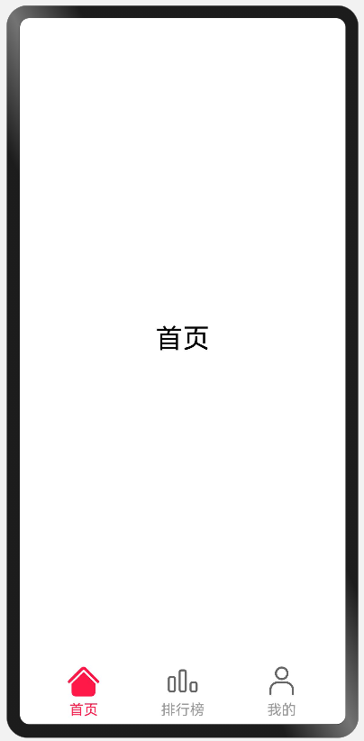 | 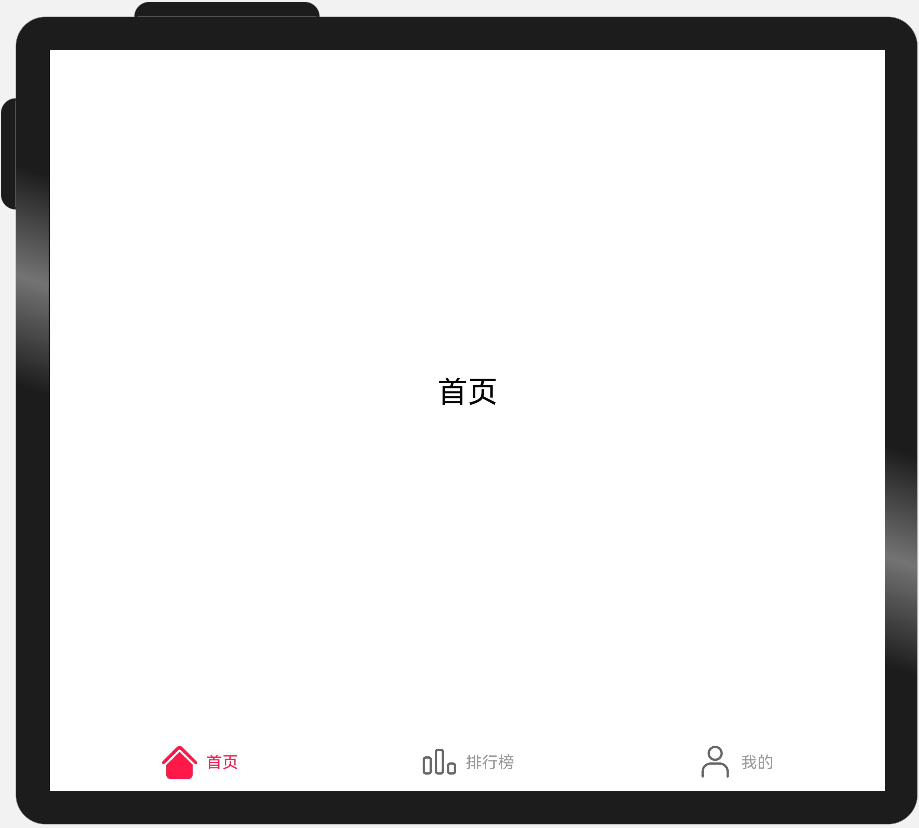 | 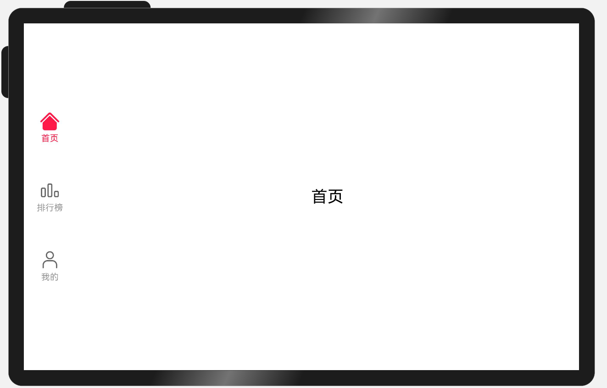 |


**实现方案**

不同断点下，页签在页面中的位置及尺寸都有差异，可以结合响应式布局能力，设置不同断点下[Tab组件](https://gitee.com/openharmony/docs/blob/master/zh-cn/application-dev/reference/arkui-ts/ts-container-tabs.md)的barPosition、vertical、barWidth和barHeight属性实现目标效果。

另外，页签栏中的文字和图片的相对位置不同，同样可以通过设置不同断点下[tabBar](https://gitee.com/openharmony/docs/blob/master/zh-cn/application-dev/reference/arkui-ts/ts-container-tabcontent.md#%E5%B1%9E%E6%80%A7)对应的CustomBuilder中的布局方向，实现目标效果。


**参考代码**


```
import { BreakpointSystem, BreakPointType } from 'common/BreakpointSystem'

type TabBar = {
  name: string
  icon: Resource
  selectIcon: Resource
}

@Entry
@Component
struct Home {
  @State currentIndex: number = 0
  @State tabs: Array<TabBar> = [{
                                  name: '首页',
                                  icon: $r('app.media.ic_music_home'),
                                  selectIcon: $r('app.media.ic_music_home_selected')
                                }, {
                                  name: '排行榜',
                                  icon: $r('app.media.ic_music_ranking'),
                                  selectIcon: $r('app.media.ic_music_ranking_selected')
                                }, {
                                  name: '我的',
                                  icon: $r('app.media.ic_music_me_nor'),
                                  selectIcon: $r('app.media.ic_music_me_selected')
                                }]

  @Builder TabBarBuilder(index: number, tabBar: TabBar) {
    Flex({
      direction: new BreakPointType({
        sm: FlexDirection.Column,
        md: FlexDirection.Row,
        lg: FlexDirection.Column
      }).getValue(this.currentBreakpoint),
      justifyContent: FlexAlign.Center,
      alignItems: ItemAlign.Center
    }) {
      Image(this.currentIndex === index ? tabBar.selectIcon : tabBar.icon)
        .size({ width: 36, height: 36 })
      Text(tabBar.name)
        .fontColor(this.currentIndex === index ? '#FF1948' : '#999')
        .margin(new BreakPointType({
          sm: { top: 4 },
          md: { left: 8 },
          lg: { top: 4 } }).getValue(this.currentBreakpoint))
        .fontSize(16)
    }
    .width('100%')
    .height('100%')
  }

  @StorageLink('currentBreakpoint') currentBreakpoint: string = 'md'
  private breakpointSystem: BreakpointSystem = new BreakpointSystem()

  aboutToAppear() {
    this.breakpointSystem.register()
  }

  aboutToDisappear() {
    this.breakpointSystem.unregister()
  }

  build() {
    Tabs({
      barPosition: new BreakPointType({
        sm: BarPosition.End,
        md: BarPosition.End,
        lg: BarPosition.Start
      }).getValue(this.currentBreakpoint)
    }) {
      ForEach(this.tabs, (item, index) => {
        TabContent() {
          Stack() {
            Text(item.name).fontSize(30)
          }.width('100%').height('100%')
        }.tabBar(this.TabBarBuilder(index, item))
      })
    }
    .vertical(new BreakPointType({ sm: false, md: false, lg: true }).getValue(this.currentBreakpoint))
    .barWidth(new BreakPointType({ sm: '100%', md: '100%', lg: '96vp' }).getValue(this.currentBreakpoint))
    .barHeight(new BreakPointType({ sm: '72vp', md: '56vp', lg: '60%' }).getValue(this.currentBreakpoint))
    .animationDuration(0)
    .onChange((index: number) => {
      this.currentIndex = index
    })
  }
}
```


## 运营横幅（Banner）


**布局效果**
  | sm | md | lg | 
| -------- | -------- | -------- |
| 展示一个内容项 | 展示两个内容项 | 展示三个内容项 | 
|   |  |  | 


**实现方案**

运营横幅通常使用[Swiper组件](https://gitee.com/openharmony/docs/blob/master/zh-cn/application-dev/reference/arkui-ts/ts-container-swiper.md)实现。不同断点下，运营横幅中展示的图片数量不同。只需要结合响应式布局，配置不同断点下Swiper组件的displayCount属性，即可实现目标效果。

**参考代码**


```
import { BreakpointSystem, BreakPointType } from 'common/BreakpointSystem'

@Entry
@Component
export default struct Banner {
  private data: Array<Resource> = [
    $r('app.media.banner1'),
    $r('app.media.banner2'),
    $r('app.media.banner3'),
    $r('app.media.banner4'),
    $r('app.media.banner5'),
    $r('app.media.banner6'),
  ]
  private breakpointSystem: BreakpointSystem = new BreakpointSystem()
  @StorageProp('currentBreakpoint') currentBreakpoint: string = 'md'

  aboutToAppear() {
    this.breakpointSystem.register()
  }

  aboutToDisappear() {
    this.breakpointSystem.unregister()
  }

  build() {
    Swiper() {
      ForEach(this.data, (item) => {
        Image(item)
          .size({ width: '100%', height: 200 })
          .borderRadius(12)
          .padding(8)
      })
    }
    .indicator(new BreakPointType({ sm: true, md: false, lg: false }).getValue(this.currentBreakpoint))
    .displayCount(new BreakPointType({ sm: 1, md: 2, lg: 3 }).getValue(this.currentBreakpoint))
  }
}
```


## 网格

**布局效果**

  | sm | md | lg | 
| -------- | -------- | -------- |
| 展示两列 | 展示四列 | 展示六列 | 
|  | 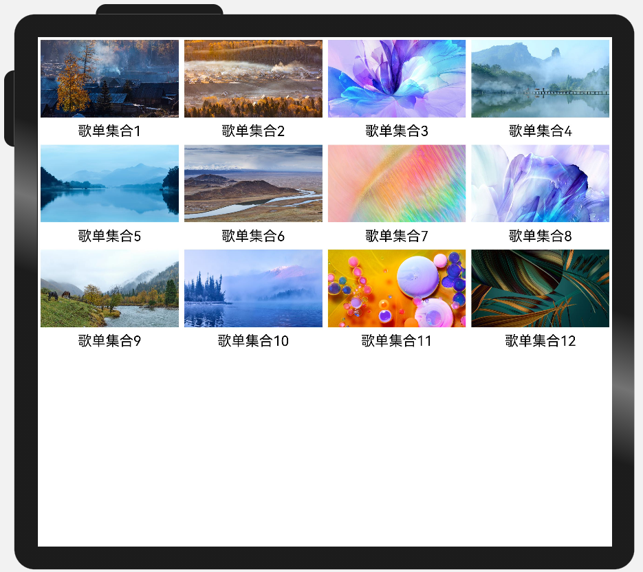 | 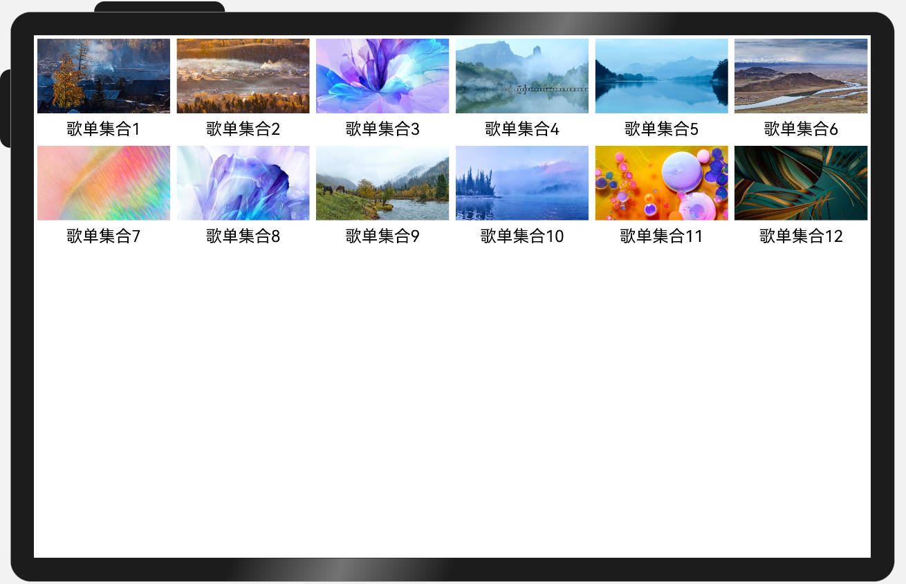 | 


**实现方案**

不同断点下，页面中图片的排布不同，此场景可以通过响应式布局能力结合[Grid组件](https://gitee.com/openharmony/docs/blob/master/zh-cn/application-dev/reference/arkui-ts/ts-container-grid.md)实现，通过调整不同断点下的Grid组件的columnsTemplate属性即可实现目标效果。

另外，由于本例中各列的宽度相同，也可以通过响应式布局能力结合[List组件](https://gitee.com/openharmony/docs/blob/master/zh-cn/application-dev/reference/arkui-ts/ts-container-list.md)实现，通过调整不同断点下的List组件的lanes属性也可实现目标效果。


**参考代码**

通过Grid组件实现


```
import { BreakpointSystem, BreakPointType } from 'common/breakpointsystem'

type GridItemInfo = {
  name: string
  image: Resource
}

@Entry
@Component
struct MultiLaneList {
  private data: GridItemInfo[] = [
    { name: '歌单集合1', image: $r('app.media.1') },
    { name: '歌单集合2', image: $r('app.media.2') },
    { name: '歌单集合3', image: $r('app.media.3') },
    { name: '歌单集合4', image: $r('app.media.4') },
    { name: '歌单集合5', image: $r('app.media.5') },
    { name: '歌单集合6', image: $r('app.media.6') },
    { name: '歌单集合7', image: $r('app.media.7') },
    { name: '歌单集合8', image: $r('app.media.8') },
    { name: '歌单集合9', image: $r('app.media.9') },
    { name: '歌单集合10', image: $r('app.media.10') },
    { name: '歌单集合11', image: $r('app.media.11') },
    { name: '歌单集合12', image: $r('app.media.12') }
  ]
  private breakpointSystem: BreakpointSystem = new BreakpointSystem()
  @StorageProp('currentBreakpoint') currentBreakpoint: string = 'md'

  aboutToAppear() {
    this.breakpointSystem.register()
  }

  aboutToDisappear() {
    this.breakpointSystem.unregister()
  }

  build() {
    Grid() {
      ForEach(this.data, (item: GridItemInfo) => {
        GridItem() {
          Column() {
            Image(item.image)
              .aspectRatio(1.8)
            Text(item.name)
              .margin({ top: 8 })
              .fontSize(20)
          }.padding(4)
        }
      })
    }
    .columnsTemplate(new BreakPointType({
      sm: '1fr 1fr',
      md: '1fr 1fr 1fr 1fr',
      lg: '1fr 1fr 1fr 1fr 1fr 1fr'
    }).GetValue(this.currentBreakpoint))
  }
}
```

通过List组件实现


```
import { BreakpointSystem, BreakPointType } from 'common/BreakpointSystem'

type ListItemInfo = {
  name: string
  image: Resource
}

@Entry
@Component
struct MultiLaneList {
  private data: ListItemInfo[] = [
    { name: '歌单集合1', image: $r('app.media.1') },
    { name: '歌单集合2', image: $r('app.media.2') },
    { name: '歌单集合3', image: $r('app.media.3') },
    { name: '歌单集合4', image: $r('app.media.4') },
    { name: '歌单集合5', image: $r('app.media.5') },
    { name: '歌单集合6', image: $r('app.media.6') },
    { name: '歌单集合7', image: $r('app.media.7') },
    { name: '歌单集合8', image: $r('app.media.8') },
    { name: '歌单集合9', image: $r('app.media.9') },
    { name: '歌单集合10', image: $r('app.media.10') },
    { name: '歌单集合11', image: $r('app.media.11') },
    { name: '歌单集合12', image: $r('app.media.12') }
  ]
  private breakpointSystem: BreakpointSystem = new BreakpointSystem()
  @StorageProp('currentBreakpoint') currentBreakpoint: string = 'md'

  aboutToAppear() {
    this.breakpointSystem.register()
  }

  aboutToDisappear() {
    this.breakpointSystem.unregister()
  }

  build() {
    List() {
      ForEach(this.data, (item: ListItemInfo) => {
        ListItem() {
          Column() {
            Image(item.image)
            Text(item.name)
              .margin({ top: 8 })
              .fontSize(20)
          }.padding(4)
        }
      })
    }
    .lanes(new BreakPointType({ sm: 2, md: 4, lg: 6 }).getValue(this.currentBreakpoint))
    .width('100%')
  }
}
```


## 侧边栏

**布局效果**

  | sm | md | lg | 
| -------- | -------- | -------- |
| 默认隐藏侧边栏，同时提供侧边栏控制按钮，用户可以通过按钮控制侧边栏显示或隐藏。 | 始终显示侧边栏，不提供控制按钮，用户无法隐藏侧边栏。 | 始终显示侧边栏，不提供控制按钮，用户无法隐藏侧边栏。 | 
| 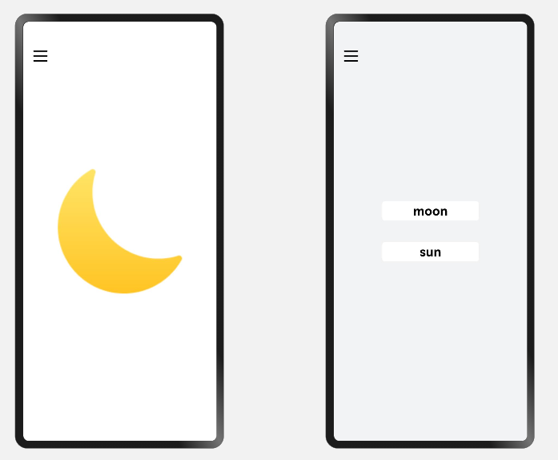  | 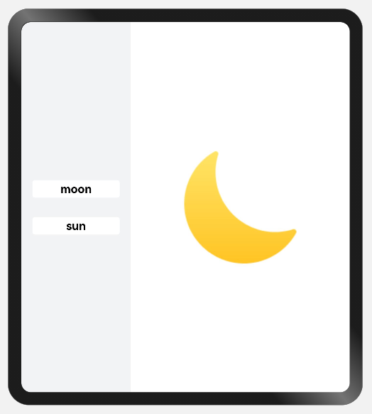 | 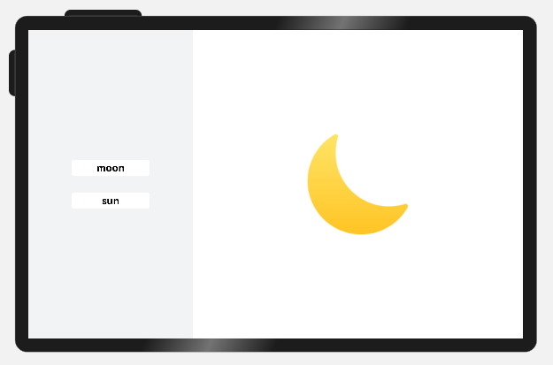 | 

**实现方案**

侧边栏通常通过[SideBarContainer组件](https://gitee.com/openharmony/docs/blob/master/zh-cn/application-dev/reference/arkui-ts/ts-container-sidebarcontainer.md)实现，结合响应式布局能力，在不同断点下为SiderBarConContainer组件的sideBarWidth、showControlButton等属性配置不同的值，即可实现目标效果。

**参考代码**


```
@Entry
@Component
struct SideBarSample {
  @StorageLink('currentBreakpoint') private currentBreakpoint: string = "md";
  private breakpointSystem: BreakpointSystem = new BreakpointSystem()
  @State showSideBar: boolean = false
  @State selectIndex: number = 0;

  aboutToAppear() {
    this.breakpointSystem.register()
    if (this.currentBreakpoint === 'sm') {
      this.showSideBar = false
    } else {
      this.showSideBar = true
    }
  }

  aboutToDisappear() {
    this.breakpointSystem.unregister()
  }

  @Builder itemBuilder(index: number) {
    Text(images[index].label)
      .width('100%')
      .fontSize(24)
      .fontWeight(FontWeight.Bold)
      .borderRadius(5)
      .margin(20)
      .backgroundColor('#ffffff')
      .textAlign(TextAlign.Center)
      .width(180)
      .height(36)
      .onClick(() => {
        this.selectIndex = index
        if (this.currentBreakpoint === 'sm') {
          this.showSideBar = false
        }
      })
  }

  build() {
    SideBarContainer(this.currentBreakpoint === 'sm' ? SideBarContainerType.Overlay : SideBarContainerType.Embed) {
      Column() {
        this.itemBuilder(0)
        this.itemBuilder(1)
      }.backgroundColor('#F1F3F5')
      .justifyContent(FlexAlign.Center)

      Column() {
        Image(images[this.selectIndex].imageSrc)
          .objectFit(ImageFit.Contain)
          .height(300)
          .width(300)
      }
      .justifyContent(FlexAlign.Center)
      .width('100%')
      .height('100%')
    }
    .height('100%')
    .sideBarWidth(this.currentBreakpoint === 'sm' ? '100%' : '33.33%')
    .minSideBarWidth(this.currentBreakpoint === 'sm' ? '100%' : '33.33%')
    .maxSideBarWidth(this.currentBreakpoint === 'sm' ? '100%' : '33.33%')
    .showControlButton(this.currentBreakpoint === 'sm')
    .autoHide(false)
    .showSideBar(this.showSideBar)
    .onChange((isBarShow: boolean) => {
      this.showSideBar = isBarShow
    })
  }
}
```


## 大图浏览

**布局效果**


  | sm | md | lg | 
| -------- | -------- | -------- |
| 图片长宽比不变，最长边充满全屏 | 图片长宽比不变，最长边充满全屏 | 图片长宽比不变，最长边充满全屏 | 
|  |  | 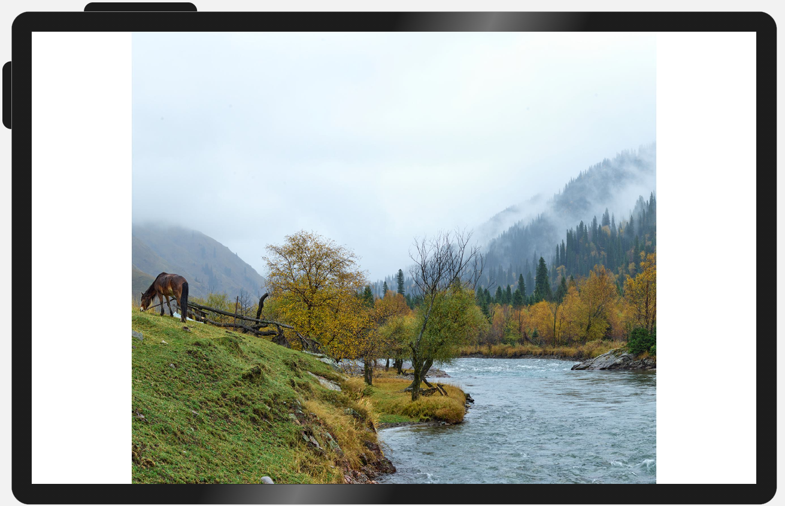 | 


**实现方案**

图片通常使用[Image组件](https://gitee.com/openharmony/docs/blob/master/zh-cn/application-dev/reference/arkui-ts/ts-basic-components-image.md)展示，Image组件的objectFit属性默认为ImageFit.Cover，即保持宽高比进行缩小或者放大以使得图片两边都大于或等于显示边界。在大图浏览场景下，因屏幕与图片的宽高比可能有差异，常常会发生图片被截断的问题。此时只需将Image组件的objectFit属性设置为ImageFit.Contain，即保持宽高比进行缩小或者放大并使得图片完全显示在显示边界内，即可解决该问题。


**参考代码**


```
@Entry
@Component
struct BigImage {
  build() {
    Row() {
      Image($r("app.media.image"))
        .objectFit(ImageFit.Contain)
    }
  }
}
```


## 操作入口

**布局效果**

  | sm | md | lg | 
| -------- | -------- | -------- |
| 列表项尺寸固定，超出内容可滚动查看 | 列表项尺寸固定，剩余空间均分 | 列表项尺寸固定，剩余空间均分 | 
|  |  |  | 


**实现方案**

Scroll（内容超出宽度时可滚动） + Row（横向均分：justifyContent（FlexAlign.SpaceAround）、 最小宽度约束：constraintSize({ minWidth: '100%' }）


**参考代码**


```
type OperationItem = {
  name: string
  icon: Resource
}

@Entry
@Component
export default struct OperationEntries {
  @State listData: Array<OperationItem> = [
    { name: '私人FM', icon: $r('app.media.self_fm') },
    { name: '歌手', icon: $r('app.media.singer') },
    { name: '歌单', icon: $r('app.media.song_list') },
    { name: '排行榜', icon: $r('app.media.rank') },
    { name: '热门', icon: $r('app.media.hot') },
    { name: '运动音乐', icon: $r('app.media.sport') },
    { name: '音乐FM', icon: $r('app.media.audio_fm') },
    { name: '福利', icon: $r('app.media.bonus') }]

  build() {
    Scroll() {
      Row() {
        ForEach(this.listData, item => {
          Column() {
            Image(item.icon)
              .width(48)
              .aspectRatio(1)
            Text(item.name)
              .margin({ top: 8 })
              .fontSize(16)
          }
          .justifyContent(FlexAlign.Center)
          .height(104)
          .padding({ left: 12, right: 12 })
        })
      }
      .constraintSize({ minWidth: '100%' }).justifyContent(FlexAlign.SpaceAround)
    }
    .width('100%')
    .scrollable(ScrollDirection.Horizontal)
  }
}
```


## 顶部


**布局效果**


  | sm | md | lg | 
| -------- | -------- | -------- |
| 标题和搜索框两行显示 | 标题和搜索框一行显示 | 标题和搜索框一行显示 | 
|  |  |  | 


**实现方案**

最外层使用栅格行组件GridRow布局

文本标题使用栅格列组件GridCol

搜索框使用栅格列组件GridCol


**参考代码**


```
@Entry
@Component
export default struct Header {
  @State needWrap: boolean = true

  build() {
    GridRow() {
      GridCol({ span: { sm: 12, md: 6, lg: 7 } }) {
        Row() {
          Text('推荐').fontSize(24)
          Blank()
          Image($r('app.media.ic_public_more'))
            .width(32)
            .height(32)
            .objectFit(ImageFit.Contain)
            .visibility(this.needWrap ? Visibility.Visible : Visibility.None)
        }
        .width('100%').height(40)
        .alignItems(VerticalAlign.Center)
      }

      GridCol({ span: { sm: 12, md: 6, lg: 5 } }) {
        Flex({ direction: FlexDirection.Row, alignItems: ItemAlign.Center }) {
          Search({ placeholder: '猜您喜欢: 万水千山' })
            .placeholderFont({ size: 16 })
            .margin({ top: 4, bottom: 4 })
          Image($r('app.media.audio_fm'))
            .width(32)
            .height(32)
            .objectFit(ImageFit.Contain)
            .flexShrink(0)
            .margin({ left: 12 })
          Image($r('app.media.ic_public_more'))
            .width(32)
            .height(32)
            .objectFit(ImageFit.Contain)
            .flexShrink(0)
            .margin({ left: 12 })
            .visibility(this.needWrap ? Visibility.None : Visibility.Visible)
        }
      }
    }.onBreakpointChange((breakpoint: string) => {
      if (breakpoint === 'sm') {
        this.needWrap = true
      } else {
        this.needWrap = false
      }
    })
    .padding({ left: 12, right: 12 })
  }
}
```


## 缩进布局


**布局效果**


  | sm | md | lg | 
| -------- | -------- | -------- |
| 栅格总列数为4，内容占满所有列 | 栅格总列数为8，内容占中间6列。 | 栅格总列数为12，内容占中间8列。 | 
|  | 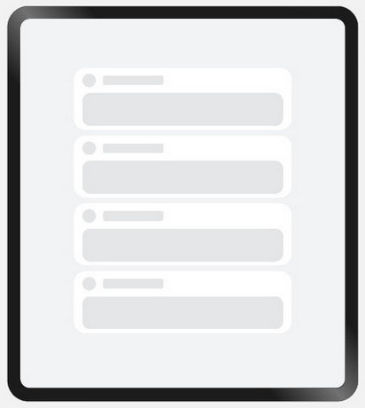 | 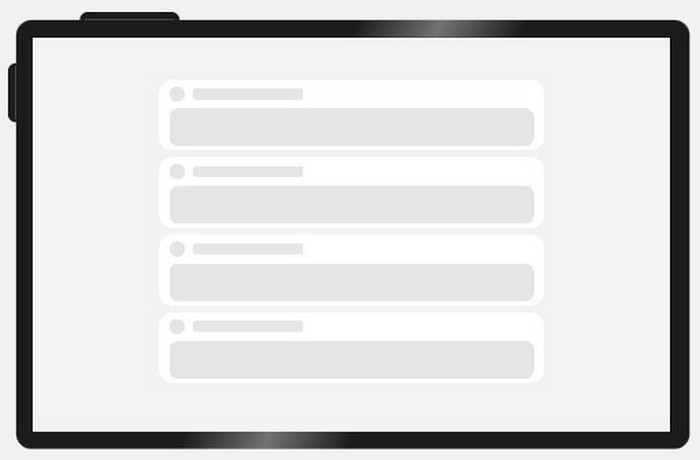 | 


**实现方案**

借助[栅格组件](https://gitee.com/openharmony/docs/blob/master/zh-cn/application-dev/reference/arkui-ts/ts-container-gridrow.md)，控制待显示内容在不同的断点下占据不同的列数，即可实现不同设备上的缩进效果。另外还可以调整不同断点下栅格组件与两侧的间距，获得更好的显示效果。


**参考代码**


```
@Entry
@Component
struct IndentationSample {
  @State private gridMargin: number = 24
  build() {
    Row() {
      GridRow({columns: {sm: 4, md: 8, lg: 12}, gutter: 24}) {
        GridCol({span: {sm: 4, md: 6, lg: 8}, offset: {md: 1, lg: 2}}) {
          Column() {
            ForEach([0, 1, 2, 4], () => {
              Column() {
                ItemContent()
              }
            })
          }.width('100%')
        }
      }
      .margin({left: this.gridMargin, right: this.gridMargin})
      .onBreakpointChange((breakpoint: string) => {
        if (breakpoint === 'lg') {
          this.gridMargin = 48
        } else if (breakpoint === 'md') {
          this.gridMargin = 32
        } else {
          this.gridMargin = 24
        }
      })
    }
    .height('100%')
    .alignItems((VerticalAlign.Center))
    .backgroundColor('#F1F3f5')
  }
}

@Component
struct ItemContent {
  build() {
    Column() {
      Row() {
        Row() {
        }
        .width(28)
        .height(28)
        .borderRadius(14)
        .margin({ right: 15 })
        .backgroundColor('#E4E6E8')

        Row() {
        }
        .width('30%').height(20).borderRadius(4)
        .backgroundColor('#E4E6E8')
      }.width('100%').height(28)

      Row() {
      }
      .width('100%')
      .height(68)
      .borderRadius(16)
      .margin({ top: 12 })
      .backgroundColor('#E4E6E8')
    }
    .height(128)
    .borderRadius(24)
    .backgroundColor('#FFFFFF')
    .padding({ top: 12, bottom: 12, left: 18, right: 18 })
    .margin({ bottom: 12 })
  }
}
```


## 挪移布局

**布局效果**

  | sm | md | lg | 
| -------- | -------- | -------- |
| 图片和文字上下布局 | 图片和文字左右布局 | 图片和文字左右布局 | 
| 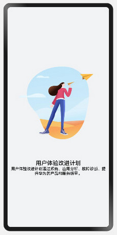 | 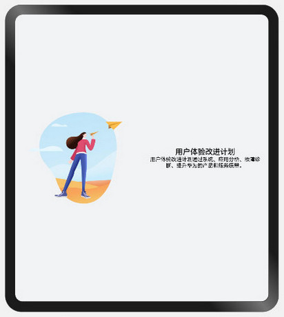 | 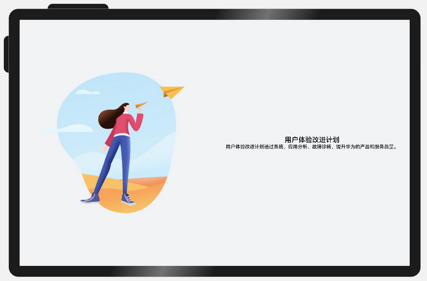 | 


**实现方案**

不同断点下，栅格子元素占据的列数会随着开发者的配置发生改变。当一行中的列数超过栅格组件在该断点的总列数时，可以自动换行，即实现”上下布局”与”左右布局”之间切换的效果。


**参考代码**


```
@Entry
@Component
struct DiversionSample {
  @State private currentBreakpoint: string = 'md'
  @State private imageHeight: number = 0
  build() {
    Row() {
      GridRow() {
        GridCol({span: {sm: 12, md: 6, lg: 6}}) {
          Image($r('app.media.illustrator'))
          .aspectRatio(1)
          .onAreaChange((oldValue: Area, newValue: Area) => {
            this.imageHeight = Number(newValue.height)
          })
          .margin({left: 12, right: 12})
        }

        GridCol({span: {sm: 12, md: 6, lg: 6}}) {
          Column(){
            Text($r('app.string.user_improvement'))
              .textAlign(TextAlign.Center)
              .fontSize(20)
              .fontWeight(FontWeight.Medium)
            Text($r('app.string.user_improvement_tips'))
              .textAlign(TextAlign.Center)
              .fontSize(14)
              .fontWeight(FontWeight.Medium)
          }
          .margin({left: 12, right: 12})
          .justifyContent(FlexAlign.Center)
          .height(this.currentBreakpoint === 'sm' ? 100 : this.imageHeight)
        }
      }.onBreakpointChange((breakpoint: string) => {
        this.currentBreakpoint = breakpoint;
      })
    }
    .height('100%')
    .alignItems((VerticalAlign.Center))
    .backgroundColor('#F1F3F5')
  }
}
```


## 重复布局

**布局效果**

| sm | md | lg |
| -------- | -------- | -------- |
| 单列显示，共8个元素<br>可以通过上下滑动查看不同的元素 | 双列显示，共8个元素 | 双列显示，共8个元素 |
|  | 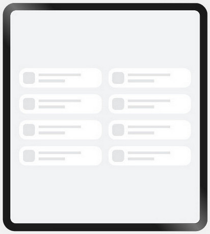  | 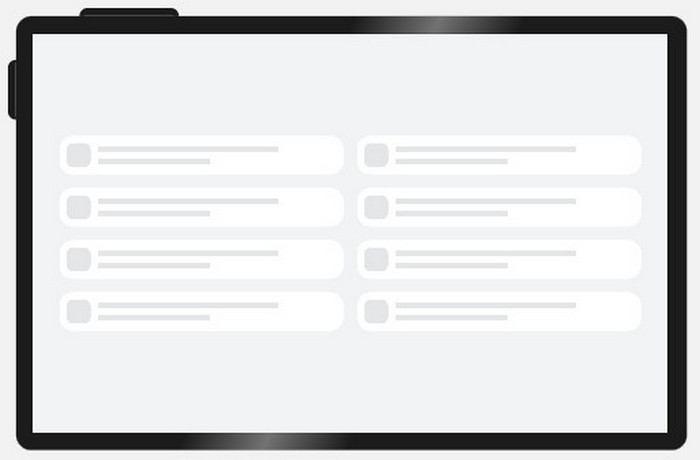 |


**实现方案**

不同断点下，配置栅格子组件占据不同的列数，即可实现“小屏单列显示、大屏双列显示”的效果。另外，还可以通过栅格组件的onBreakpointChange事件，调整页面中显示的元素数量。


**参考代码**


```
@Entry
@Component
struct RepeatSample {
  @State private currentBreakpoint: string = 'md'
  @State private listItems: number[] = [1, 2, 3, 4, 5, 6, 7, 8]
  @State private gridMargin: number = 24

  build() {
    Row() {
      // 当目标区域不足以显示所有元素时，可以通过上下滑动查看不同的元素
      Scroll() {
        GridRow({gutter: 24}) {
          ForEach(this.listItems, () => {
           // 通过配置元素在不同断点下占的列数，实现不同的布局效果
            GridCol({span: {sm: 12, md: 6, lg: 6}}) {
              Column() {
                RepeatItemContent()
              }
            }
          })
        }
        .margin({left: this.gridMargin, right: this.gridMargin})
        .onBreakpointChange((breakpoint: string) => {
          this.currentBreakpoint = breakpoint;
          if (breakpoint === 'lg') {
            this.gridMargin = 48
          } else if (breakpoint === 'md') {
            this.gridMargin = 32
          } else {
            this.gridMargin = 24
          }
        })
      }.height(348)
    }
    .height('100%')
    .backgroundColor('#F1F3F5')
  }
}

@Component
struct RepeatItemContent {
  build() {
    Flex() {
      Row() {
      }
      .width(43)
      .height(43)
      .borderRadius(12)
      .backgroundColor('#E4E6E8')
      .flexGrow(0)

      Flex({ direction: FlexDirection.Column, alignItems: ItemAlign.Start, justifyContent: FlexAlign.SpaceAround }) {
        Row() {
        }
        .height(10)
        .width('80%')
        .backgroundColor('#E4E6E8')

        Row() {
        }
        .height(10)
        .width('50%')
        .backgroundColor('#E4E6E8')
      }
      .flexGrow(1)
      .margin({ left: 13 })
    }
    .padding({ top: 13, bottom: 13, left: 13, right: 37 })
    .height(69)
    .backgroundColor('#FFFFFF')
    .borderRadius(24)
  }
}
```
