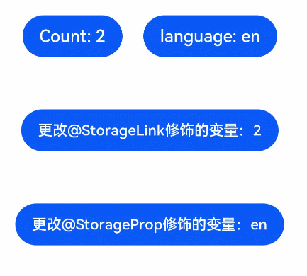

# 应用级变量的状态管理

在前面的章节中，已经讲述了如何管理页面级变量的状态，本章将说明如何管理应用级变量的状态，具体接口请参考[应用级变量的状态管理接口](../reference/arkui-ts/ts-state-management.md)。

## AppStorage

AppStorage是应用程序中的单例对象，由UI框架在应用程序启动时创建，在应用程序退出时销毁，为应用程序范围内的可变状态属性提供中央存储。

AppStorage包含整个应用程序中需要访问的所有状态属性，只要应用程序保持运行，AppStorage就会保存所有属性及属性值，属性值可以通过唯一的键值进行访问。


组件可以通过装饰器将应用程序状态数据与AppStorage进行同步，应用业务逻辑的实现也可以通过接口访问AppStorage。


AppStorage的选择状态属性可以与不同的数据源或数据接收器同步，这些数据源和接收器可以是设备上的本地或远程，并具有不同的功能，如数据持久性。这样的数据源和接收器可以独立于UI在业务逻辑中实现。

默认情况下，AppStorage中的属性是可变的，AppStorage还可使用不可变（只读）属性。

### @StorageLink装饰器

组件通过使用@StorageLink(key)装饰的状态变量，与AppStorage建立双向数据绑定，key为AppStorage中的属性键值。当创建包含@StorageLink的状态变量的组件时，该状态变量的值将使用AppStorage中的值进行初始化。在UI组件中对@StorageLink的状态变量所做的更改将同步到AppStorage，并从AppStorage同步到任何其他绑定实例中，如PersistentStorage或其他绑定的UI组件。

### @StorageProp装饰器

组件通过使用@StorageProp(key)装饰的状态变量，将与AppStorage建立单向数据绑定，key标识AppStorage中的属性键值。当创建包含@StoageProp的状态变量的组件时，该状态变量的值将使用AppStorage中的值进行初始化。AppStorage中的属性值的更改会导致绑定的UI组件进行状态更新。

### 示例

每次用户单击Count按钮时，this.varA变量值都会增加，此变量与AppStorage中的varA同步。每次用户单击当前语言按钮时，修改AppStorage中的languageCode，此修改会同步给this.lang变量。 

```ts
// xxx.ets

@Entry
@Component
struct ComponentA {
  @StorageLink('varA') varA: number = 2
  @StorageProp('languageCode') lang: string = 'en'
  private label: string = 'count'

  aboutToAppear() {
    this.label = (this.lang === 'zh') ? '数' : 'Count'
  }

  build() {
    Column(){
      Row({ space: 20 }) {
        Button(`${this.label}: ${this.varA}`)
          .onClick(() => {
            AppStorage.Set<number>('varA', AppStorage.Get<number>('varA') + 1)
          })
        Button(`lang: ${this.lang}`)
          .onClick(() => {
            if (this.lang === 'zh') {
              AppStorage.Set<string>('languageCode', 'en')
            } else {
              AppStorage.Set<string>('languageCode', 'zh')
            }
            this.label = (this.lang === 'zh') ? '数' : 'Count'
          })
      }
      .margin({ bottom: 50 })
      Row(){
        Button(`更改@StorageLink修饰的变量：${this.varA}`).fontSize(10)
          .onClick(() => {
            this.varA++
          })
      }.margin({ bottom: 50 })
      Row(){
        Button(`更改@StorageProp修饰的变量：${this.lang}`).fontSize(10)
          .onClick(() => {
            this.lang = 'test'
          })
      }
    }
  }
}
```

  

## LocalStorage

> **说明：** 该组件从API version 9开始支持。后续版本如有新增内容，则采用上角标单独标记该内容的起始版本。

LocalStorage是应用程序中的存储单元，生命周期跟随其关联的Ability。在Stage模型下，LocalStorage解决AppStorage共享范围过大的问题，提供Ability之间全局数据的隔离。同时，LocalStorage为应用程序范围内的可变状态属性和非可变状态属性提供存储，可变状态属性和非可变状态属性是构建应用程序UI的一部分，如一个Ability的UI。解决App与Ability之间数据互相干扰问题，多实例场景下同一个Ability类的不同Ability实例之间的数据互相干扰问题。在分布式迁移的场景下，Ability是系统调度的最小单元，配合LocalStorage更方便实现组件的数据迁移。

应用层：一个应用程序可以创建多个LocalStorage实例，应用程序的每一个Ability对应一个LocalStorage实例。

Ability： 一个应用程序可以拥有多个Ability，一个Ability中的所有子组件最多可以分配一个LocalStorage实例。并且，Ability中的所有子组件都将继承对此LocalStorage实例存储对象的访问权。

一个组件最多可以访问一个LocalStorage实例，一个LocalStorage对象可以分配给多个组件。

### @LocalStorageLink装饰器

组件通过使用@LocalStorageLink(key)装饰的状态变量，key值为LocalStorage中的属性键值，与LocalStorage建立双向数据绑定。当创建包含@LocalStorageLink的状态变量的组件时，该状态变量的值将会使用LocalStorage中的值进行初始化。如果LocalStorage中未定义初始值，将使用@LocalStorageLink定义的初始值。在UI组件中对@LocalStorageLink的状态变量所做的更改将同步到LocalStorage中，并从LocalStorage同步到Ability下的组件中。

### @LocalStorageProp装饰器

组件通过使用LocalStorageProp(key)装饰的状态变量，key值为LocalStorage中的属性键值，与LocalStorage建立单向数据绑定。当创建包含@LocalStorageProp的状态变量的组件时，该状态变量的值将使用LocalStorage中的值进行初始化。LocalStorage中的属性值的更改会导致当前Ability下的所有UI组件进行状态更新。

> **说明：** 创建LocalStorage实例时如未定义初始值，可以使用组件内@LocalStorageLink和@LocalStorageProp的初始值。如果定义时给定了初始值，那么不会再使用@LocalStorageLink和@LocalStorageProp的初始值。

### 示例1（在一个Ability创建的LocalStorage)

LocalStorage通过loadContent接口加载，接口详见[loadContent](../reference/apis/js-apis-window.md#loadcontent9-1)。

```
import Ability from '@ohos.application.Ability'
export default class MainAbility extends Ability {    
  storage : LocalStorage    
  onCreate() {    
    this.storage = new LocalStorage();
    this.storage.setOrCreate("storageSimpleProp",121);    
    console.log("[Demo MainAbility onCreate]"); 
  }  
  onDestroy() {    
    console.log("[Demo MainAbility onDestroy]")  
  }    
  onWindowStageCreate(windowStage) {
  // storage作为参数传递给loadContent接口。
    windowStage.loadContent("pages/index",this.storage)    
  }    
  onWindowStageDestroy() {
    console.log("[Demo] MainAbility onWindoeStageDestroy") 
  }    
  onForeground() {
    console.log("[Demo] MainAbility onForeground")   
  }    
  onBackground() {
    console.log("[Demo] MainAbility onBackground")    
  }
}
```

@Component组件获取数据

```
let storage = LocalStorage.GetShared()
@Entry(storage)
@Component
struct LocalStorageComponent {
  @LocalStorageLink("storageSimpleProp") simpleVarName: number = 0
  build() {
    Column(){
      Text(this.simpleVarName.toString())
        .onClick(()=>{
          this.simpleVarName +=1;
        })
      Text(JSON.stringify(this.simpleVarName))
        .fontSize(50)
    }
    .height(500)
  }
}
```

### 示例2（在Entry页面定义LocalStorage）

```
let storage = new LocalStorage({"PropA":47});
@Entry(storage)
@Component 
struct ComA {    
  @LocalStorageLink("PropA") storLink: number = 1;    
  build() {    
	Column() {        
	  Text(`Parent from LocalStorage ${ this.storLink }`)            				     
        .onClick(()=>this.storLink+=1)            
	  Child()    
 	}    
  }
}


@Component
struct Child{    
  @LocalStorageLink("PropA") storLink: number = 1;    
  build() {    
	Text(`Parent from LocalStorage ${ this.storLink }`)        
	  .onClick(()=>this.storLink+=1)    
  }
}
```

## PersistentStorage

PersistentStorage类提供了一些静态方法用来管理应用持久化数据，可以将特定标记的持久化数据链接到AppStorage中，并由AppStorage接口访问对应持久化数据，或者通过@StorageLink装饰器来访问对应key的变量。 

> **说明：**
>
> - PersistProp接口使用时，需要保证输入对应的key应当在AppStorage存在。
> - DeleteProp接口使用时，只能对本次启动已经link过的数据生效。

```ts
// xxx.ets
PersistentStorage.PersistProp("highScore", "0");

@Entry
@Component
struct PersistentComponent {
    @StorageLink('highScore') highScore: string = '0'
    @State currentScore: number = 0
    build() {
        Column() {
            if (this.currentScore === Number(this.highScore)) {
                Text(`new highScore : ${this.highScore}`)
            }
            Button() {
                Text(`goal!, currentScore : ${this.currentScore}`)
                    .fontSize(10)
            }.onClick(() => {
                this.currentScore++
                if (this.currentScore > Number(this.highScore)) {
                    this.highScore = this.currentScore.toString()
                }
            })
        }
    }
}
```

  

## Environment

Environment是框架在应用程序启动时创建的单例对象，它为AppStorage提供了一系列应用程序需要的环境状态属性，这些属性描述了应用程序运行的设备环境。Environment及其属性是不可变的，所有属性值类型均为简单类型。如下示例展示了从Environment获取语音环境：

```
Environment.EnvProp("accessibilityEnabled", "default");
var enable = AppStorage.Get("accessibilityEnabled");
```

accessibilityEnabled是Environment提供默认系统变量识别符。首先需要将对应系统属性绑定到AppStorage中，再通过AppStorage中的方法或者装饰器访问对应系统的属性数据。
