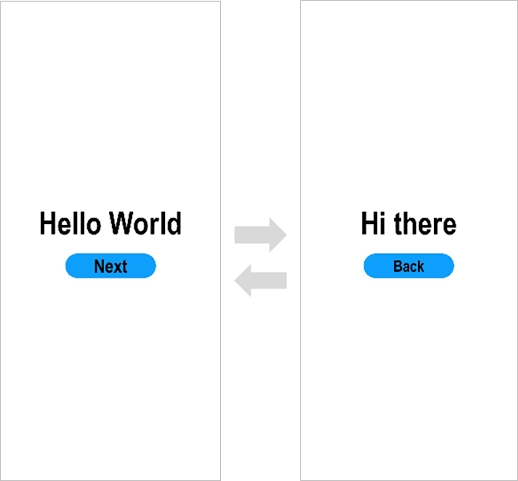

# 开发准备

本文档适用于OpenHarmony应用开发的初学者。通过构建一个简单的具有页面跳转/返回功能的应用（如下图所示），快速了解工程目录的主要文件，熟悉OpenHarmony应用开发流程。

在开始之前，您需要了解有关OpenHarmony应用的一些基本概念：UI框架的简单说明、Ability的基本概念。

## 基本概念

### UI框架

OpenHarmony提供了一套UI开发框架，即方舟开发框架（ArkUI框架）。方舟开发框架可为开发者提供应用UI开发所必需的能力，比如多种组件、布局计算、动画能力、UI交互、绘制等。

方舟开发框架针对不同目的和技术背景的开发者提供了两种开发范式，分别是基于eTS的声明式开发范式（简称“声明式开发范式”）和兼容JS的类Web开发范式（简称“类Web开发范式”）。以下是两种开发范式的简单对比。

| **开发范式名称** | **语言生态** | **UI更新方式** | **适用场景** | **适用人群** |
| -------- | -------- | -------- | -------- | -------- |
| 声明式开发范式 | eTS语言 | 数据驱动更新 | 复杂度较大、团队合作度较高的程序 | 移动系统应用开发人员、系统应用开发人员 |
| 类Web开发范式 | JS语言 | 数据驱动更新 | 界面较为简单的程序应用和卡片 | Web前端开发人员 |

更多UI框架的开发内容及指导，详见[UI开发](../ui/arkui-overview.md)。

### Ability

Ability是应用所具备能力的抽象，也是应用程序的重要组成部分。一个应用可以具备多种能力（即可以包含多个Ability）。OpenHarmony支持应用以Ability为单位进行部署。

Ability框架模型结构具有两种形态：

- **FA模型**：API 8及其更早版本的应用程序只能使用FA模型进行开发。更多FA模型的内容详见[FA模型综述](../ability/fa-brief.md)。

- **Stage模型**：从API 9开始，Ability框架引入并支持使用Stage模型进行开发。更多Stage模型的内容详见[Stage模型综述](../ability/stage-brief.md)。

FA模型和Stage模型的工程目录结构存在差异，Stage模型只支持使用eTS语言进行开发。

关于FA模型和Stage模型的整体架构和设计思想等更多区别，详见[Ability框架概述](../ability/ability-brief.md)。

快速入门提供了一个含有两个页面的Ability的开发实例。更多Ability的开发内容及指导，请见[Ability开发](../ability/ability-brief.md)。

## 工具准备

1. 安装最新版[DevEco Studio](https://developer.harmonyos.com/cn/develop/deveco-studio#download)。

2. 请参考[配置OpenHarmony SDK](https://developer.harmonyos.com/cn/docs/documentation/doc-guides/ohos-setting-up-environment-0000001263160443)，完成**DevEco Studio**的安装和开发环境配置。

完成上述操作及基本概念的理解后，可参照[使用eTS语言进行开发（Stage模型）](start-with-ets-stage.md)、[使用eTS语言开发（FA模型）](start-with-ets-fa.md)、[使用JS语言开发（FA模型）](../quick-start/start-with-js-fa.md)中的任一章节进行下一步体验和学习。
