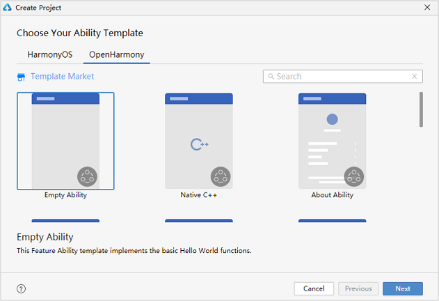
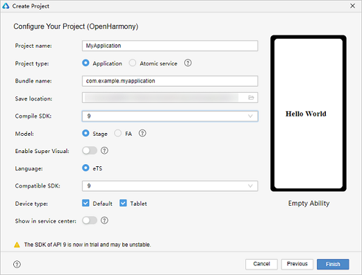
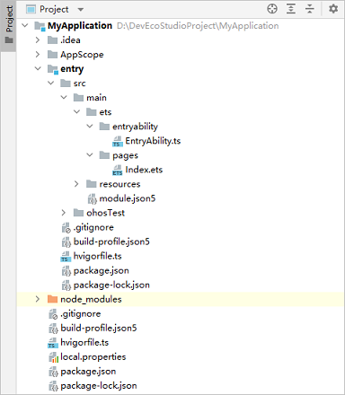

# 使用ArkTS语言开发（Stage模型）


> **说明：**
> 请使用**DevEco Studio V3.0.0.900 Beta3**及更高版本。
> 
> 为确保运行效果，本文以使用**DevEco Studio V3.0.0.993**版本为例，点击[此处](https://developer.harmonyos.com/cn/develop/deveco-studio#download)获取下载链接。


## 创建eTS工程

1. 若首次打开**DevEco Studio**，请点击**Create Project**创建工程。如果已经打开了一个工程，请在菜单栏选择**File** &gt; **New** &gt; **Create Project**来创建一个新工程。选择**OpenHarmony**模板库，选择模板“**Empty Ability**”，点击**Next**进行下一步配置。

   

2. 进入配置工程界面，**Compile SDK**选择“**9**”，**Model** 选择“**Stage**”，其他参数保持默认设置即可。

   

   > **说明：**
   >
   > 支持使用ArkTS[低代码开发](https://developer.harmonyos.com/cn/docs/documentation/doc-guides/ohos-low-code-development-0000001218440652)方式。
   >
   > 低代码开发方式具有丰富的UI界面编辑功能，通过可视化界面开发方式快速构建布局，可有效降低开发者的上手成本并提升开发者构建UI界面的效率。
   >
   > 如需使用低代码开发方式，请打开上图中的Enable Super Visual开关。
   
3. 点击**Finish**，工具会自动生成示例代码和相关资源，等待工程创建完成。


## eTS工程目录结构



- **AppScope &gt; app.json5**：应用的全局配置信息。

- **entry**：OpenHarmony工程模块，编译构建生成一个[HAP](../../glossary.md#hap)包。
  - **src &gt; main &gt; ets**：用于存放ets源码。
  - **src &gt; main &gt; ets &gt; Application &gt; AbilityStage.ts**：实现AbilityStage接口。
  - **src &gt; main &gt; ets &gt; MainAbility**：应用/服务的入口。
  - **src &gt; main &gt; ets &gt; MainAbility &gt; MainAbility.ts**：承载Ability生命周期。
  - **src &gt; main &gt; ets &gt; pages**：MainAbility包含的页面。
  - **src &gt; main &gt; resources**：用于存放应用/服务所用到的资源文件，如图形、多媒体、字符串、布局文件等。关于资源文件，详见[资源文件的分类](resource-categories-and-access.md)。
  - **src &gt; main &gt; module.json5**：模块配置文件。主要包含HAP包的配置信息、应用/服务在具体设备上的配置信息以及应用/服务的全局配置信息。具体的配置文件说明，详见[应用包结构配置文件的说明（Stage模型）](stage-structure.md)。
  - **build-profile.json5**：当前的模块信息 、编译信息配置项，包括buildOption、targets配置等。
  - **hvigorfile.js**：模块级编译构建任务脚本，开发者可以自定义相关任务和代码实现。

- **build-profile.json5**：应用级配置信息，包括签名、产品配置等。

- **hvigorfile.js**：应用级编译构建任务脚本。


## 构建第一个页面

1. 使用文本组件。

   工程同步完成后，在“**Project**”窗口，点击“**entry &gt; src &gt; main &gt; ets &gt; pages**”，打开“**index.ets**”文件，可以看到页面由Text组件组成。“**index.ets**”文件的示例如下：
   
   ```ts
   // index.ets
   @Entry
   @Component
   struct Index {
     @State message: string = 'Hello World'
   
     build() {
       Row() {
         Column() {
           Text(this.message)
             .fontSize(50)
             .fontWeight(FontWeight.Bold)
         }
         .width('100%')
       }
       .height('100%')
     }
   }
   ```

2. 添加按钮。

   在默认页面基础上，我们添加一个Button组件，作为按钮响应用户点击，从而实现跳转到另一个页面。“**index.ets**”文件的示例如下：
   
   ```ts
   // index.ets
   @Entry
   @Component
   struct Index {
     @State message: string = 'Hello World'
   
     build() {
       Row() {
         Column() {
           Text(this.message)
             .fontSize(50)
             .fontWeight(FontWeight.Bold)
           // 添加按钮，以响应用户点击
           Button() {
             Text('Next')
               .fontSize(30)
               .fontWeight(FontWeight.Bold)
           }
           .type(ButtonType.Capsule)
           .margin({
             top: 20
           })
           .backgroundColor('#0D9FFB')
           .width('40%')
           .height('5%')
         }
         .width('100%')
       }
       .height('100%')
     }
   }
   ```

3. 在编辑窗口右上角的侧边工具栏，点击Previewer，打开预览器。第一个页面效果如下图所示：

   


## 构建第二个页面

1. 创建第二个页面。

   - 新建第二个页面文件。在“**Project**”窗口，打开“**entry &gt; src &gt; main &gt; ets**”，右键点击“**pages**”文件夹，选择“**New &gt; eTS File**”，命名为“**second**”，点击“**Finish**”。可以看到文件目录结构如下：

      

      > **说明：**
      > 开发者也可以在右键点击“**pages**”文件夹时，选择“**New &gt; Page**”，则无需手动配置相关页面路由。
   - 配置第二个页面的路由。在“**Project**”窗口，打开“**entry &gt; src &gt; main &gt; resources &gt; base &gt; profile**”，在main_pages.json文件中的“src”下配置第二个页面的路由“pages/second”。示例如下：
     
      ```json
      {
        "src": [
          "pages/index",
          "pages/second"
        ]
      }
      ```

2. 添加文本及按钮。

   参照第一个页面，在第二个页面添加Text组件、Button组件等，并设置其样式。“**second.ets**”文件的示例如下：
   
   ```ts
   // second.ets
   @Entry
   @Component
   struct Second {
     @State message: string = 'Hi there'
   
     build() {
       Row() {
         Column() {
           Text(this.message)
             .fontSize(50)
             .fontWeight(FontWeight.Bold)
           Button() {
             Text('Back')
               .fontSize(25)
               .fontWeight(FontWeight.Bold)
           }
           .type(ButtonType.Capsule)
           .margin({
             top: 20
           })
           .backgroundColor('#0D9FFB')
           .width('40%')
           .height('5%')
         }
         .width('100%')
       }
       .height('100%')
     }
   }
   ```


## 实现页面间的跳转

页面间的导航可以通过[页面路由router](../reference/apis/js-apis-router.md#routerpush)来实现。页面路由router根据页面url找到目标页面，从而实现跳转。使用页面路由请导入router模块。

1. 第一个页面跳转到第二个页面。

   在第一个页面中，跳转按钮绑定onClick事件，点击按钮时跳转到第二页。“**index.ets**”文件的示例如下：
   
   ```ts
   // index.ets
   // 导入页面路由模块
   import router from '@ohos.router';
   
   @Entry
   @Component
   struct Index {
     @State message: string = 'Hello World'
   
     build() {
       Row() {
         Column() {
           Text(this.message)
             .fontSize(50)
             .fontWeight(FontWeight.Bold)
           // 添加按钮，以响应用户点击
           Button() {
             Text('Next')
               .fontSize(30)
               .fontWeight(FontWeight.Bold)
           }
           .type(ButtonType.Capsule)
           .margin({
             top: 20
           })
           .backgroundColor('#0D9FFB')
           .width('40%')
           .height('5%')
           // 跳转按钮绑定onClick事件，点击时跳转到第二页
           .onClick(() => {
             router.push({ url: 'pages/second' })
           })
         }
         .width('100%')
       }
       .height('100%')
     }
   }
   ```

2. 第二个页面返回到第一个页面。

   在第二个页面中，返回按钮绑定onClick事件，点击按钮时返回到第一页。“**second.ets**”文件的示例如下：
   
   ```ts
   // second.ets
   // 导入页面路由模块
   import router from '@ohos.router';
   
   @Entry
   @Component
   struct Second {
     @State message: string = 'Hi there'
   
     build() {
       Row() {
         Column() {
           Text(this.message)
             .fontSize(50)
             .fontWeight(FontWeight.Bold)
           Button() {
             Text('Back')
               .fontSize(25)
               .fontWeight(FontWeight.Bold)
           }
           .type(ButtonType.Capsule)
           .margin({
             top: 20
           })
           .backgroundColor('#0D9FFB')
           .width('40%')
           .height('5%')
           // 返回按钮绑定onClick事件，点击按钮时返回到第一页
           .onClick(() => {
             router.back()
           })
         }
         .width('100%')
       }
       .height('100%')
     }
   }
   ```

3. 打开index.ets文件，点击预览器中的按钮进行刷新。效果如下图所示：

   


## 使用真机运行应用

1. 将搭载OpenHarmony标准系统的开发板与电脑连接。

2. 点击**File**&gt; **Project Structure...** &gt; **Project**&gt;**SigningConfigs**界面勾选“**Automatically generate signature**”，等待自动签名完成即可，点击“**OK**”。如下图所示：

   

3. 在编辑窗口右上角的工具栏，点击按钮运行。效果如下图所示：

   

恭喜您已经使用ArkTS语言开发（Stage模型）完成了第一个OpenHarmony应用，快来[探索更多的OpenHarmony功能](../application-dev-guide.md)吧。
