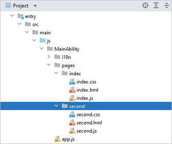
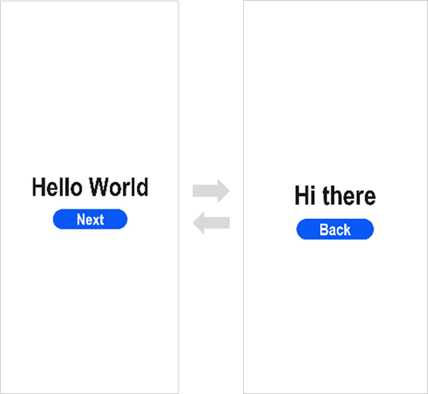

# 使用JS语言开发（FA模型）


> **说明：**
> 为确保运行效果，本文以使用**DevEco Studio V3.0.0.991 Beta4**版本为例，点击[此处](https://developer.harmonyos.com/cn/develop/deveco-studio#download_beta)获取下载链接。


## 创建JS工程

1. 若首次打开**DevEco Studio**，请点击**Create Project**创建工程。如果已经打开了一个工程，请在菜单栏选择**File** &gt; **New** &gt; **Create Project**来创建一个新工程。选择**OpenHarmony**模板库，选择模板“**Empty Ability**”，点击**Next**进行下一步配置。
   

2. 进入配置工程界面，**Compile SDK**选择“**8**”（**Complie SDK**选择“**9**”时注意同步选择 **Model** 为“**FA**”，此处以选择“**8**”为例），**Language**选择“**JS**”，其他参数保持默认设置即可。
   

   > **说明：**
   > DevEco Studio V2.2 Beta1及更高版本支持使用JS[低代码开发](https://developer.harmonyos.com/cn/docs/documentation/doc-guides/ohos-low-code-development-0000001218440652)方式。
   > 
   > 低代码开发方式具有丰富的UI界面编辑功能，通过可视化界面开发方式快速构建布局，可有效降低开发者的上手成本并提升开发者构建UI界面的效率。
   > 
   > 如需使用低代码开发方式，请打开上图中的Enable Super Visual开关。

3. 点击**Finish**，工具会自动生成示例代码和相关资源，等待工程创建完成。


## JS工程目录结构

- **entry**：OpenHarmony工程模块，编译构建生成一个[HAP](../../glossary.md#hap)包。
  - **src &gt; main &gt; js**：用于存放js源码。
  - **src &gt; main &gt; js &gt; MainAbility**：应用/服务的入口。
  - **src &gt; main &gt; js &gt; MainAbility &gt; i18n**：用于配置不同语言场景资源内容，比如应用文本词条、图片路径等资源。
  - **src &gt; main &gt; js &gt; MainAbility &gt; pages**：MainAbility包含的页面。
  - **src &gt; main &gt; js &gt; MainAbility &gt; app.js**：承载Ability生命周期。

  - **src &gt; main &gt; resources**：用于存放应用/服务所用到的资源文件，如图形、多媒体、字符串、布局文件等。关于资源文件，详见[资源限定与访问](../ui/js-framework-resource-restriction.md)。
  - **src &gt; main &gt; config.json**：模块配置文件。主要包含HAP包的配置信息、应用/服务在具体设备上的配置信息以及应用/服务的全局配置信息。具体的配置文件说明，详见[应用包结构配置文件的说明（FA模型）](package-structure.md)。
  - **build-profile.json5**：当前的模块信息 、编译信息配置项，包括buildOption、targets配置等。
  - **hvigorfile.js**：模块级编译构建任务脚本，开发者可以自定义相关任务和代码实现。

- **build-profile.json5**：应用级配置信息，包括签名、产品配置等。

- **hvigorfile.js**：应用级编译构建任务脚本。


## 构建第一个页面

1. 使用文本组件。
   工程同步完成后，在“**Project**”窗口，点击“**entry &gt; src &gt; main &gt; js &gt; MainAbility &gt; pages&gt; index**”，打开“**index.hml**”文件，设置Text组件内容。“**index.hml**”文件的示例如下：

   
   ```html
   <!-- index.hml -->
   <div class="container">
       <text class="title">
           Hello World
       </text>
   </div>
   ```

2. 添加按钮，并绑定onclick方法。
   在默认页面基础上，我们添加一个button类型的input组件，作为按钮响应用户点击，从而实现跳转到另一个页面。“**index.hml**”文件的示例代码如下：

   
   ```html
   <!-- index.hml -->
   <div class="container">
       <text class="title">
           Hello World
       </text>
   
   <!-- 添加按钮，值为Next，并绑定onclick方法-->
       <input class="btn" type="button" value="Next" onclick="onclick"></input>
   </div>
   ```

3. 设置页面样式。
   在“**Project**”窗口，点击“**entry &gt; src &gt; main &gt; js &gt; MainAbility &gt; pages&gt; index**”，打开“**index.css**”文件，可以对页面中文本、按钮设置宽高、字体大小、间距等样式。“**index.css**”文件的示例如下：

   
   ```css
   /* index.css */
   .container {
       display: flex;
       flex-direction: column;
       justify-content: center;
       align-items: center;
       left: 0px;
       top: 0px;
       width: 100%;
       height: 100%;
   }
   
   .title {
       font-size: 100px;
       font-weight: bold;
       text-align: center;
       width: 100%;
       margin: 10px;
   }
   
   .btn {
       font-size: 60px;
       font-weight: bold;
       text-align: center;
       width: 40%;
       height: 5%;
       margin-top: 20px;
   }
   ```

4. 在编辑窗口右上角的侧边工具栏，点击Previewer，打开预览器。第一个页面效果如下图所示：
   


## 构建第二个页面

1. 创建第二个页面。
   在“**Project**”窗口，打开“**entry &gt; src &gt; main &gt; js &gt; MainAbility**”，右键点击“**pages**”文件夹，选择“**New &gt; Page**”，命名为“**second**”，点击“**Finish**”，即完成第二个页面的创建。可以看到文件目录结构如下：

   

2. 添加文本及按钮。
   参照第一个页面，在第二个页面添加文本、按钮及点击按钮绑定页面返回等。“**second.hml**”文件的示例如下：

   
   ```html
   <!-- second.hml -->
   <div class="container">
       <text class="title">
           Hi there
       </text>
   
   <!-- 添加按钮，值为Back，并绑定back方法-->
       <input class="btn" type="button" value="Back" onclick="back"></input>
   </div>
   ```

3. **设置页面样式。**“**second.css**”文件的示例如下：
   
   ```css
   /* second.css */
   .container {
       display: flex;
       flex-direction: column;
       justify-content: center;
       align-items: center;
       left: 0px;
       top: 0px;
       width: 100%;
       height: 100%;
   }
   
   .title {
       font-size: 100px;
       font-weight: bold;
       text-align: center;
       width: 100%;
       margin: 10px;
   }
   
   .btn {
       font-size: 60px;
       font-weight: bold;
       text-align: center;
       width: 40%;
       height: 5%;
       margin-top: 20px;
   }
   ```


## 实现页面间的跳转

页面间的导航可以通过[页面路由router](../ui/ui-js-building-ui-routes.md)来实现。页面路由router根据页面url找到目标页面，从而实现跳转。使用页面路由请导入router模块。

1. 第一个页面跳转到第二个页面。
   在第一个页面中，跳转按钮绑定onclick方法，点击按钮时跳转到第二页。“**index.js**”示例如下：

   
   ```js
   // index.js
   import router from '@ohos.router';
   
   export default {
       onclick: function () {
           router.push({
               url: "pages/second/second"
           })
       }
   }
   ```

2. 第二个页面返回到第一个页面。
   在第二个页面中，返回按钮绑定back方法，点击按钮时返回到第一页。“**second.js**”示例如下：

   
   ```js
   // second.js
   import router from '@ohos.router';
   
   export default {
       back: function () {
           router.back()
       }
   }
   ```

3. 打开index文件夹下的任意一个文件，点击预览器中的按钮进行刷新。效果如下图所示：
   


## 使用真机运行应用

1. 将搭载OpenHarmony标准系统的开发板与电脑连接。

2. 点击**File**&gt; **Project Structure...** &gt; **Project**&gt;**Signing Configs**界面勾选“**Automatically generate signing**”，等待自动签名完成即可，点击“**OK**”。如下图所示：
   

3. 在编辑窗口右上角的工具栏，点击按钮运行。效果如下图所示：
   

恭喜您已经使用JS语言开发（FA模型）完成了第一个OpenHarmony应用，快来[探索更多的OpenHarmony功能](../application-dev-guide.md)吧。
