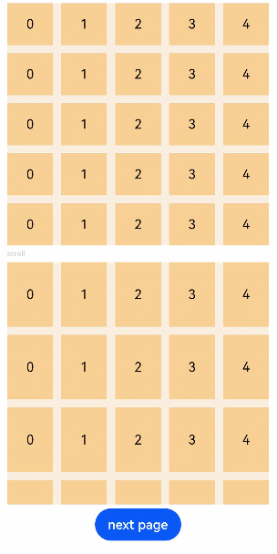

# Grid

网格容器，由“行”和“列”分割的单元格所组成，通过指定“项目”所在的单元格做出各种各样的布局。

>  **说明：**
>
>  该组件从API Version 7开始支持。后续版本如有新增内容，则采用上角标单独标记该内容的起始版本。


## 子组件

包含[GridItem](ts-container-griditem.md)子组件。


## 接口

Grid(scroller?: Scroller)

**参数：**
| 参数名       | 参数类型                                     | 必填   | 参数描述                    |
| --------- | ---------------------------------------- | ---- | ----------------------- |
| scroller  | [Scroller](ts-container-scroll.md#scroller) | 否    | 可滚动组件的控制器。用于与可滚动组件进行绑定。 |

## 属性

除支持[通用属性](ts-universal-attributes-size.md)外，还支持以下属性：

| 名称 | 参数类型 | 描述 |
| -------- | -------- | -------- |
| columnsTemplate | string | 设置当前网格布局列的数量，不设置时默认1列。<br/>例如,&nbsp;'1fr&nbsp;1fr&nbsp;2fr'&nbsp;是将父组件分3列，将父组件允许的宽分为4等份，第一列占1份，第二列占1份，第三列占2份。|
| rowsTemplate | string | 设置当前网格布局行的数量，不设置时默认1行。<br/>例如,&nbsp;'1fr&nbsp;1fr&nbsp;2fr'是将父组件分三行，将父组件允许的高分为4等份，第一行占1份，第二行占一份，第三行占2份。 |
| columnsGap | Length | 设置列与列的间距。<br/>默认值：0 |
| rowsGap | Length | 设置行与行的间距。<br/>默认值：0 |
| scrollBar      | [BarState](ts-appendix-enums.md#barstate) | 设置滚动条状态。<br/>默认值：BarState.Off |
| scrollBarColor | string&nbsp;\|&nbsp;number&nbsp;\|&nbsp;Color              | 设置滚动条的颜色。 |
| scrollBarWidth | string \| number    | 设置滚动条的宽度。 |
| cachedCount | number                                   | 设置预加载的GridItem的数量。具体使用可参考[减少应用白块说明](../../ui/ui-ts-performance-improvement-recommendation.md#减少应用滑动白块)。<br/>默认值：1 |
| editMode <sup>8+</sup>                   | boolean | 设置Grid是否进入编辑模式，进入编辑模式可以拖拽Grid组件内部[GridItem](ts-container-griditem.md)。<br/>默认值：flase |
| layoutDirection<sup>8+</sup>             | [GridDirection](#griddirection8枚举说明) | 设置布局的主轴方向。<br/>默认值：GridDirection.Row |
| maxCount<sup>8+</sup> | number  | 当layoutDirection是Row/RowReverse时，表示可显示的最大列数<br/>当layoutDirection是Column/ColumnReverse时，表示可显示的最大行数。<br/>默认值：Infinity |
| minCount<sup>8+</sup> | number  | 当layoutDirection是Row/RowReverse时，表示可显示的最小列数。<br/>当layoutDirection是Column/ColumnReverse时，表示可显示的最小行数。<br/>默认值：1 |
| cellLength<sup>8+</sup> | number  | 当layoutDirection是Row/RowReverse时，表示一行的高度。<br/>当layoutDirection是Column/ColumnReverse时，表示一列的宽度。<br/>默认值：第一个元素的大小 |
| multiSelectable<sup>8+</sup> | boolean | 是否开启鼠标框选。<br/>默认值：false<br/>-&nbsp;false：关闭框选。<br/>-&nbsp;true：开启框选。 |
| supportAnimation<sup>8+</sup> | boolean | 是否支持动画。<br/>默认值：false |

Grid组件根据rowsTemplate、columnsTemplate属性的设置情况，可分为以下三种布局模式：

1、rowsTemplate、columnsTemplate同时设置：

Grid只展示固定行列数的元素，其余元素不展示，且Grid不可滚动。例如rowsTemplate、columnsTemplate都设置为"1fr 1fr"时，则仅展示两行两列，共4个元素，其他元素不展示。

此模式下以下属性不生效：layoutDirection、maxCount、minCount、cellLength。

2、rowsTemplate、columnsTemplate仅设置其中的一个：

元素按照设置的方向进行排布，超出的元素可通过滚动的方式展示。例如Grid有十个元素，且设置columnsTemplate为"1fr 1fr 1fr"，则Grid有三列，元素先填满一行，再填充下一行。在Grid区域外的元素，可通过竖直方向的滚动，进行展示。

此模式下以下属性不生效：layoutDirection、maxCount、minCount、cellLength。

3、rowsTemplate、columnsTemplate都不设置：

元素在layoutDirection方向上排布，列数由Grid的宽度、首个元素的宽度、minCount、maxCount、columnsGap共同决定；行数由Grid高度、首个元素高度、cellLength、rowsGap共同决定。超出行列容纳范围的元素不显示，也不能通过滚动进行展示。

此模式下仅生效以下属性：layoutDirection、maxCount、minCount、cellLength、editMode、columnsGap、rowsGap。

## GridDirection<sup>8+</sup>枚举说明

| 名称   | 描述                                   |
  | ------ | -------------------------------------- |
| Row  | 主轴布局方向沿水平方向布局，即自左往右先填满一行，再去填下一行。 |
| Column | 主轴布局方向沿垂直方向布局，即自上往下先填满一列，再去填下一列。 |
| RowReverse    | 主轴布局方向沿水平方向反向布局，即自右往左先填满一行，再去填下一行。 |
| ColumnReverse   | 主轴布局方向沿垂直方向反向布局，即自下往上先填满一列，再去填下一列。 |

## 事件

除支持[通用事件](ts-universal-events-click.md)外，还支持以下事件：

| 名称 | 功能描述 |
| -------- | -------- |
| onScrollIndex(event: (first: number) => void) | 当前网格显示的起始位置item发生变化时触发。<br/>- first: 当前显示的网格起始位置的索引值。 |
| onItemDragStart(event: (event: ItemDragInfo, itemIndex: number) => (() => any) \| void) | 开始拖拽网格元素时触发。<br/>- event: 见[ItemDragInfo对象说明](#itemdraginfo对象说明)。<br/>- itemIndex: 被拖拽网格元素索引值。 |
| onItemDragEnter(event: (event: ItemDragInfo) => void) | 拖拽进入网格元素范围内时触发。<br/>- event: 见[ItemDragInfo对象说明](#itemdraginfo对象说明)。 |
| onItemDragMove(event: (event: ItemDragInfo, itemIndex: number, insertIndex: number) => void) | 拖拽在网格元素范围内移动时触发。<br/>- event: 见[ItemDragInfo对象说明](#itemdraginfo对象说明)。<br/>- itemIndex: 拖拽起始位置。<br/>- insertIndex: 拖拽插入位置。 |
| onItemDragLeave(event: (event: ItemDragInfo, itemIndex: number) => void) | 拖拽离开网格元素时触发。<br/>- event: 见[ItemDragInfo对象说明](#itemdraginfo对象说明)。<br/>- itemIndex: 拖拽离开的网格元素索引值。 |
| onItemDrop(event: (event: ItemDragInfo, itemIndex: number, insertIndex: number, isSuccess: boolean) => void) | 绑定该事件的网格元素可作为拖拽释放目标，当在网格元素内停止拖拽时触发。<br/>- event: 见[ItemDragInfo对象说明](#itemdraginfo对象说明)。<br/>- itemIndex: 拖拽起始位置。<br/>- insertIndex: 拖拽插入位置。<br/>- isSuccess: 是否成功释放。 |

## ItemDragInfo对象说明

| 名称         | 类型         |   描述         |
| ---------- | ---------- | ---------- |
| x | number |  当前拖拽点的x坐标。    |
| y   | number |  当前拖拽点的y坐标。    |

## 示例

```ts
// xxx.ets
@Entry
@Component
struct GridExample {
  @State Number: String[] = ['0', '1', '2', '3', '4']

  build() {
    Column({ space: 5 }) {
      Grid() {
        ForEach(this.Number, (day: string) => {
          ForEach(this.Number, (day: string) => {
            GridItem() {
              Text(day)
                .fontSize(16)
                .backgroundColor(0xF9CF93)
                .width('100%')
                .height('100%')
                .textAlign(TextAlign.Center)
            }
          }, day => day)
        }, day => day)
      }
      .columnsTemplate('1fr 1fr 1fr 1fr 1fr')
      .rowsTemplate('1fr 1fr 1fr 1fr 1fr')
      .columnsGap(10)
      .rowsGap(10)
      .width('90%')
      .backgroundColor(0xFAEEE0)
      .height(300)

      Text('scroll').fontColor(0xCCCCCC).fontSize(9).width('90%')
      Grid() {
        ForEach(this.Number, (day: string) => {
          ForEach(this.Number, (day: string) => {
            GridItem() {
              Text(day)
                .fontSize(16)
                .backgroundColor(0xF9CF93)
                .width('100%')
                .height(80)
                .textAlign(TextAlign.Center)
            }
          }, day => day)
        }, day => day)
      }
      .columnsTemplate('1fr 1fr 1fr 1fr 1fr')
      .columnsGap(10)
      .rowsGap(10)
      .onScrollIndex((first: number) => {
        console.info(first.toString())
      })
      .width('90%')
      .backgroundColor(0xFAEEE0)
      .height(300)
    }.width('100%').margin({ top: 5 })
  }
}
```

