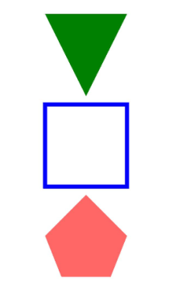

# Polygon

多边形绘制组件。

>  **说明：**
>
>  该组件从API Version 7开始支持。后续版本如有新增内容，则采用上角标单独标记该内容的起始版本。


## 子组件

无


## 接口

Polygon(value?: {width?: string | number, height?: string | number})

**参数：**

| 参数名 | 参数类型 | 必填 | 默认值 | 参数描述 |
| -------- | -------- | -------- | -------- | -------- |
| width | string \| number | 否 | 0 | 宽度。 |
| height | string \| number | 否 | 0 | 高度。 |


## 属性

除支持[通用属性](ts-universal-attributes-size.md)外，还支持以下属性：

| 名称 | 类型 | 默认值 | 描述 |
| -------- | -------- | -------- | -------- |
| points | Array&lt;Point&gt; | [] | 多边形的顶点坐标列表。 |
| fill | [ResourceColor](ts-types.md) | Color.Black | 设置填充区域颜色。 |
| fillOpacity | number&nbsp;\|&nbsp;string&nbsp;\|&nbsp;[Resource](ts-types.md#resource类型) | 1 | 设置填充区域透明度。 |
| stroke | [ResourceColor](ts-types.md) | - | 设置边框颜色，不设置时，默认没有边框线条。 |
| strokeDashArray | Array&lt;Length&gt; | [] | 设置边框间隙。 |
| strokeDashOffset | number&nbsp;\|&nbsp;string | 0 | 边框绘制起点的偏移量。 |
| strokeLineCap | [LineCapStyle](ts-appendix-enums.md#linecapstyle) | LineCapStyle.Butt | 设置边框端点绘制样式。 |
| strokeLineJoin | [LineJoinStyle](ts-appendix-enums.md#linejoinstyle) | LineJoinStyle.Miter | 设置边框拐角绘制样式。 |
| strokeMiterLimit | number&nbsp;\|&nbsp;string | 4 | 设置锐角绘制成斜角的极限值。 |
| strokeOpacity | number&nbsp;\|&nbsp;string&nbsp;\|&nbsp;[Resource](ts-types.md#resource类型) | 1 | 设置边框透明度。 |
| strokeWidth | Length | 1 | 设置边框宽度。 |
| antiAlias | boolean | true | 是否开启抗锯齿效果。 |

## Point

点坐标类型。

| 名称      | 类型定义             | 描述                                                         |
| --------- | -------------------- | ------------------------------------------------------------ |
| Point | [number,&nbsp;number] | 第一个参数为x轴坐标，第二个参数为y轴坐标（相对坐标）。 |


## 示例

```ts
// xxx.ets
@Entry
@Component
struct PolygonExample {
  build() {
    Column({ space: 10 }) {
      // 在 100 * 100 的矩形框中绘制一个三角形，起点(0, 0)，经过(50, 100)，终点(100, 0)
      Polygon({ width: 100, height: 100 })
        .points([[0, 0], [50, 100], [100, 0]])
        .fill(Color.Green)
      // 在 100 * 100 的矩形框中绘制一个四边形，起点(0, 0)，经过(0, 100)和(100, 100)，终点(100, 0)
      Polygon().width(100).height(100)
        .points([[0, 0], [0, 100], [100, 100], [100, 0]])
        .fillOpacity(0)
        .strokeWidth(5)
        .stroke(Color.Blue)
      // 在 100 * 100 的矩形框中绘制一个五边形，起点(50, 0)，依次经过(0, 50)、(20, 100)和(80, 100)，终点(100, 50)
      Polygon().width(100).height(100)
        .points([[50, 0], [0, 50], [20, 100], [80, 100], [100, 50]])
        .fill(Color.Red)
        .fillOpacity(0.6)
    }.width('100%').margin({ top: 10 })
  }
}
```


