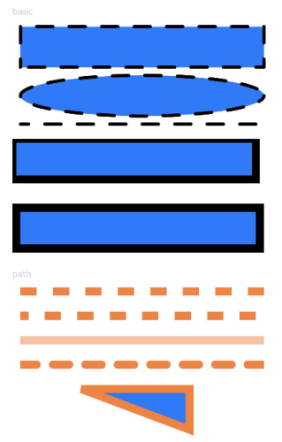

# Shape

绘制组件的父组件，父组件中会描述所有绘制组件均支持的通用属性。


1、绘制组件使用Shape作为父组件，实现类似SVG的效果。

2、绘制组件单独使用，用于在页面上绘制指定的图形。

>  **说明：**
>
>  该组件从API Version 7开始支持。后续版本如有新增内容，则采用上角标单独标记该内容的起始版本。


## 子组件

可以包含子组件。


## 接口

Shape(value?: PixelMap)

**参数：**

| 参数名 | 参数类型 | 必填 | 参数描述 |
| -------- | -------- | -------- | -------- |
| value | PixelMap | 否 | 绘制目标，可将图形绘制在指定的PixelMap对象中，若未设置，则在当前绘制目标中进行绘制。 |


## 属性

| 参数名称 | 参数类型 | 必填 | 参数描述 |
| -------- | -------- | -------- | -------- |
| viewPort | {<br/>x:&nbsp;string&nbsp;\|&nbsp;number,<br/>y:&nbsp;string&nbsp;\|&nbsp;number,<br/>width:&nbsp;string&nbsp;\|&nbsp;number,<br/>height:&nbsp;string&nbsp;\|&nbsp;number<br/>} | 是 | 形状的视口。 |
| fill | [ResourceColor](../../ui/ts-types.md) | 否 | 填充颜色。<br/>默认值：Color.Black |
| fillOpacity | string&nbsp;\|&nbsp;number&nbsp;\|&nbsp;[Resource](../../ui/ts-types.md#resource类型) |  |  |
| stroke | [ResourceColor](../../ui/ts-types.md) | 否 | 边框颜色。 |
| strokeDashArray | Array&lt;Length&gt; | 否 | 设置边框的间隙。 |
| strokeDashOffset | Length | 否 | 边框绘制起点的偏移量。 |
| strokeLineCap | [LineCapStyle](ts-appendix-enums.md#linecapstyle) | 否 | 路径端点绘制样式。<br/>默认值：LineCapStyle.Butt |
| strokeLineJoin | [LineJoinStyle](ts-appendix-enums.md#linejoinstyle) | 否 | 边框拐角绘制样式。<br/>默认值：LineJoinStyle.Miter |
| strokeMiterLimit | number&nbsp;\|&nbsp;string | 否 | 锐角绘制成斜角的极限值。<br/>默认值：4 |
| strokeOpacity | number&nbsp;\|&nbsp;string&nbsp;\|&nbsp;[Resource](../../ui/ts-types.md#resource类型) | 否 | 设置边框的不透明度。<br/>默认值：1 |
| strokeWidth | Length | 否 | 设置边框的宽度。<br/>默认值：1 |
| antiAlias | boolean | 否 | 是否开启抗锯齿。<br/>默认值：true |
| mesh<sup>8+</sup> | Array&lt;number&gt;,number,number | 否 | 设置mesh效果。第一个参数为长度（column+1）*（row+1）*2的数组，它记录了扭曲后的位图和各个顶点位置，第二个参数为mesh矩阵列数column，第三个参数为mesh矩阵行数row。 |

## 示例

```ts
// xxx.ets
@Entry
@Component
struct ShapeExample {
  build() {
    Column({ space: 5 }) {
      Text('basic').fontSize(30).fontColor(0xCCCCCC).width(320)
      // 在Shape的(-2, -2)点绘制一个 300 * 50 带边框的矩形,颜色0x317Af7,边框颜色黑色,边框宽度4,边框间隙20,向左偏移10,尖端样式圆角,拐角样式圆角,抗锯齿(默认开启)
      // 在Shape的(-2, 58)点绘制一个 300 * 50 带边框的椭圆,颜色0x317Af7,边框颜色黑色,边框宽度4,边框间隙20,向左偏移10,尖端样式圆角,拐角样式圆角,抗锯齿(默认开启)
      // 在Shape的(-2, 118)点绘制一个 300 * 10 线段,颜色0x317Af7,边框颜色黑色,宽度4,间隙20,向左偏移10,尖端样式圆角,拐角样式圆角,抗锯齿(默认开启)
      Shape() {
        Rect().width(300).height(50)
        Ellipse().width(300).height(50).offset({ x: 0, y: 60 })
        Path().width(300).height(10).commands('M0 0 L900 0').offset({ x: 0, y: 120 })
      }
      .viewPort({ x: -2, y: -2, width: 304, height: 130 })
      .fill(0x317Af7).stroke(Color.Black).strokeWidth(4)
      .strokeDashArray([20]).strokeDashOffset(10).strokeLineCap(LineCapStyle.Round)
      .strokeLineJoin(LineJoinStyle.Round).antiAlias(true)
      // 在Shape的(-1, -1)点绘制一个 300 * 50 带边框的矩形,颜色0x317Af7,边框颜色黑色,边框宽度2
      Shape() {
        Rect().width(300).height(50)
      }.viewPort({ x: -1, y: -1, width: 302, height: 52 }).fill(0x317Af7).stroke(Color.Black).strokeWidth(2)

      Text('border').fontSize(30).fontColor(0xCCCCCC).width(320).margin({top:30})
      // 在Shape的(0, -5)点绘制一个 300 * 10 直线,颜色0xEE8443,边框宽度10,边框间隙20
      Shape() {
        Path().width(300).height(10).commands('M0 0 L900 0')
      }.viewPort({ x: 0, y: -5, width: 300, height: 20 }).stroke(0xEE8443).strokeWidth(10).strokeDashArray([20])
      // 在Shape的(0, -5)点绘制一个 300 * 10 直线,颜色0xEE8443,边框宽度10,边框间隙20,向左偏移10
      Shape() {
        Path().width(300).height(10).commands('M0 0 L900 0')
      }
      .viewPort({ x: 0, y: -5, width: 300, height: 20 })
      .stroke(0xEE8443).strokeWidth(10).strokeDashArray([20]).strokeDashOffset(10)
      // 在Shape的(0, -5)点绘制一个 300 * 10 直线,颜色0xEE8443,边框宽度10,透明度0.5
      Shape() {
        Path().width(300).height(10).commands('M0 0 L900 0')
      }.viewPort({ x: 0, y: -5, width: 300, height: 20 }).stroke(0xEE8443).strokeWidth(10).strokeOpacity(0.5)
      // 在Shape的(0, -5)点绘制一个 300 * 10 直线,颜色0xEE8443,边框宽度10,边框间隙20,向左偏移10,尖端样式圆角
      Shape() {
        Path().width(300).height(10).commands('M0 0 L900 0')
      }
      .viewPort({ x: 0, y: -5, width: 300, height: 20 })
      .stroke(0xEE8443).strokeWidth(10).strokeDashArray([20]).strokeLineCap(LineCapStyle.Round)
      // 在Shape的(-5, -5)点绘制一个 300 * 50 带边框的矩形,颜色0x317Af7,边框宽度10,边框颜色0xEE8443,拐角样式圆角
      Shape() {
        Rect().width(300).height(100)
      }
      .viewPort({ x: -5, y: -5, width: 310, height: 120 })
      .fill(0x317Af7).stroke(0xEE8443).strokeWidth(10).strokeLineJoin(LineJoinStyle.Round)
      Shape() {
        Path().width(300).height(60).commands('M0 0 L400 0 L400 200 Z')
      }
      .viewPort({ x: -80, y: -5, width: 310, height: 100 })
      .fill(0x317Af7).stroke(0xEE8443).strokeWidth(10)
      .strokeLineJoin(LineJoinStyle.Miter).strokeMiterLimit(5)
    }.width('100%').margin({ top: 15 })
  }
}
```


