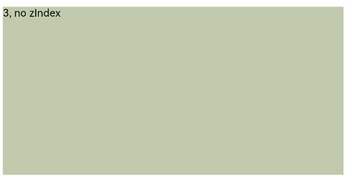
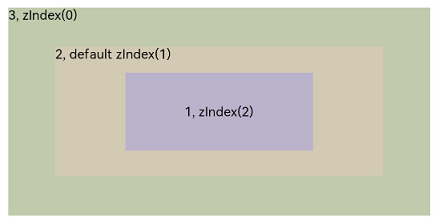

# Z序控制

组件的Z序，设置组件的堆叠顺序。

>  **说明：**
>
>  从API Version 7开始支持。后续版本如有新增内容，则采用上角标单独标记该内容的起始版本。


## 属性


| 名称 | 参数类型 | 描述 |
| -------- | -------- | -------- |
| zIndex | number | 同一容器中兄弟组件显示层级关系。zIndex值越大，显示层级越高，即zIndex值大的组件会覆盖在zIndex值小的组件上方。 |


## 示例

```ts
// xxx.ets
@Entry
@Component
struct ZIndexExample {
  build() {
    Column() {
      Stack() {
        // stack会重叠组件, 默认后定义的在最上面，具有较高zIndex值的元素在zIndex较小的元素前面
        Text('1, zIndex(2)')
          .size({ width: '40%', height: '30%' }).backgroundColor(0xbbb2cb)
          .zIndex(2)
        Text('2, default zIndex(1)')
          .size({ width: '70%', height: '50%' }).backgroundColor(0xd2cab3).align(Alignment.TopStart)
          .zIndex(1)
        Text('3, zIndex(0)')
          .size({ width: '90%', height: '80%' }).backgroundColor(0xc1cbac).align(Alignment.TopStart)
      }.width('100%').height(200)
    }.width('100%').height(200)
  }
}
```
Stack容器内子组件不设置zIndex的效果

Stack容器子组件设置zIndex后效果


