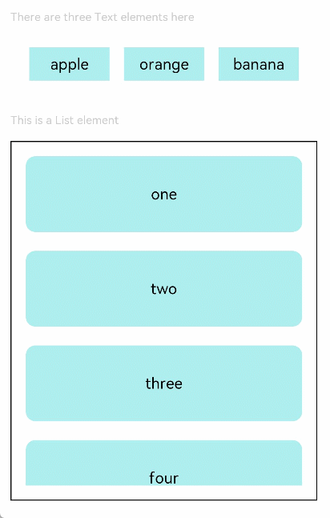

# 拖拽事件

拖拽事件指被长按后拖拽时触发的事件。

>  **说明：**
>  从API Version 8开始支持。后续版本如有新增内容，则采用上角标单独标记该内容的起始版本。

## 事件

| 名称                                       | 支持冒泡 | 功能描述                                     |
| ---------------------------------------- | ---- | ---------------------------------------- |
| onDragStart(callback:&nbsp;(event:&nbsp;DragEvent,&nbsp;extraParams?:&nbsp;string)&nbsp;=&gt;&nbsp;&nbsp;[CustomBuilder](../../ui/ts-types.md)) | 否    | 第一次拖拽此事件绑定的组件时，触发回调。<br/>- event：拖拽事件信息，包括拖拽点坐标。<br/>- extraParams：拖拽事件额外信息，详见extraParam类型描述。<br/>返回值：当前跟手效果所拖拽的对象，用于显示拖拽时的提示组件。<br/>长按150毫秒(ms)可触发拖拽事件。优先级：长按手势配置时间小于等于150毫秒(ms)时，长按手势优先触发，否则拖拽事件优先触发。 |
| onDragEnter(callback:&nbsp;(event:&nbsp;DragEvent,&nbsp;extraParams?:&nbsp;string)&nbsp;=&gt;&nbsp;void) | 否    | 拖拽进入组件范围内时，触发回调。<br/>- event：拖拽事件信息，包括拖拽点坐标。<br/>- extraParams：拖拽事件额外信息，详见extraParam类型描述。<br/>当监听了onDrop事件时，此事件才有效。 |
| onDragMove(callback:&nbsp;(event:&nbsp;DragEvent,&nbsp;extraParams?:&nbsp;string)&nbsp;=&gt;&nbsp;void) | 否    | 拖拽在组件范围内移动时，触发回调。<br/>- event：拖拽事件信息，包括拖拽点坐标。<br/>- extraParams：拖拽事件额外信息，详见extraParam类型描述。<br/>当监听了onDrop事件时，此事件才有效。 |
| onDragLeave(callback:&nbsp;(event:&nbsp;DragEvent,&nbsp;extraParams?:&nbsp;string)&nbsp;=&gt;&nbsp;void) | 否    | 拖拽离开组件范围内时，触发回调。<br/>- event：拖拽事件信息，包括拖拽点坐标。<br/>- extraParams：拖拽事件额外信息，详见extraParam类型描述。<br/>当监听了onDrop事件时，此事件才有效。 |
| onDrop(callback:&nbsp;(event:&nbsp;DragEvent,&nbsp;extraParams?:&nbsp;string)&nbsp;=&gt;&nbsp;void) | 否    | 绑定此事件的组件可作为拖拽释放目标，当在本组件范围内停止拖拽行为时，触发回调。<br/>- event：拖拽事件信息，包括拖拽点坐标。<br/>- extraParams：拖拽事件额外信息，详见extraParam类型描述。 |

- extraParam说明<br>
  用于返回组件在拖拽中需要用到的额外信息。
  extraParam是Json对象转换的string字符串，可以通过Json.parse转换的Json对象获取如下属性。
  | 属性名称          | 属性类型   | 描述                                       |
  | ------------- | ------ | ---------------------------------------- |
  | selectedIndex | number | 当拖拽事件设在父容器的子元素时，selectedIndex表示当前被拖拽子元素是父容器第selectedIndex个子元素，selectedIndex从0开始。<br/>仅在ListItem组件中生效。 |
  | insertIndex   | number | 当前拖拽元素在List组件中放下时，insertIndex表示被拖拽元素插入该组件的第insertIndex个位置，insertIndex从0开始。<br/>仅在List组件的拖拽事件中生效。 |

### DragEvent对象说明
| 名称     | 返回值类型  | 功能描述             |
| ------ | ------ | ---------------- |
| getX() | number | 当前拖拽点x轴坐标，单位为vp。 |
| getY() | number | 当前拖拽点y轴坐标，单位为vp。 |

## 示例

```ts
// xxx.ets
@Entry
@Component
struct DragExample {
  @State numbers: string[] = ['one', 'two', 'three', 'four', 'five', 'six']
  @State text: string = ''
  @State bool: boolean = false
  @State bool1: boolean = false
  @State appleVisible: Visibility = Visibility.Visible
  @State orangeVisible: Visibility = Visibility.Visible
  @State bananaVisible: Visibility = Visibility.Visible
  @State select: number = 0

  @Builder pixelMapBuilder() {
    Column() {
      Text(this.text)
        .width('50%').height(60).fontSize(16).borderRadius(10)
        .textAlign(TextAlign.Center).backgroundColor(Color.Yellow)
    }
  }

  build() {
    Column() {
      Text('There are three Text elements here')
        .fontSize(12).fontColor(0xCCCCCC).width('90%')
        .textAlign(TextAlign.Start).margin(5)
      Flex({ direction: FlexDirection.Row, alignItems: ItemAlign.Center, justifyContent: FlexAlign.SpaceAround }) {
        Text('apple').width('25%').height(35).fontSize(16)
          .textAlign(TextAlign.Center).backgroundColor(0xAFEEEE)
          .visibility(this.appleVisible)
          .onDragStart(() => {
            this.bool = true
            this.text = 'apple'
            this.appleVisible = Visibility.Hidden
            return this.pixelMapBuilder
          })
        Text('orange').width('25%').height(35).fontSize(16)
          .textAlign(TextAlign.Center).backgroundColor(0xAFEEEE)
          .visibility(this.orangeVisible)
          .onDragStart(() => {
            this.bool = true
            this.text = 'orange'
            this.orangeVisible = Visibility.Hidden
            return this.pixelMapBuilder
          })
        Text('banana').width('25%').height(35).fontSize(16)
          .textAlign(TextAlign.Center).backgroundColor(0xAFEEEE)
          .visibility(this.bananaVisible)
          .onDragStart((event: DragEvent, extraParams: string) => {
            console.log('Text onDragStarts, ' + extraParams)
            this.bool = true
            this.text = 'banana'
            this.bananaVisible = Visibility.Hidden
            return this.pixelMapBuilder
          })
      }.border({ width: 1 }).width('90%').padding({ top: 10, bottom: 10 }).margin(10)

      Text('This is a List element').fontSize(12)
        .fontColor(0xCCCCCC).width('90%')
        .textAlign(TextAlign.Start).margin(15)
      List({ space: 20, initialIndex: 0 }) {
        ForEach(this.numbers, (item) => {
          ListItem() {
            Text('' + item)
              .width('100%').height(80).fontSize(16).borderRadius(10)
              .textAlign(TextAlign.Center).backgroundColor(0xAFEEEE)
          }
          .onDragStart((event: DragEvent, extraParams: string) => {
            console.log('ListItem onDragStarts, ' + extraParams)
            var jsonString = JSON.parse(extraParams)
            this.bool1 = true
            this.text = this.numbers[jsonString.selectedIndex]
            this.select = jsonString.selectedIndex
            return this.pixelMapBuilder
          })
        }, item => item)
      }
      .editMode(true)
      .height('50%').width('90%').border({ width: 1 })
      .divider({ strokeWidth: 2, color: 0xFFFFFF, startMargin: 20, endMargin: 20 })
      .onDragEnter((event: DragEvent, extraParams: string) => {
        console.log('List onDragEnter, ' + extraParams)
      })
      .onDragMove((event: DragEvent, extraParams: string) => {
        console.log('List onDragMove, ' + extraParams)
      })
      .onDragLeave((event: DragEvent, extraParams: string) => {
        console.log('List onDragLeave, ' + extraParams)
      })
      .onDrop((event: DragEvent, extraParams: string) => {
        var jsonString = JSON.parse(extraParams)
        if (this.bool) {
          this.numbers.splice(jsonString.insertIndex, 0, this.text)
          this.bool = false
        } else if (this.bool1) {
          this.numbers.splice(jsonString.selectedIndex, 1)
          this.numbers.splice(jsonString.insertIndex, 0, this.text)
          this.bool = false
          this.bool1 = false
        }
      })
    }.width('100%').height('100%').padding({ top: 20 }).margin({ top: 20 })
  }
}
```


