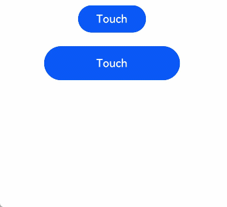

# 触摸事件

当手指在组件上按下、滑动、抬起时触发。

> **说明：**
>
> 从API Version 7开始支持。后续版本如有新增内容，则采用上角标单独标记该内容的起始版本。


## 事件

| 名称                                                         | 是否冒泡 | 功能描述                                                     |
| ------------------------------------------------------------ | -------- | ------------------------------------------------------------ |
| onTouch(event:&nbsp;(event?:&nbsp;TouchEvent)&nbsp;=&gt;&nbsp;void) | 是       | 触摸动作触发该方法调用，event返回值见[TouchEvent](#touchevent对象说明)介绍。 |


## TouchEvent对象说明

| 名称                | 类型                                       | 描述           |
| ------------------- | ---------------------------------------- | ------------ |
| type                | [TouchType](ts-appendix-enums.md#touchtype)      | 触摸事件的类型。     |
| touches             | Array&lt;[TouchObject](#touchobject对象说明)&gt; | 全部手指信息。      |
| changedTouches      | Array&lt;[TouchObject](#touchobject对象说明)&gt; | 当前发生变化的手指信息。 |
| stopPropagation      | () => void | 阻塞事件冒泡。 |
| timestamp<sup>8+</sup> | number | 事件时间戳。触发事件时距离系统启动的时间间隔，单位纳秒。 |
| target<sup>8+</sup> | [EventTarget](ts-universal-events-click.md\#eventtarget8对象说明) | 触发事件的元素对象显示区域。 |
| source<sup>8+</sup> | [SourceType](ts-gesture-settings.md\#sourcetype枚举说明) | 事件输入设备。 |


## TouchObject对象说明

| 名称    | 类型                                        | 描述                                  |
| ------- | ------------------------------------------- | ------------------------------------- |
| type    | [TouchType](ts-appendix-enums.md#touchtype) | 触摸事件的类型。                      |
| id      | number                                      | 手指唯一标识符。                      |
| screenX | number                                      | 触摸点相对于应用窗口左上角的X坐标。   |
| screenY | number                                      | 触摸点相对于应用窗口左上角的Y坐标。   |
| x       | number                                      | 触摸点相对于被触摸元素左边沿的X坐标。 |
| y       | number                                      | 触摸点相对于被触摸元素上边沿的Y坐标。 |

## 示例

```ts
// xxx.ets
@Entry
@Component
struct TouchExample {
  @State text: string = '';
  @State eventType: string = '';

  build() {
    Column() {
      Button('Touch').height(40).width(100)
        .onTouch((event: TouchEvent) => {
          if (event.type === TouchType.Down) {
            this.eventType = 'Down';
          }
          if (event.type === TouchType.Up) {
            this.eventType = 'Up';
          }
          if (event.type === TouchType.Move) {
            this.eventType = 'Move';
          }
          this.text = 'TouchType:' + this.eventType + '\nDistance between touch point and touch element:\nx: '
          + event.touches[0].x + '\n' + 'y: ' + event.touches[0].y + '\nComponent globalPos:('
          + event.target.area.globalPosition.x + ',' + event.target.area.globalPosition.y + ')\nwidth:'
          + event.target.area.width + '\nheight:' + event.target.area.height;
        })
      Button('Touch').height(50).width(200).margin(20)
        .onTouch((event: TouchEvent) => {
          if (event.type === TouchType.Down) {
            this.eventType = 'Down';
          }
          if (event.type === TouchType.Up) {
            this.eventType = 'Up';
          }
          if (event.type === TouchType.Move) {
            this.eventType = 'Move';
          }
          this.text = 'TouchType:' + this.eventType + '\nDistance between touch point and touch element:\nx: '
          + event.touches[0].x + '\n' + 'y: ' + event.touches[0].y + '\nComponent globalPos:('
          + event.target.area.globalPosition.x + ',' + event.target.area.globalPosition.y + ')\nwidth:'
          + event.target.area.width + '\nheight:' + event.target.area.height;
        })
      Text(this.text)
    }.width('100%').padding(30)
  }
}
```


