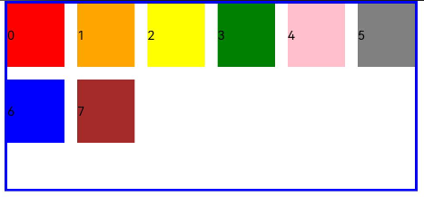
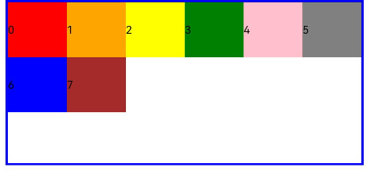
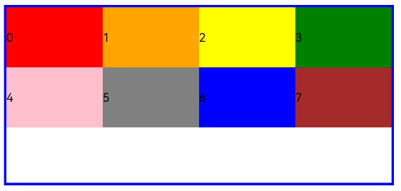
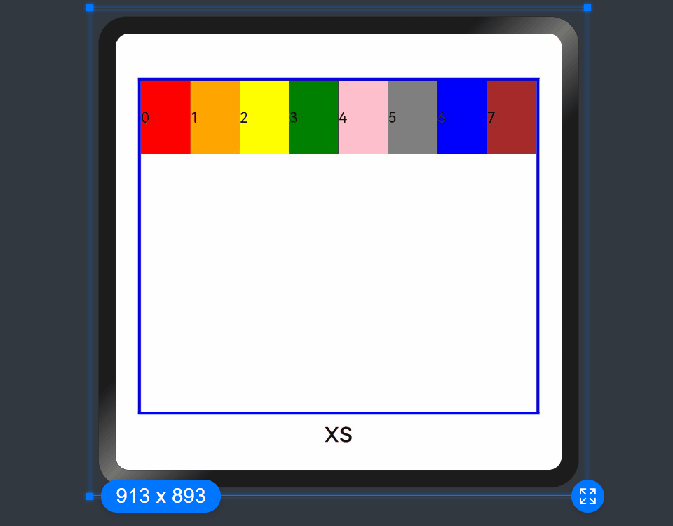
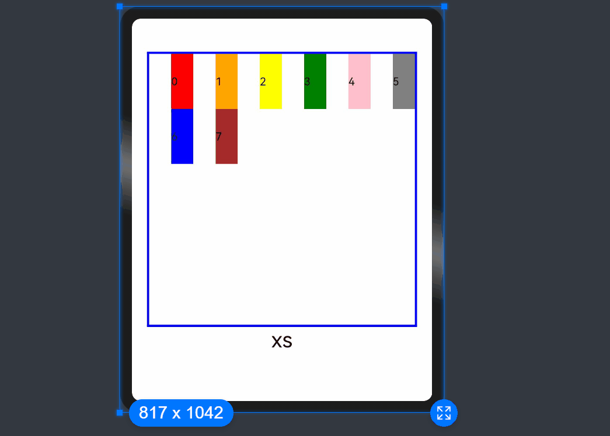

# 栅格布局

栅格组件[GridRow](../reference/arkui-ts/ts-container-gridrow.md)和[GridCol](../reference/arkui-ts/ts-container-gridcol.md)
相对于[GridContainer](../reference/arkui-ts/ts-container-gridcontainer.md)提供了更灵活、更全面的栅格系统实现方案。其中GridRow为栅格容器组件，仅可以和栅格子组件(GridCol)在栅格布局场景中使用。GridCol作为栅格子组件使用。

## 栅格容器GridRow

栅格布局的列数，间隔，排列方向和断点由GridRow组件的columns、gutter、direction、breakpoints四个关键特性决定。

### 栅格布局的总列数

栅格布局的主要定位工具，设置栅格布局的总列数。

* 当columns类型为number时，栅格布局在任何尺寸设备下都被分为columns列。当未设置columns时，使用系统默认的值，将栅格布局分成12列。
  

```ts
  GridRow({}) {
    ForEach(this.bgColors, (color, index) => {
      GridCol() {
        Row() {
          Text(${index})
        }.width("100%").height("50")                 
      }
      .backgroundColor(color)
      .span(2)  
    })
  }           
  ```

  
  
  如上所示，栅格系统默认分成12列，每一个子组件占2列，前6个子组件在第一排。

* 当columns类型为GridRowColumnOption时，支持下面六种不同尺寸（xs, sm, md, lg, xl, xxl）设备的总列数设置，各个尺寸下数值可不同。
  

```ts
  columns: {sm: 8, md: 10} 
  ```

  如上，若只设置sm, md的栅格总列数，则较小的尺寸使用默认columns值12，较大的尺寸使用前一个尺寸的columns。这里详单与设置了，xs:12, sm:8, md:10, lg:10, xl:10, xxl:10。

### 栅格子组件间距

GridRow的gutter属性设置元素之间的距离，决定内容间的紧密程度。

* 当类型为number时，同时设置栅格子组件间的水平垂直边距且相等。
  

```ts
  GridRow({ gutter: 10 }){}
  ```

  
  
  上例中，子组件水平与垂直方向距离相邻元素的间距为10。

* 当类型为GutterOption时，单独设置栅格子组件水平垂直边距，x属性为水平方向间距，y为垂直方向间距。
  

```ts
  GridRow({ gutter: { x: 20, y: 50 } }){}
  ```

    

### 排列方向

通过GridRow的direction属性设置栅格子组件在栅格容器中的排列方向。

* 子组件默认从左往右排列。
  

```ts
  GridRow({ direction: GridRowDirection.Row }){}
  ```

  
  

* 子组件从右往左排列。
  

```ts
  GridRow({ direction: GridRowDirection.RowReverse }){}
  ```

  
  

### 栅格系统断点

断点以设备宽度为基准，将应用宽度分成了几个不同的区间，即不同的断点。开发者可根据需要在不同的区间下实现不同的页面布局效果。
[栅格系统默认断点](ui-ts-layout-grid-container.md#系统栅格断点)将设备宽度分为xs、sm、md、lg四类，尺寸范围如下：

| 断点名称  | 取值范围（vp）| 
| --------| ------ | 
| xs | [0, 320）   | 
| sm | [320, 520) | 
| md | [520, 840) | 
| lg | [840, +∞)  | 

在GridRow新栅格组件中，允许开发者使用breakpoints自定义修改断点的取值范围，最多支持6个断点，除了默认的四个断点外，还可以启用xl，xxl两个断点。

* 针对断点位置，开发者可以根据实际使用场景，通过一个单调递增数组设置，例如：
  

```ts
  breakpoints: {value: ["100vp", "200vp"]}
  ```

  表示启用xs、sm、md共3个断点，小于100vp为xs，100vp-200vp为sm，大于200vp为md。
  
  

```ts
  breakpoints: {value: ["320vp", "520vp", "840vp", "1080vp"]}
  ```

  表示启用xs、sm、md、lg、xl共5个断点，breakpoints最多支持六个断点，断点范围数量value数组值的个数最多为5。
* 设置以窗口或者容器为断点切换参考物，实现栅格系统监听对象设置。 考虑到应用可能以非全屏窗口的形式显示，以应用窗口宽度为参照物更为通用。

  breakpoints示例如下：
  

```ts
  GridRow({
    breakpoints: {
      value: ['200vp', '300vp', '400vp', '500vp', '600vp'],
      reference: BreakpointsReference.WindowSize
    }
  }) {
       ForEach(this.bgColors, (color, index) => {
         GridCol({
           span: {
             xs: 2,
             sm: 3,
             md: 4,
             lg: 6,
             xl: 8,
             xxl: 12
           }
         }) {
           Row() {
             Text(${index})
           }.width("100%").height("50vp")
         }.backgroundColor(color)
  
       })
  }                                                                    
  ```

  

首次通过设置断点位置，得到一系列断点区间；其次，借助栅格组件能力监听应用窗口大小的变化，判断应用当前处于哪个断点区间，进而可以调整应用的布局，实现栅格布局。

## 栅格子组件GridCol

GridCol组件作为GridRow组件的子组件，通过给GridCol传参或者设置属性两种方式，设置span，offset，order的值。


* span的设置
  

```ts
  GridCol({ span: 2 }){}
  GridCol({ span: { xs: 1, sm: 2, md: 3, lg: 4 } }){}
  GridCol(){}.span(2)
  GridCol(){}.span({ xs: 1, sm: 2, md: 3, lg: 4 })
  ```

* offset的设置
  

```ts
  GridCol({ offset: 2 }){}
  GridCol({ offset: { xs: 2, sm: 2, md: 2, lg: 2 } }){}
  GridCol(){}.offset(2)
  GridCol(){}.offset({ xs: 1, sm: 2, md: 3, lg: 4 }) 
  ```

* order的设置
  

```ts
  GridCol({ order: 2 }){}
  GridCol({ order: { xs: 1, sm: 2, md: 3, lg: 4 } }){}
  GridCol(){}.order(2)
  GridCol(){}.order({ xs: 1, sm: 2, md: 3, lg: 4 })
  ```

  下面使用参数的方式演示各属性的使用

### span

子组件占栅格布局的列数，决定了子组件的宽度，默认为1。

* 当类型为number时，子组件在所有尺寸设备下占用的列数相同。
  

```ts
  GridRow({ columns: 8 }) {
    ForEach(this.bgColors, (color, index) => {
      GridCol({ span: 2 }) {      
        Row() {
          Text(${index})
        }.width("100%").height("50vp")          
      }
      .backgroundColor(color)
    })
  }                
  ```

  

- 当类型为GridColColumnOption时，支持六种不同尺寸（xs, sm, md, lg, xl, xxl）设备中子组件所占列数设置,各个尺寸下数值可不同。
  

```ts
  GridRow({ columns: 8 }) {
    ForEach(this.bgColors, (color, index) => {
      GridCol({ span: { xs: 1, sm: 2, md: 3, lg: 4 } }) {      
        Row() {
          Text(${index})
        }.width("100%").height("50vp")          
      }
      .backgroundColor(color)
    })
  }                
  ```

  

### offset

栅格子组件相对于前一个子组件的偏移列数，默认为0。
* 当类型为number时，子组件偏移相同列数。
  

```ts
  GridRow() {
    ForEach(this.bgColors, (color, index) => {
      GridCol({ offset: 2 }) {      
        Row() {
          Text("" + index)
        }.width("100%").height("50vp")          
      }
      .backgroundColor(color)
    })
  }                
  ```

  
  栅格默认分成12列，每一个子组件默认占1列，偏移2列，每个子组件及间距共占3列，一行放四个子组件。

- 当类型为GridColColumnOption时，支持六种不同尺寸（xs, sm, md, lg, xl, xxl）设备中子组件所占列数设置,各个尺寸下数值可不同。
  

```ts
  GridRow() {
    ForEach(this.bgColors, (color, index) => {
      GridCol({ offset: { xs: 1, sm: 2, md: 3, lg: 4 } }) {      
        Row() {
          Text("" + index)
        }.width("100%").height("50vp")          
      }
      .backgroundColor(color)
    })
  }                
  ```

  

### order

  栅格子组件的序号，决定子组件排列次序。当子组件不设置order或者设置相同的order, 子组件按照代码顺序展示。当子组件设置不同的order时，order较大的组件在前，较小的在后。
  当子组件部分设置order，部分不设置order时，未设置order的子组件依次排序靠前，设置了order的子组件按照数值从大到小排列。
* 当类型为number时，子组件在任何尺寸下排序次序一致。

```ts
GridRow() {
  GridCol({ order: 5 }) {
    Row() {
      Text("1")
    }.width("100%").height("50vp")
  }.backgroundColor(Color.Red)
  GridCol({ order: 4 }) {
    Row() {
      Text("2")
    }.width("100%").height("50vp")
  }.backgroundColor(Color.Orange)
  GridCol({ order: 3 }) {
    Row() {
      Text("3")
    }.width("100%").height("50vp")
  }.backgroundColor(Color.Yellow)
  GridCol({ order: 2 }) {
    Row() {
      Text("4")
    }.width("100%").height("50vp")
  }.backgroundColor(Color.Green)
}            
```

  
* 当类型为GridColColumnOption时，支持六种不同尺寸（xs, sm, md, lg, xl, xxl）设备中子组件排序次序设置。

  


