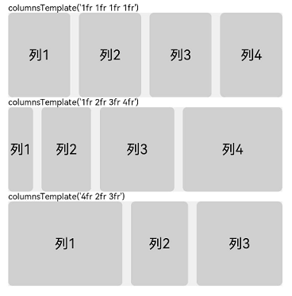
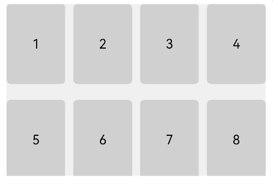
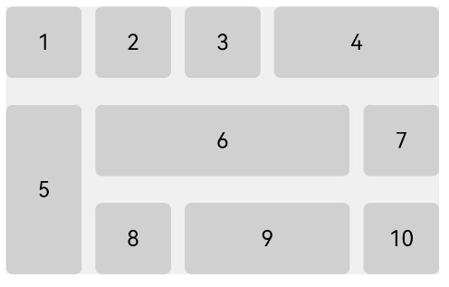
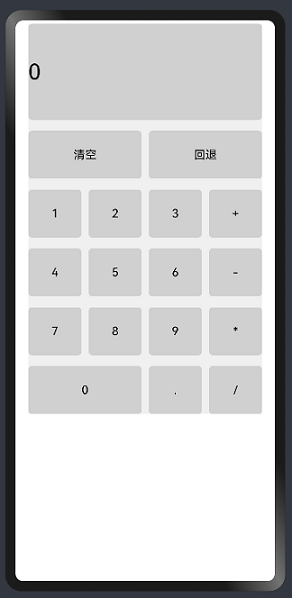

# 网格布局

网格布局（GridLayout）是自适应布局中一种重要的布局，具备较强的页面均分能力，子组件占比控制能力。
通过[Grid](../reference/arkui-ts/ts-container-grid.md)容器组件和子组件[GridItem](../reference/arkui-ts/ts-container-griditem.md)实现，
Grid用于设置网格布局相关参数，GridItem定义子组件相关特征。优势如下：

1. 容器组件尺寸发生变化时，所有子组件以及间距等比例调整，实现布局的自适应能力。
2. 支持自定义网格布局行数和列数，以及每行每列尺寸占比。
3. 支持设置网格布局中子组件的行列间距。
4. 支持设置子组件横跨几行或者几列。
 


## 容器组件Grid设置

### 行列数量占比
通过Grid的组件的columnsTemplate和rowTemplate属性设置网格布局行列数量与尺寸占比。

下面以columnsTemplate为例，介绍该属性的设置，该属性值是一个由多个空格和'数字+fr'间隔拼接的字符串，fr的个数即网格布局的列数，fr前面的数值大小，用于计算该列在网格布局宽度上的占比，最终决定该列的宽度。

```ts
Grid().columnsTemplate('1fr 1fr 1fr 1fr')
```

定义了四个等分的列，每列宽度相等。

```ts
Grid().columnsTemplate('1fr 2fr 3fr 4fr')
```

定义了四列，每列宽度比值为1:2:3:4。

```ts
Grid().columnsTemplate('4fr 2fr 3fr')
```

定义了三列，每列宽度比值为4:2:3。

效果如下：



### 排列方式

通过layoutDirection可以设置网格布局的主轴方向，决定子组件的排列方式。
可选值包括Row，RowReverse， Column， ColumnReverse四种情况。
效果如下：


### 行列间距

columnsGap用于设置网格子组件GridItem垂直方向的间距，rowsGap用于设置GridItem水平方向的间距。

```ts
Grid()
.columnsTemplate('1fr 1fr 1fr 1fr')
.columnsGap(10)
.rowsGap(20)
```



上图中，设置网格布局子组件间的垂直间距为20，水平间距为10。

## 网格子组件GridItem设置

### 设置子组件占的行列数

网格布局的行列标号从1开始，依次编号。

子组件横跨多行时，通过rowStart设置子组件起始行编号，rowEnd设置终点行编号。当rowStart值与rowEnd值相同时，子组件只占一个网格。示例如下：

```ts
Grid() {
    GridItem() {
      Text('5')
        .fontSize(16)
        .textAlign(TextAlign.Center)
        .textStyle()
    }.rowStart(2).rowEnd(3)  // 5子组件从第二列到第三列

    GridItem() {
      Text('4')
        .fontSize(16)
        .textAlign(TextAlign.Center)
        .textStyle()
    }.columnStart(4).columnEnd(5) // 4从第四列到第五列
  
    GridItem() {
      Text('6')
        .fontSize(16)
        .textAlign(TextAlign.Center)
        .textStyle()
    }.columnStart(2).columnEnd(4)  // 6从第二列到第四列

    GridItem() {
      Text('9')
        .fontSize(16)
        .textAlign(TextAlign.Center)
        .textStyle()
    }.columnStart(3).columnEnd(4)    // 从第三列到第四列
}
.columnsTemplate('1fr 1fr 1fr 1fr 1fr')
.rowsTemplate('1fr 1fr 1fr')
.columnsGap(10)
.rowsGap(20)
.width('90%')
.backgroundColor(0xF0F0F0)
.height('200vp')
.layoutDirection(GridDirection.Column)
```



## 场景示例

使用grid布局实现一个计算器的排布效果，代码如下：

```ts
@Entry
@Component
struct GridExample {
  @State Number: Array<string> = ['1', '2', '3', '+', '4', '5', '6', '-', '7', '8', '9', '*', '0', '.', '/']

  @Styles textStyle(){
    .backgroundColor(0xd0d0d0)
    .width('100%')
    .height('100%')
    .borderRadius(5)
  }

  build() {
    Column({ space: 5 }) {
      Grid() {
        GridItem() {
          Text('0')
            .fontSize(30)
            .textStyle()
        }.columnStart(1).columnEnd(4)

        GridItem() {
          Text('清空')
            .fontSize(16)
            .textAlign(TextAlign.Center)
            .textStyle()
        }.columnStart(1).columnEnd(2)

        GridItem() {
          Text('回退')
            .fontSize(16)
            .textAlign(TextAlign.Center)
            .textStyle()
        }.columnStart(3).columnEnd(4)

        ForEach(this.Number, (day: string) => {
          if (day === '0') {
            GridItem() {
              Text(day)
                .fontSize(16)
                .textAlign(TextAlign.Center)
                .textStyle()
            }.columnStart(1).columnEnd(2)
          } else {
            GridItem() {
              Text(day)
                .fontSize(16)
                .textAlign(TextAlign.Center)
                .textStyle()
            }
          }
        })
      }
      .columnsTemplate('1fr 1fr 1fr 1fr')
      .rowsTemplate('2fr 1fr 1fr 1fr 1fr 1fr')
      .columnsGap(10)
      .rowsGap(15)
      .width('90%')
      .backgroundColor(0xF0F0F0)
      .height('70%')
    }.width('100%').margin({ top: 5 })
  }
}
```

在大屏设备上展示效果如下：


在小屏设备下展示效果如下：


