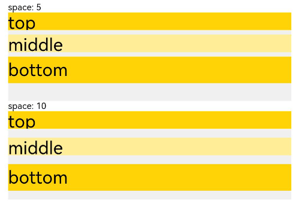
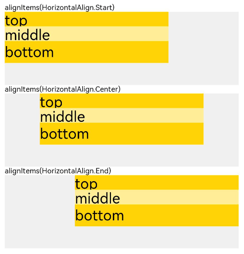
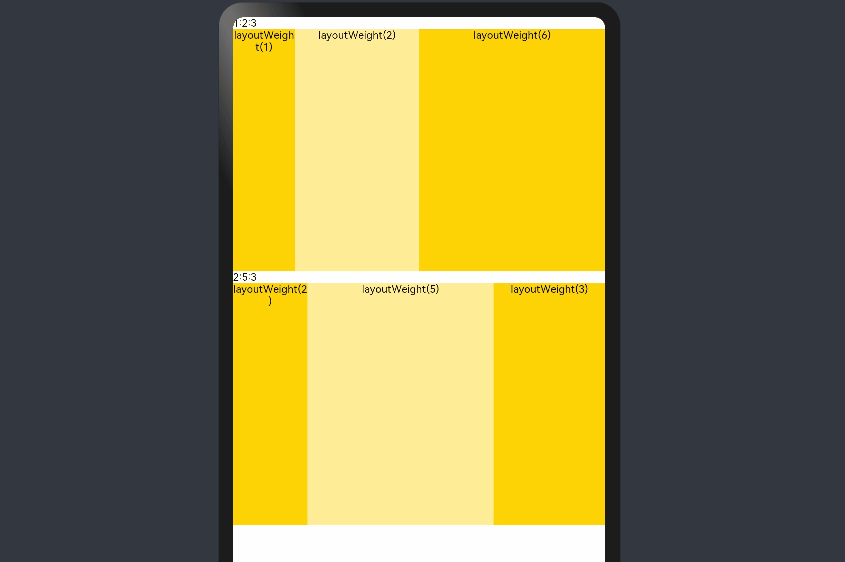
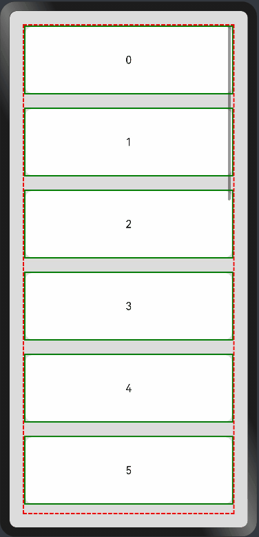
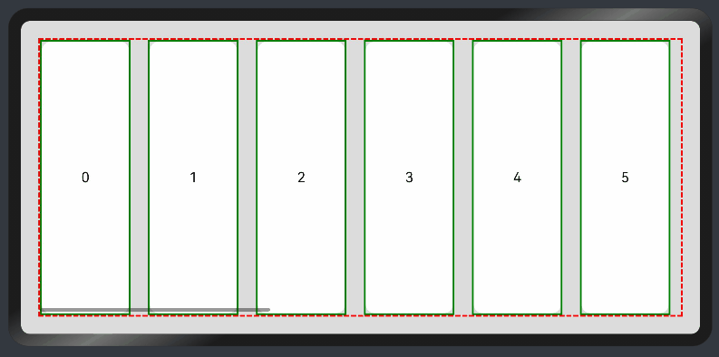

# 线性布局

线性布局(LinearLayout)是开发中最常用的布局。线性布局的子组件在线性方向上（水平方向和垂直方向）依次排列。

通过线性容器[Row](../reference/arkui-ts/ts-container-row.md)和[Column](../reference/arkui-ts/ts-container-column.md)实现线性布局。Column容器内子组件按照垂直方向排列，Row组件中，子组件按照水平方向排列。

## 线性布局的排列

线性布局的排列方向由所选容器组件决定。根据不同的排列方向，选择使用Row或Column容器创建线性布局，通过调整space，alignItems，justifyContent属性调整子组件的间距，水平垂直方向的对齐方式。
1. 通过space参数设置主轴（排列方向）上子组件的间距。达到各子组件在排列方向上的等间距效果。
2. 通过alignItems属性设置子组件在交叉轴（排列方向的垂直方向）的对齐方式。且在各类尺寸屏幕中，表现一致。其中，交叉轴为垂直方向时，取值为[VerticalAlign类型](../reference/arkui-ts/ts-appendix-enums.md#verticalalign)，水平方向取值为[HorizontalAlign类型](../reference/arkui-ts/ts-appendix-enums.md#horizontalalign)。
3. 通过justifyContent属性设置子组件在主轴（排列方向）上的对齐方式。实现布局的自适应均分能力。取值为[FlexAlign类型](../reference/arkui-ts/ts-appendix-enums.md#flexalign)。

具体使用以及效果如下表所示：

|属性名|描述|Row效果图|Column效果图|
|------|---------------------------|----------------------------|---------------------------|
|space |- 横向布局中各子组件的在水平方向的间距<br> - 纵向布局中个子组件垂直方向间距|         |    |
|alignItems |容器排列方向的垂直方向上，子组件在父容器中的对齐方式|            ||
|justifyContent |容器排列方向上，子组件在父容器中的对齐方式 |            ||

## 自适应拉伸

在线性布局下，常用空白填充组件[Blank](../reference/arkui-ts/ts-basic-components-blank.md)，在容器主轴方向自动填充空白空间，达到自适应拉伸效果。

```ts
@Entry
@Component
struct BlankExample {
  build() {
    Column() {
      Row() {
        Text('Bluetooth').fontSize(18)
        Blank()
        Toggle({ type: ToggleType.Switch, isOn: true })
      }.backgroundColor(0xFFFFFF).borderRadius(15).padding({ left: 12 }).width('100%')
    }.backgroundColor(0xEFEFEF).padding(20).width('100%')
  }
}
```


## 自适应缩放

自适应缩放是指在各种不同大小设备中，子组件按照预设的比例，尺寸随容器尺寸的变化而变化。在线性布局中有下列方法实现：

1. 父容器尺寸确定时，设置了layoutWeight属性的子组件与兄弟元素占主轴尺寸按照权重进行分配，忽略元素本身尺寸设置，在任意尺寸设备下，自适应占满剩余空间。
    

  ```ts
  @Entry
  @Component
  struct layoutWeightExample {
    build() {
      Column() {
        Text('1:2:3').width('100%')
        Row() {
          Column() {
            Text('layoutWeight(1)')
              .textAlign(TextAlign.Center)
          }.layoutWeight(2).backgroundColor(0xffd306).height('100%')
  
          Column() {
            Text('layoutWeight(2)')
              .textAlign(TextAlign.Center)
          }.layoutWeight(4).backgroundColor(0xffed97).height('100%')
  
          Column() {
            Text('layoutWeight(6)')
              .textAlign(TextAlign.Center)
          }.layoutWeight(6).backgroundColor(0xffd306).height('100%')
  
        }.backgroundColor(0xffd306).height('30%')
  
        Text('2:5:3').width('100%')
        Row() {
          Column() {
            Text('layoutWeight(2)')
              .textAlign(TextAlign.Center)
          }.layoutWeight(2).backgroundColor(0xffd306).height('100%')
  
          Column() {
            Text('layoutWeight(5)')
              .textAlign(TextAlign.Center)
          }.layoutWeight(5).backgroundColor(0xffed97).height('100%')
  
          Column() {
            Text('layoutWeight(3)')
              .textAlign(TextAlign.Center)
          }.layoutWeight(3).backgroundColor(0xffd306).height('100%')
        }.backgroundColor(0xffd306).height('30%')
      }
    }
  }
  ```

  

2. 父容器尺寸确定时，使用百分比设置子组件以及兄弟组件的width宽度，可以保证各自元素在任意尺寸下的自适应占比。
  

  ```ts
  @Entry
  @Component
  struct WidthExample {
    build() {
      Column() {
        Row() {
          Column() {
            Text('left width 20%')
              .textAlign(TextAlign.Center)
          }.width('20%').backgroundColor(0xffd306).height('100%')
  
          Column() {
            Text('center width 50%')
              .textAlign(TextAlign.Center)
          }.width('50%').backgroundColor(0xffed97).height('100%')
  
          Column() {
            Text('right width 30%')
              .textAlign(TextAlign.Center)
          }.width('30%').backgroundColor(0xffd306).height('100%')
        }.backgroundColor(0xffd306).height('30%')
      }
    }
  }
  ```

  

上例中，在任意大小的设备中，子组件的宽度占比固定。

## 定位能力
* 相对定位

  使用组件的[offset属性](../reference/arkui-ts/ts-universal-attributes-location.md)可以实现相对定位，设置元素相对于自身的偏移量。设置该属性，不影响父容器布局，仅在绘制时进行位置调整。使用线性布局和offset可以实现大部分布局的开发。
  

  ```ts
  @Entry
  @Component
  struct OffsetExample {
    @Styles eleStyle() {
      .size({ width: 120, height: '50' })
      .backgroundColor(0xbbb2cb)
      .border({ width: 1 })
    }
  
    build() {
      Column({ space: 20 }) {
        Row() {
          Text('1').size({ width: '15%', height: '50' }).backgroundColor(0xdeb887).border({ width: 1 }).fontSize(16)
          Text('2  offset(15, 30)')
            .eleStyle()
            .fontSize(16)
            .align(Alignment.Start)
            .offset({ x: 15, y: 30 })
          Text('3').size({ width: '15%', height: '50' }).backgroundColor(0xdeb887).border({ width: 1 }).fontSize(16)
          Text('4 offset(-10%, 20%)')
            .eleStyle()
            .fontSize(16)
            .offset({ x: '-5%', y: '20%' })
        }.width('90%').height(150).border({ width: 1, style: BorderStyle.Dashed })
      }
      .width('100%')
      .margin({ top: 25 })
    }
  } 
   ```

  

* 绝对定位

  线性布局中可以使用组件的[positon属性](../reference/arkui-ts/ts-universal-attributes-location.md)实现绝对布局（AbsoluteLayout），设置元素左上角相对于父容器左上角偏移位置。对于不同尺寸的设备，使用绝对定位的适应性会比较差，在屏幕的适配上有缺陷。
  

  ```ts
  @Entry
  @Component
  struct PositionExample {
    @Styles eleStyle(){
      .backgroundColor(0xbbb2cb)
      .border({ width: 1 })
      .size({ width: 120, height: 50 })
    }
  
    build() {
      Column({ space: 20 }) {
        // 设置子组件左上角相对于父组件左上角的偏移位置
        Row() {
          Text('position(30, 10)')
            .eleStyle()
            .fontSize(16)
            .position({ x: 10, y: 10 })
  
          Text('position(50%, 70%)')
            .eleStyle()
            .fontSize(16)
            .position({ x: '50%', y: '70%' })
  
          Text('position(10%, 90%)')
            .eleStyle()
            .fontSize(16)
            .position({ x: '10%', y: '80%' })
        }.width('90%').height('100%').border({ width: 1, style: BorderStyle.Dashed })
      }
      .width('90%').margin(25)
    }
  }
  ```

  


## 自适应延伸

自适应延伸是在不同尺寸设备下，当页面显示内容个数不一并延伸到屏幕外时，可通过滚动条拖动展示。适用于线性布局中内容无法一屏展示的场景。常见以下两类实现方法。


* List组件

  List子项过多一屏放不下时，未展示的子项通过滚动条拖动显示。通过scrollBar属性设置滚动条的常驻状态，edgeEffect属性设置拖动到极限的回弹效果。
  

```ts
  @Entry
  @Component
  struct ListExample1 {
    @State arr: string[] = ["0", "1", "2", "3", "4", "5", "6", "7", "8", "9", "10", "11", "12", "13", "14", "15"]
    @State alignListItem: ListItemAlign = ListItemAlign.Start
  
    build() {
      Column() {
        List({ space: 20, initialIndex: 0 }) {
          ForEach(this.arr, (item) => {
            ListItem() {
              Text('' + item)
                .width('100%')
                .height(100)
                .fontSize(16)
                .textAlign(TextAlign.Center)
                .borderRadius(10)
                .backgroundColor(0xFFFFFF)
            }
            .border({ width: 2, color: Color.Green })
          }, item => item)
        }
        .border({ width: 2, color: Color.Red, style: BorderStyle.Dashed })
        .scrollBar(BarState.On) // 滚动条常驻
        .edgeEffect(EdgeEffect.Spring) // 滚动到边缘再拖动回弹效果
  
      }.width('100%').height('100%').backgroundColor(0xDCDCDC).padding(20)
    }
  }
  ```

  
  

```ts
  @Entry
  @Component
  struct ListExample2 {
    @State arr: string[] = ["0", "1", "2", "3", "4", "5", "6", "7", "8", "9", "10", "11", "12", "13", "14", "15"]
    @State alignListItem: ListItemAlign = ListItemAlign.Start
  
    build() {
      Column() {
        List({ space: 20, initialIndex: 0 }) {
          ForEach(this.arr, (item) => {
            ListItem() {
              Text('' + item)
                .height('100%')
                .width(100)
                .fontSize(16)
                .textAlign(TextAlign.Center)
                .borderRadius(10)
                .backgroundColor(0xFFFFFF)
            }
            .border({ width: 2, color: Color.Green })
          }, item => item)
        }
        .border({ width: 2, color: Color.Red, style: BorderStyle.Dashed })
        .scrollBar(BarState.On) // 滚动条常驻
        .edgeEffect(EdgeEffect.Spring) // 滚动到边缘再拖动回弹效果
        .listDirection(Axis.Horizontal)  // 列表水平排列
      }.width('100%').height('100%').backgroundColor(0xDCDCDC).padding(20)
    }
  } 
  ```

  

- Scroll组件

  线性布局中，当子组件的布局尺寸超过父组件的尺寸时，内容可以滚动，再内容外层包裹一个可滚动的容器组件Scroll，
  

```ts
  @Entry
  @Component
  struct ScrollExample {
    scroller: Scroller = new Scroller();
    private arr: number[] = [0, 1, 2, 3, 4, 5, 6, 7, 8, 9];
  
    build() {
      Scroll(this.scroller) {
        Column() {
          ForEach(this.arr, (item) => {
            Text(item.toString())
              .width('90%')
              .height(150)
              .backgroundColor(0xFFFFFF)
              .borderRadius(15)
              .fontSize(16)
              .textAlign(TextAlign.Center)
              .margin({ top: 10 })
          }, item => item)
        }.width('100%')
      }
      .backgroundColor(0xDCDCDC)
      .scrollable(ScrollDirection.Vertical) // 滚动方向纵向
      .scrollBar(BarState.On) // 滚动条常驻显示
      .scrollBarColor(Color.Gray) // 滚动条颜色
      .scrollBarWidth(30) // 滚动条宽度
      .edgeEffect(EdgeEffect.Spring) // 滚动到边沿后回弹
    }
  }
  ```

  
  

```ts
  @Entry
  @Component
  struct ScrollExample {
    scroller: Scroller = new Scroller();
    private arr: number[] = [0, 1, 2, 3, 4, 5, 6, 7, 8, 9];
  
    build() {
      Scroll(this.scroller) {
        Row() {
          ForEach(this.arr, (item) => {
            Text(item.toString())
              .height('90%')
              .width(150)
              .backgroundColor(0xFFFFFF)
              .borderRadius(15)
              .fontSize(16)
              .textAlign(TextAlign.Center)
              .margin({ left: 10 })
          }, item => item)
        }.height('100%')
      }
      .backgroundColor(0xDCDCDC)
      .scrollable(ScrollDirection.Horizontal) // 滚动方向纵向
      .scrollBar(BarState.On) // 滚动条常驻显示
      .scrollBarColor(Color.Gray) // 滚动条颜色
      .scrollBarWidth(30) // 滚动条宽度
      .edgeEffect(EdgeEffect.Spring) // 滚动到边沿后回弹
    }
  }
  ```

  
