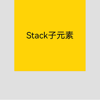
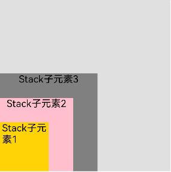

# 层叠布局

层叠布局（StackLayout）是所有布局中最为简单的一个布局，用于在屏幕上预留一个区域来显示组件中的元素,提供元素可以重叠的框架布局。
通过层叠容器[Stack](../reference/arkui-ts/ts-container-stack.md)实现，容器中的子组件依次入栈，后一个子组件覆盖前一个子组件显示。

## 对齐方式

设置子组件在容器内的对齐方式。支持左上，上中，右上，左，中，右，右下，中下，右下九种对齐方式，如下表所示：

|名称|    描述| 图示 |
|---|	---|---|
|TopStart|    顶部起始端 ||
Top    |顶部横向居中 ||
TopEnd|    顶部尾端 ||
Start|    起始端纵向居中 ||
Center|    横向和纵向居中 ||
End|    尾端纵向居中 ||
BottomStart    |底部起始端 ||
Bottom|    底部横向居中 ||
BottomEnd|    底部尾端 ||

## Z序控制

Stack容器中兄弟组件显示层级关系可以通过[zIndex](../reference/arkui-ts/ts-universal-attributes-z-order.md)
属性改变。zIndex值越大，显示层级越高，即zIndex值大的组件会覆盖在zIndex值小的组件上方。

- 在层叠布局中，如果后面子元素尺寸大于前面子元素尺寸，则前面子元素完全隐藏。
    ```ts
    Stack({ alignContent: Alignment.BottomStart }) {
      Column(){
        Text('Stack子元素1').textAlign(TextAlign.End).fontSize(20)
      }.width(100).height(100).backgroundColor(0xffd306)
      Column(){
        Text('Stack子元素2').fontSize(20)
      }.width(150).height(150).backgroundColor(Color.Pink)
      Column(){
        Text('Stack子元素3').fontSize(20)
      }.width(200).height(200).backgroundColor(Color.Grey)
    }.margin({ top: 100 }).width(350).height(350).backgroundColor(0xe0e0e0)
    ```
    

    上图中，最后的子元素3的尺寸大于前面的所有子元素，所以，前面两个元素完全隐藏，可以通过改变前面元素的zIndex属性展示出来:
    ```ts
    Stack({ alignContent: Alignment.BottomStart }) {
      Column(){
        Text('Stack子元素1').textAlign(TextAlign.End).fontSize(20)
      }.width(100).height(100).backgroundColor(0xffd306).zIndex(2)
      Column(){
        Text('Stack子元素2').fontSize(20)
      }.width(150).height(150).backgroundColor(C   olor.Pink).zIndex(1)
      Column(){
        Text('Stack子元素3').fontSize(20)
      }.width(200).height(200).backgroundColor(Color.Grey)
    }.margin({ top: 100 }).width(350).height(350).backgroundColor(0xe0e0e0)
    ```
  
- 
  通过Z序控制实现了显示效果。

