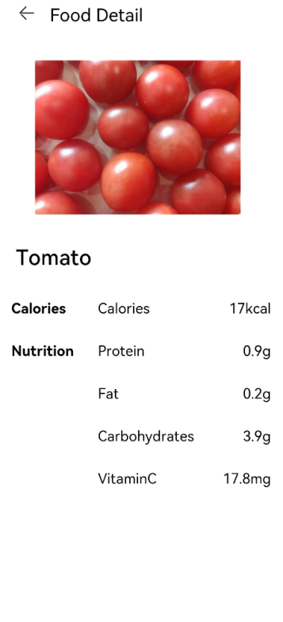

# 页面跳转与数据传递

本节将学习页面跳转和数据传递，实现：


1. 页面跳转：点击食物分类列表页面的食物条目后，跳转到食物详情页；点击食物详情页的返回按钮，返回到食物列表页。

2. 页面间数据传递：点击不同的食物条目后，FoodDetail接受前一个页面的数据，渲染对应的食物详情页。


## 页面跳转

声明式UI范式提供了两种机制来实现页面间的跳转：

1. 路由容器组件Navigator，包装了页面路由的能力，指定页面target后，使其包裹的子组件都具有路由能力。

2. 路由RouterAPI接口，通过在页面上引入router，可以调用router的各种接口，从而实现页面路由的各种操作。

下面我们就分别学习这两种跳转机制来实现食物分类列表页面和食物详情页的链接。

1. 点击FoodListItem后跳转到FoodDetail页面。在FoodListItem内创建Navigator组件，使其子组件都具有路由功能，目标页面target为'pages/FoodDetail'。
   ```ts
   @Component
   struct FoodListItem {
     private foodItem: FoodData
     build() {
       Navigator({ target: 'pages/FoodDetail' }) {
         Flex({ justifyContent: FlexAlign.Start, alignItems: ItemAlign.Center }) {
           Image(this.foodItem.image)
             .objectFit(ImageFit.Contain)
             .height(40)
             .width(40)
             .backgroundColor('#FFf1f3f5')
             .margin({ right: 16 })
           Text(this.foodItem.name)
             .fontSize(14)
             .flexGrow(1)
           Text(this.foodItem.calories + ' kcal')
             .fontSize(14)
         }
         .height(64)
       }
       .margin({ right: 24, left:32 })
     }
   }
   ```

   

2. 点击FoodGridItem后跳转到FoodDetail页面。调用页面路由router模块的push接口，将FoodDetail页面推到路由栈中，实现页面跳转。使用router路由API接口，需要先引入router。
   ```ts
   import router from '@ohos.router'

   @Component
   struct FoodGridItem {
     private foodItem: FoodData
     build() {
       Column() {
         ......
       }
       .height(184)
       .width('100%')
       .onClick(() => {
         router.push({ url: 'pages/FoodDetail' })
       })
     }
   }
   ```

   

3. 在FoodDetail页面增加回到食物列表页面的图标。在resources &gt; base &gt; media文件夹下存入回退图标Back.png。新建自定义组件PageTitle，包含后退的图标和Food Detail的文本，调用路由的router.back()接口，弹出路由栈最上面的页面，即返回上一级页面。
   ```ts
   // FoodDetail.ets
   import router from '@ohos.router'

   @Component
   struct PageTitle {
       build() {
           Flex({ alignItems: ItemAlign.Start }) {
               Image($r('app.media.Back'))
                   .width(21.8)
                   .height(19.6)
               Text('Food Detail')
                   .fontSize(21.8)
                   .margin({left: 17.4})
           }
           .height(61)
           .backgroundColor('#FFedf2f5')
           .padding({ top: 13, bottom: 15, left: 28.3 })
           .onClick(() => {
               router.back()
           })
       }
   }
   ```

4. 在FoodDetail组件内创建Stack组件，包含子组件FoodImageDisplay和PageTitle子组件，设置其对齐方式为左上对齐TopStart。
   ```ts
   @Entry
   @Component
   struct FoodDetail {
     build() {
       Column() {
         Stack( { alignContent: Alignment.TopStart }) {
           FoodImageDisplay()
           PageTitle()
         }
         ContentTable()
       }
       .alignItems(HorizontalAlign.Center)
     }
   }
   ```

   


## 页面间数据传递

我们已经完成了FoodCategoryList页面和FoodDetail页面的跳转和回退，但是点击不同的FoodListItem/FoodGridItem，跳转的FoodDetail页面都是西红柿Tomato的详细介绍，这是因为没有构建起两个页面的数据传递，需要用到携带参数（parameter）路由。

1. 在FoodListItem组件的Navigator设置其params属性，params属性接受key-value的Object。
   ```ts
   // FoodList.ets
   @Component
   struct FoodListItem {
     private foodItem: FoodData
     build() {
       Navigator({ target: 'pages/FoodDetail' }) {
         ......
       }
       .params({ foodData: this.foodItem })
     }
   }
   ```

   FoodGridItem调用的routerAPI同样有携带参数跳转的能力，使用方法和Navigator类似。

   ```ts
   router.push({
     url: 'pages/FoodDetail',
     params: { foodData: this.foodItem }
   })
   ```

2. FoodDetail页面引入FoodData类，在FoodDetail组件内添加foodItem成员变量。
   ```ts
   // FoodDetail.ets
   import { FoodData } from '../model/FoodData'

   @Entry
   @Component
   struct FoodDetail {
     private foodItem: FoodData
     build() {
       ......
     }
   }
   ```

3. 获取foodData对应的value。调用router.getParams()['foodData']来获取到FoodCategoryList页面跳转来时携带的foodDate对应的数据。
   ```ts
   @Entry
   @Component
   struct FoodDetail {
     private foodItem: FoodData = router.getParams()['foodData']

     build() {
       ......
     }
   }
   ```

4. 重构FoodDetail页面的组件。在构建视图时，FoodDetail页面的食物信息都是直接声明的常量，现在要用传递来的FoodData数据来对其进行重新赋值。整体的FoodDetail.ets代码如下。
   ```ts
   @Component
   struct PageTitle {
       build() {
           Flex({ alignItems: ItemAlign.Start }) {
               Image($r('app.media.Back'))
                   .width(21.8)
                   .height(19.6)
               Text('Food Detail')
                   .fontSize(21.8)
                   .margin({left: 17.4})
           }
           .height(61)
           .backgroundColor('#FFedf2f5')
           .padding({ top: 13, bottom: 15, left: 28.3 })
           .onClick(() => {
               router.back()
           })
       }
   }

   @Component
   struct FoodImageDisplay {
     private foodItem: FoodData
     build() {
       Stack({ alignContent: Alignment.BottomStart }) {
         Image(this.foodItem.image)
           .objectFit(ImageFit.Contain)
         Text(this.foodItem.name)
           .fontSize(26)
           .fontWeight(500)
           .margin({ left: 26, bottom: 17.4 })
       }
       .height(357)
       .backgroundColor('#FFedf2f5')
     }
   }

   @Component
   struct ContentTable {
     private foodItem: FoodData

     @Builder IngredientItem(title:string, name: string, value: string) {
       Flex() {
         Text(title)
           .fontSize(17.4)
           .fontWeight(FontWeight.Bold)
           .layoutWeight(1)
         Flex() {
           Text(name)
             .fontSize(17.4)
             .flexGrow(1)
           Text(value)
             .fontSize(17.4)
         }
         .layoutWeight(2)
       }
     }

     build() {
       Flex({ direction: FlexDirection.Column, justifyContent: FlexAlign.SpaceBetween, alignItems: ItemAlign.Start }) {
         this.IngredientItem('Calories', 'Calories', this.foodItem.calories + 'kcal')
         this.IngredientItem('Nutrition', 'Protein', this.foodItem.protein + 'g')
         this.IngredientItem('', 'Fat', this.foodItem.fat + 'g')
         this.IngredientItem('', 'Carbohydrates', this.foodItem.carbohydrates + 'g')
         this.IngredientItem('', 'VitaminC', this.foodItem.vitaminC + 'mg')
       }
       .height(280)
       .padding({ top: 30, right: 30, left: 30 })
     }
   }

   @Entry
   @Component
   struct FoodDetail {
     private foodItem: FoodData = router.getParams()['foodData']

     build() {
       Column() {
         Stack( { alignContent: Alignment.TopStart }) {
           FoodImageDisplay({ foodItem: this.foodItem })
           PageTitle()
         }
         ContentTable({ foodItem: this.foodItem })
       }
       .alignItems(HorizontalAlign.Center)
     }
   }
   ```

## 相关实例

针对页面布局与连接，有以下示例工程可供参考：

- [`DefiningPageLayoutAndConnection`：页面布局和连接（eTS）（API8）](https://gitee.com/openharmony/app_samples/tree/master/ETSUI/DefiningPageLayoutAndConnection)

  本示例构建了食物分类列表页面和食物详情页，向开发者展示了List布局、Grid布局以及页面路由的基本用法。
