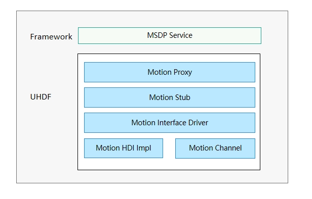
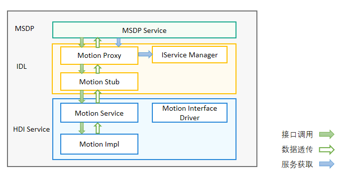

# Motion

## 概述

### 功能简介

手势识别模块作为端侧设备不可或缺的一部分，为用户提供手势识别控制能力。当前支持的手势识别类型有拿起、翻转、摇一摇、旋转屏等。

基于HDF（Hardware Driver Foundation）驱动框架开发的Motion驱动，能够屏蔽硬件器件差异，为上层MSDP（Multimodal Sensor 
Data Platform）服务层提供稳定的手势识别控制能力接口，包括手势识别使能/去使能、手势识别订阅/去订阅等。

Motion驱动框架如图1所示，上层为Framework层，提供MSDP服务，通过UHDF（User Hardware Driver Foundation）层的Motion Proxy与Motion Stub进行交互；而Motion Stub可调用Motion HDI实现类接口，从而实现上层服务的手势识别使能/去使能、手势识别订阅/去订阅等能力。

**图1** Motion驱动框架



### 运作机制

通过介绍Motion驱动模型的加载以及运行流程，对模型内部关键组件以及关联组件之间的关系进行了划分，整体加载流程如图2所示：

**图 2** Motion驱动运行图



1. MSDP：上层综合传感信息处理平台服务层，当HDI接口服务实例获取成功后可以直接调用Motion HDI接口。
2. IDL：接口抽象层。MSDP服务层首先从Motion Proxy获取到Motion HDI接口服务实例。而Motion Proxy获取到的接口实例是由IService Manager进行分配。当MSDP服务层成功获取到Motion HDI接口服务实例后，MSDP服务层就可以直接调用Motion Proxy中的HDI接口，然后通过IPC（Inter-Process Communication）调用到Motion Stub，从而调用到Motion Service的接口。这部分是由工具自动生成的代码，不用器件厂商自己开发。
3. HD IService：HDI Service中包括Motion Interface Driver、Motion Service和Motion Impl三个部分。其中Motion Interface Driver为手势识别接口的驱动代码，在这部分驱动代码中通过定义一个struct HdfDriverEntry类型的结构体变量，实现此变量中的的Init、Bind和Release函数描述驱动能力，函数内部通过HDF_INIT宏加载驱动。Motion Service为手势识别服务接口类，具体的实现在Motion Impl中描述。此部分代码需要器件厂商根据自己器件来开发。

## 开发指导 

### 场景介绍

Motion驱动的主要工作是为上层MSDP服务提供稳定的使能/去使能手势识别服务，订阅/取消订阅手势识别数据回调函数的功能。可应用于拿起、翻转、摇一摇、旋转屏等手势识别场景。

### 接口说明

**表1** 接口功能介绍

| 接口名                                                       | 功能介绍                     |
| ------------------------------------------------------------ | ---------------------------- |
| int32_t EnableMotion(int32_t motionType)                     | 使能一种手势识别类型，只有数据订阅者使能手势识别后，才能获取订阅的手势识别数据。 |
| int32_t DisableMotion(int32_t motionType)                    | 去使能手势识别。             |
| int32_t Register(const sptr\<IMotionCallback\> &callbackObj)   | 订阅者成功注册手势识别数据回调函数，系统会将获取到的手势识别数据上报给订阅者。 |
| int32_t Unregister(const sptr\<IMotionCallback\> &callbackObj) | 取消订阅手势识别数据回调函数。 |

### 开发步骤

开发步骤分为两个大步骤。

1. 基于HDF驱动框架，完成手势识别用户态驱动开发。
2. 厂商实现EnableMotion、DisableMotion、Register和Unregister接口功能。

手势识别目录结构及各部分功能简介。

```undefined
/drivers/peripheral/motion               # 此目录具体实现需要厂商根据自己的器件进行开发
├── hdi_service                          # 手势识别模块对上层MSDP服务提供的驱动能力
├── test                                 # 手势识别模块测试代码
│   └── unittest\hdi                     # 手势识别模块HDI单元测试代码
```

下面结合DEMO实例，介绍如何基于HDF驱动框架，手势识别用户态驱动开发。具体实现请参考 [motion_interface_driver.cpp](https://gitee.com/openharmony/drivers_peripheral/blob/master/motion/hdi_service/motion_interface_driver.cpp)。

手势识别用户态驱动开发， 主要完成Bind、Init、Release、Dispatch函数接口实现。其中Bind函数为驱动对外提供的服务能力，Init函数为系统加载驱动前需要的一些初始化的操作，Release函数的主要作用为当系统加载驱动调用Init函数失败时对资源进行回收操作。

```c++
// 自定义的HdfMotionInterfaceHost对象
struct HdfMotionInterfaceHost {
    struct IDeviceIoService ioService;
    OHOS::sptr<OHOS::IRemoteObject> stub;
};

// 服务接口调用响应接口
static int32_t MotionInterfaceDriverDispatch(struct HdfDeviceIoClient *client, int cmdId, struct HdfSBuf *data,
    struct HdfSBuf *reply)
{
    auto *hdfMotionInterfaceHost = CONTAINER_OF(client->device->service, struct HdfMotionInterfaceHost, ioService);

    OHOS::MessageParcel *dataParcel = nullptr;
    OHOS::MessageParcel *replyParcel = nullptr;
    OHOS::MessageOption option;

    if (SbufToParcel(data, &dataParcel) != HDF_SUCCESS) {
        HDF_LOGE("%{public}s: invalid data sbuf object to dispatch", __func__);
        return HDF_ERR_INVALID_PARAM;
    }
    if (SbufToParcel(reply, &replyParcel) != HDF_SUCCESS) {
        HDF_LOGE("%{public}s: invalid reply sbuf object to dispatch", __func__);
        return HDF_ERR_INVALID_PARAM;
    }

    return hdfMotionInterfaceHost->stub->SendRequest(cmdId, *dataParcel, *replyParcel, option);
}

// 初始化接口
int HdfMotionInterfaceDriverInit(struct HdfDeviceObject *deviceObject)
{
    HDF_LOGI("HdfMotionInterfaceDriverInit enter");
    return HDF_SUCCESS;
}

// Motion驱动对外提供的服务绑定到HDF框架
int HdfMotionInterfaceDriverBind(struct HdfDeviceObject *deviceObject)
{
    HDF_LOGI("HdfMotionInterfaceDriverBind enter");

    auto *hdfMotionInterfaceHost = new (std::nothrow) HdfMotionInterfaceHost;
    if (hdfMotionInterfaceHost == nullptr) {
        HDF_LOGE("%{public}s: failed to create HdfMotionInterfaceHost object", __func__);
        return HDF_FAILURE;
    }

    hdfMotionInterfaceHost->ioService.Dispatch = MotionInterfaceDriverDispatch;
    hdfMotionInterfaceHost->ioService.Open = NULL;
    hdfMotionInterfaceHost->ioService.Release = NULL;

    auto serviceImpl = IMotionInterface::Get(true);
    if (serviceImpl == nullptr) {
        HDF_LOGE("%{public}s: failed to get of implement service", __func__);
        return HDF_FAILURE;
    }

    hdfMotionInterfaceHost->stub = OHOS::HDI::ObjectCollector::GetInstance().GetOrNewObject(serviceImpl,
        IMotionInterface::GetDescriptor());
    if (hdfMotionInterfaceHost->stub == nullptr) {
        HDF_LOGE("%{public}s: failed to get stub object", __func__);
        return HDF_FAILURE;
    }

    deviceObject->service = &hdfMotionInterfaceHost->ioService;
    return HDF_SUCCESS;
}

// 释放Motion驱动中的资源
void HdfMotionInterfaceDriverRelease(struct HdfDeviceObject *deviceObject)
{
    HDF_LOGI("HdfMotionInterfaceDriverRelease enter");
    auto *hdfMotionInterfaceHost = CONTAINER_OF(deviceObject->service, struct HdfMotionInterfaceHost, ioService);
    delete hdfMotionInterfaceHost;
    hdfMotionInterfaceHost = nullptr;
}

// 注册Motion驱动入口数据结构体对象
struct HdfDriverEntry g_motioninterfaceDriverEntry = {
    .moduleVersion = 1,
    .moduleName = "motion_service",
    .Bind = HdfMotionInterfaceDriverBind,
    .Init = HdfMotionInterfaceDriverInit,
    .Release = HdfMotionInterfaceDriverRelease,
};

// 调用HDF_INIT将驱动入口注册到HDF框架中，在加载驱动时HDF框架会先调用Bind函数，再调用Init函数加载该驱动，当Init调用异常时，HDF框架会调用Release释放驱动资源并退出。
HDF_INIT(g_userAuthInterfaceDriverEntry);
```


### 调测验证

测试代码开发步骤：

1. 通过调用IMotionInterface::Get()获取到手势识别实例，并赋给IMotionInterface类型的智能指针对象g_motionInterface。

2. 通过g_motionInterface实例调用Register接口注册回调，回调函数需要根据自己的需求来设计。

3. 通过g_motionInterface实例调用EnableMotion接口使能Motion类型，当前支持拿起（HDF_MOTION_TYPE_PICKUP）、翻转（HDF_MOTION_TYPE_FLIP）、摇一摇（HDF_MOTION_TYPE_SHAKE）、旋转（HDF_MOTION_TYPE_ROTATION）等手势识别类型。

4. 通过g_motionInterface实例调用DisableMotion接口去使能手势识别类型。

5. 通过g_motionInterface实例调用Unregister取消订阅Motion数据回调函数。注意取消订阅必须先调用Register接口注册回调，否则Unregister会返回失败。

   测试代码实例如下：

   ```c++
   using namespace OHOS::HDI::Motion::V1_0;
   using namespace testing::ext;
   
   namespace {
       sptr<IMotionInterface> g_motionInterface = nullptr;
       sptr<IMotionCallback> g_motionCallback = new MotionCallbackService();
       sptr<IMotionCallback> g_motionCallbackUnregistered = new MotionCallbackService();
   }
   
   class HdfMotionTest : public testing::Test {
   public:
       static void SetUpTestCase();
       static void TearDownTestCase();
       void SetUp();
       void TearDown();
   };
   
   void HdfMotionTest::SetUpTestCase()
   {
       // 1.获取手势识别实例
       g_motionInterface = IMotionInterface::Get();
   }
   
   void HdfMotionTest::TearDownTestCase()
   {
   }
   
   void HdfMotionTest::SetUp()
   {
   }
   
   void HdfMotionTest::TearDown()
   {
   }
   
   HWTEST_F(HdfMotionTest, EnableMotion_001, TestSize.Level1)
   {
       if (g_motionInterface == nullptr) {
           ASSERT_NE(nullptr, g_motionInterface);
           return;
       }
   
       vector<int> vec;
       vec.push_back(HDF_MOTION_TYPE_PICKUP);
       vec.push_back(HDF_MOTION_TYPE_FLIP);
       vec.push_back(HDF_MOTION_TYPE_SHAKE);
       vec.push_back(HDF_MOTION_TYPE_ROTATION);
   
       // 2.订阅手势识别数据回调函数
       int32_t ret = g_motionInterface->Register(g_motionCallback);
       EXPECT_EQ(HDF_SUCCESS, ret);
   
       for (int i = 0; i < vec.size(); i++) {
           // 3.使能手势识别
           ret = g_motionInterface->EnableMotion(vec[i]);
           if (ret == HDF_SUCCESS) {
               printf("Motion %d enabled successfully\n", vec[i]);
           } else {
               printf("Motion %d enable failed\n", vec[i]);
           }
           EXPECT_EQ(HDF_SUCCESS, ret);
           OsalSleep(15);
           // 4.去使能手势识别
           ret = g_motionInterface->DisableMotion(vec[i]);
           if (ret == HDF_SUCCESS) {
               printf("Motion %d disabled successfully\n", vec[i]);
           } else {
               printf("Motion %d disable failed\n", vec[i]);
           }
           EXPECT_EQ(HDF_SUCCESS, ret);
           OsalSleep(2);
       }
       // 5.取消订阅手势识别数据回调函数
       ret = g_motionInterface->Unregister(g_motionCallback);
       EXPECT_EQ(HDF_SUCCESS, ret);
   }
   ```
   