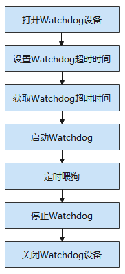

# Watchdog


## 概述

看门狗（Watchdog），又叫看门狗计时器（Watchdog timer），是一种硬件的计时设备。当系统主程序发生错误导致未及时清除看门狗计时器的计时值时，看门狗计时器就会对系统发出复位信号，使系统从悬停状态恢复到正常运作状态。


## 接口说明

**表1** 看门狗API接口功能介绍

| 接口 | 接口描述 | 
| -------- | -------- |
| WatchdogOpen | 打开看门狗 | 
| WatchdogClose | 关闭看门狗 | 
| WatchdogStart | 启动看门狗 | 
| WatchdogStop | 停止看门狗 | 
| WatchdogSetTimeout | 设置看门狗超时时间 | 
| WatchdogGetTimeout | 获取看门狗超时时间 | 
| WatchdogGetStatus | 获取看门狗状态 | 
| WatchdogFeed | 清除看门狗定时器（喂狗) | 

> **说明：**<br>
> 本文涉及的看门狗的所有接口，仅限内核态使用，不支持在用户态使用。


## 使用指导


### 使用流程

使用看门狗的一般流程如下图所示。

**图1** 看门狗使用流程图




### 打开看门狗设备

在操作看门狗之前，需要使用WatchdogOpen打开一个看门狗设备，一个系统可能有多个看门狗，通过ID号来打开指定的看门狗设备：

DevHandle WatchdogOpen(int16_t wdtId);

**表2** WatchdogOpen参数和返回值描述

| **参数** | **参数描述** | 
| -------- | -------- |
| wdtId | 看门狗设备号 | 
| **返回值** | **返回值描述** | 
| NULL | 打开失败 | 
| DevHandle类型指针 | 看门狗设备句柄 | 


```
DevHandle handle = NULL;
handle = WatchdogOpen(0);  /* 打开0号看门狗设备 */
if (handle == NULL) {
    HDF_LOGE("WatchdogOpen: failed, ret %d\n", ret);
    return;
}
```


### 获取看门狗状态

int32_t WatchdogGetStatus(DevHandle handle, int32_t *status); 

**表3** WatchdogGetStatus参数和返回值描述

| **参数** | **参数描述** |
| -------- | -------- |
| handle | 看门狗设备句柄 |
| status | 获取到的看门狗状态的指针 |
| **返回值** | **返回值描述** |
| 0 | 获取成功 |
| 负数 | 获取失败 |


```
int32_t ret;
int32_t status;
/* 获取Watchdog启动状态 */
ret = WatchdogGetStatus(handle, &status);
if (ret != 0) {
    HDF_LOGE("WatchdogGetStatus: failed, ret %d\n", ret);
    return;
}
```


### 设置超时时间

int32_t WatchdogSetTimeout(DevHandle *handle, uint32_t seconds); 

**表4** WatchdogSetTimeout参数和返回值描述

| **参数** | **参数描述** | 
| -------- | -------- |
| handle | 看门狗设备句柄 | 
| seconds | 超时时间，单位为秒 | 
| **返回值** | **返回值描述** | 
| 0 | 设置成功 | 
| 负数 | 设置失败 | 


```
int32_t ret;
uint32_t timeOut = 60;
/* 设置超时时间，单位：秒 */
ret = WatchdogSetTimeout(handle, timeOut);
if (ret != 0) {
    HDF_LOGE("WatchdogSetTimeout: failed, ret %d\n", ret);
    return;
}
```


### 获取超时时间

int32_t WatchdogGetTimeout(DevHandle *handle, uint32_t *seconds);

**表5** WatchdogGetTimeout参数和返回值描述

| **参数** | **参数描述** | 
| -------- | -------- |
| handle | 看门狗设备句柄 | 
| seconds | 接收超时时间的指针，单位为秒 | 
| **返回值** | **返回值描述** | 
| 0 | 获取成功 | 
| 负数 | 获取失败 | 


```
int32_t ret;
uint32_t timeOut;
/* 获取超时时间，单位：秒 */
ret = WatchdogGetTimeout(handle, &timeOut);
if (ret != 0) {
    HDF_LOGE("WatchdogGetTimeout: failed, ret %d\n", ret);
    return;
}
```


### 启动看门狗

int32_t WatchdogStart(DevHandle handle);

**表6** WatchdogStart参数和返回值描述

| **参数** | **参数描述** | 
| -------- | -------- |
| handle | 看门狗设备句柄 | 
| **返回值** | **返回值描述** | 
| 0 | 启动成功 | 
| 负数 | 启动失败 | 


```
int32_t ret;
/* 启动看门狗 */
ret = WatchdogStart(handle);
if (ret != 0) {
    HDF_LOGE("WatchdogStart: failed, ret %d\n", ret);
    return;
}
```


### 喂狗

int32_t WatchdogFeed(DevHandle handle);

**表7** WatchdogFeed参数和返回值描述

| **参数** | **参数描述** | 
| -------- | -------- |
| handle | 看门狗设备句柄 | 
| **返回值** | **返回值描述** | 
| 0 | 喂狗成功 | 
| 负数 | 喂狗失败 | 


```
int32_t ret;
/* 喂狗 */
ret = WatchdogFeed(handle);
if (ret != 0) {
    HDF_LOGE("WatchdogFeed: failed, ret %d\n", ret);
    return;
}
```


### 停止看门狗

int32_t WatchdogStop(DevHandle handle);

**表8** WatchdogStop参数和返回值描述

| **参数** | **参数描述** | 
| -------- | -------- |
| handle | 看门狗设备句柄 | 
| **返回值** | **返回值描述** | 
| 0 | 停止成功 | 
| 负数 | 停止失败 | 


```
int32_t ret;
/* 停止看门狗 */
ret = WatchdogStop(handle);
if (ret != 0) {
    HDF_LOGE("WatchdogStop: failed, ret %d\n", ret);
    return;
}
```


### 关闭看门狗设备

当操作完毕时，使用WatchdogClose关闭打开的设备句柄：

void WatchdogClose(DevHandle handle);

**表9** WatchdogClose参数和返回值描述

| **参数** | **参数描述** | 
| -------- | -------- |
| handle | 看门狗设备句柄 | 


```
/* 关闭看门狗 */
ret = WatchdogClose(handle);
```


## 使用实例

本例程提供看门狗的完整使用流程。

在本例程中，我们打开一个看门狗设备，设置超时时间并启动计时:

- 首先定期喂狗，即按时清除看门狗定时器，确保系统不会因定时器超时而复位。

- 接着再停止喂狗，观察定时器到期后系统是否发生复位行为。

  示例如下：
  
```
#include "watchdog_if.h"
#include "hdf_log.h"
#include "osal_irq.h"
#include "osal_time.h"

#define WATCHDOG_TEST_TIMEOUT     2
#define WATCHDOG_TEST_FEED_TIME   6

static int32_t TestCaseWatchdog(void)
{
    int32_t i;
    int32_t ret;
    uint32_t timeout;
    DevHandle handle = NULL;

    /* 打开0号看门狗设备 */
    handle = WatchdogOpen(0);
    if (handle == NULL) {
        HDF_LOGE("Open watchdog failed!");
        return -1;
    }

    /* 设置超时时间 */
    ret = WatchdogSetTimeout(handle, WATCHDOG_TEST_TIMEOUT);
    if (ret != HDF_SUCCESS) {
        HDF_LOGE("%s: set timeout fail! ret:%d\n", __func__, ret);
        WatchdogClose(handle);
        return ret;
    }

    /* 回读设置的超时时间值 */
    ret = WatchdogGetTimeout(handle, &timeout);
    if (ret != HDF_SUCCESS) {
        HDF_LOGE("%s: get timeout fail! ret:%d\n", __func__, ret);
        WatchdogClose(handle);
        return ret;
    }
    HDF_LOGI("%s: read timeout back:%u\n", __func__, timeout);

    /* 启动看门狗，开始计时 */
    ret = WatchdogStart(handle);
    if (ret != HDF_SUCCESS) {
        HDF_LOGE("%s: start fail! ret:%d\n", __func__, ret);
        WatchdogClose(handle);
        return ret;
    }

    /* 每隔1S喂狗一次 */
    for (i = 0; i < WATCHDOG_TEST_FEED_TIME; i++) {
        HDF_LOGI("%s: feeding watchdog %d times... \n", __func__, i);
        ret = WatchdogFeed(handle);
        if (ret != HDF_SUCCESS) {
            HDF_LOGE("%s: feed dog fail! ret:%d\n", __func__, ret);
            WatchdogClose(handle);
            return ret;
        }
        OsalSleep(1);
    }
    /* 由于喂狗间隔小于超时时间，系统不会发生复位，此日志可以正常打印 */
    HDF_LOGI("%s: no reset ... feeding test OK!!!\n", __func__);

    /* 接下来持续不喂狗，使得看门狗计时器超时 */
    for (i = 0; i < WATCHDOG_TEST_FEED_TIME; i++) {
        HDF_LOGI("%s: waiting dog buck %d times... \n", __func__, i);
        OsalSleep(1);
    }

    /* 当不喂狗时间到达之前设定的超时时间的时候，系统会发生复位，理论上观察不到此日志的打印 */
    HDF_LOGI("%s: dog hasn't back!!! \n", __func__, i);
    WatchdogClose(handle);
    return -1;
}
```