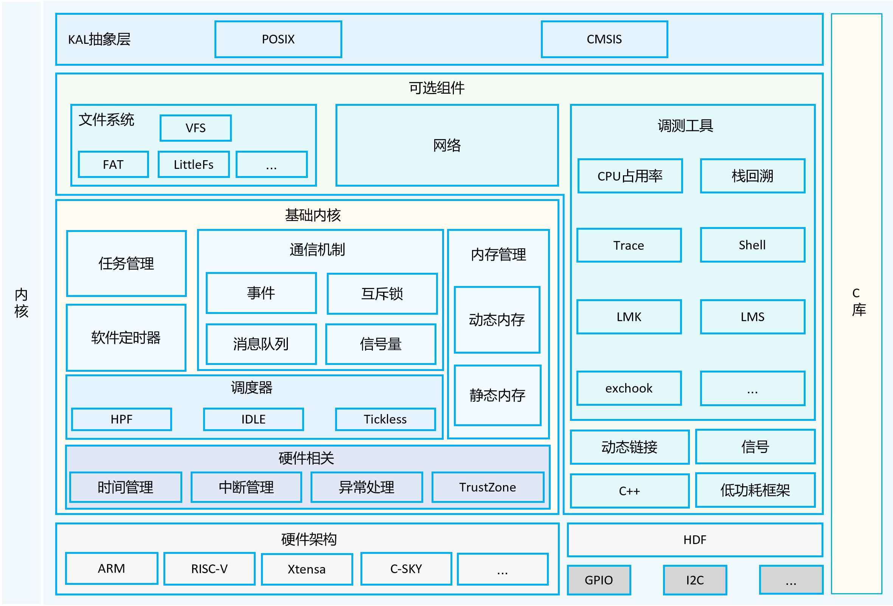

# 内核概述

## 内核简介

OpenHarmony LiteOS-M内核是面向IoT领域构建的轻量级物联网操作系统内核，具有小体积、低功耗、高性能的特点。其代码结构简单，主要包括内核最小功能集、内核抽象层、可选组件以及工程目录等。支持驱动框架HDF（Hardware Driver Foundation），统一驱动标准，为设备厂商提供了更统一的接入方式，使驱动更加容易移植，力求做到一次开发，多系统部署。

OpenHarmony LiteOS-M内核架构包含硬件相关层以及硬件无关层，如下图所示，其中硬件相关层按不同编译工具链、芯片架构分类，提供统一的HAL（Hardware Abstraction Layer）接口，提升了硬件易适配性，满足AIoT类型丰富的硬件和编译工具链的拓展；其他模块属于硬件无关层，其中基础内核模块提供基础能力，扩展模块提供网络、文件系统等组件能力，还提供错误处理、调测等能力，KAL（Kernel Abstraction Layer）模块提供统一的标准接口。

  **图1** 内核架构图

  

## CPU体系架构支持

CPU体系架构分为通用架构定义和特定架构定义两层，通用架构定义层为所有体系架构都需要支持和实现的接口，特定架构定义层为特定体系架构所特有的部分。在新增一个体系架构的时候，必须需要实现通用架构定义层，如果该体系架构还有特有的功能，可以在特定架构定义层来实现。

  **表1** CPU体系架构规则

| 规则 | 通用体系架构层 | 特定体系架构层 | 
| -------- | -------- | -------- |
| 头文件位置 | arch/include | arch/&lt;arch&gt;/&lt;arch&gt;/&lt;toolchain&gt;/ | 
| 头文件命名 | los_&lt;function&gt;.h | los_arch_&lt;function&gt;.h | 
| 函数命名 | Halxxxx | Halxxxx | 

LiteOS-M已经支持ARM Cortex-M3、ARM Cortex-M4、ARM Cortex-M7、ARM Cortex-M33、RISC-V等主流架构，如果需要扩展CPU体系架构，请参考[芯片架构适配点](../porting/porting-chip-kernel-overview.md#芯片架构适配点)。

## 运行机制

在开发板配置文件target_config.h配置系统时钟、每秒Tick数，可以对任务、内存、IPC、异常处理模块进行裁剪配置。系统启动时，根据配置进行指定模块的初始化。内核启动流程包含外设初始化、系统时钟配置、内核初始化、操作系统启动等，详见下图。

  **图2** 内核启动流程
  
