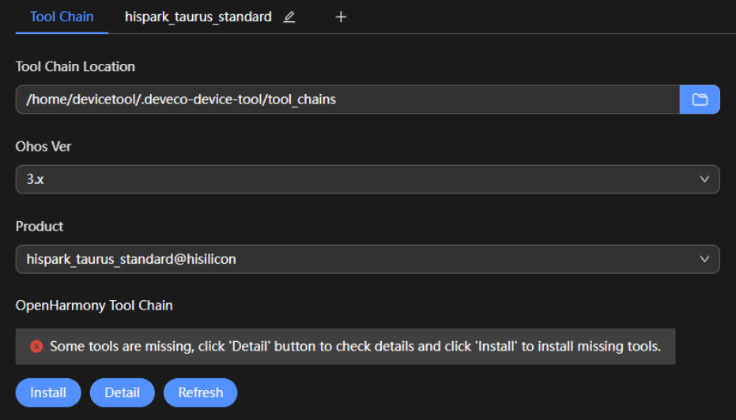
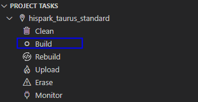
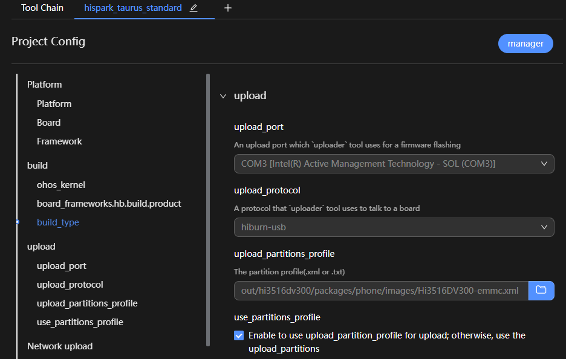
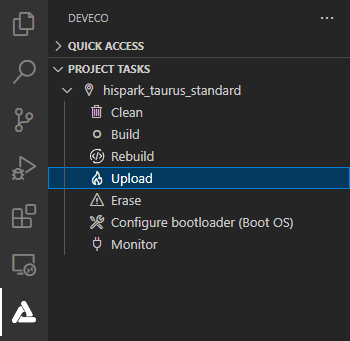
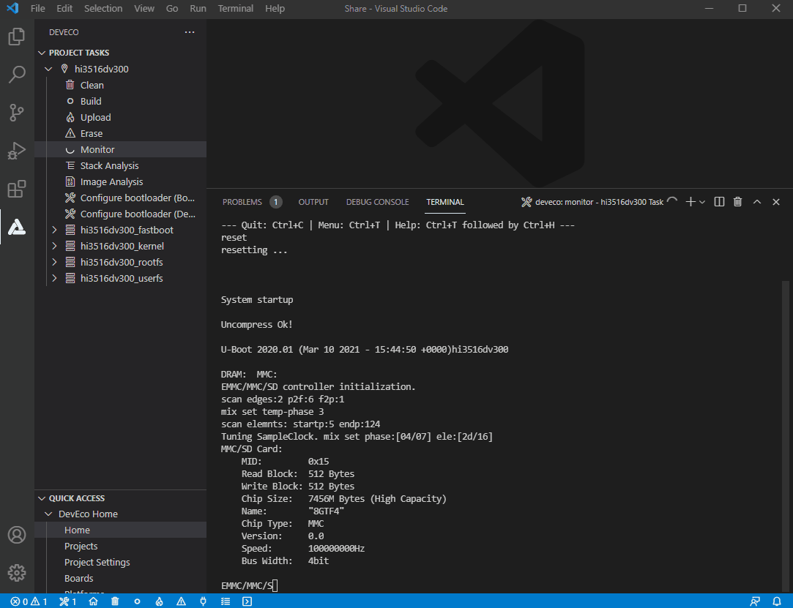

# Hi3516标准系统入门（IDE方式）


除小型系统外，Hi3516DV300开发板还支持标准系统。此章节简要介绍如何使用IDE在Hi3516DV300开发板上进行标准系统的开发。


下方将展示如何在单板上运行第一个应用程序，其中包括新建应用程序、编译、烧写、运行等步骤，最终输出“Hello World！”。


在进行开发之前，请完成如下准备工作：


- [搭建开发环境](quickstart-ide-env--win.md)

- [创建工程并获取源码](quickstart-ide-import-project.md)


## 编写“Hello World”程序


### 示例目录


```
applications/sample/hello
 │── BUILD.gn
 │── include
 │   └── helloworld.h
 │── src
 │   └── helloworld.c
 ├── bundle.json
 build
 └── subsystem_config.json
 productdefine/common
 └── products 
     └── Hi3516DV300.json
```


### 开发步骤

请在源码目录中通过以下步骤创建“Hello World”应用程序：

1. 创建目录，编写业务代码。
   新建applications/sample/hello/src/helloworld.c目录及文件，代码如下所示，用户可以自定义修改打印内容（例如：修改World为OHOS）。其中helloworld.h包含字符串打印函数HelloPrint的声明。当前应用程序可支持标准C及C++的代码开发。

   
   ```
   #include <stdio.h>
   #include "helloworld.h"
   int main(int argc, char **argv)
   {
       HelloPrint();
       return 0;
   }
   void HelloPrint()
   {
       printf("\n\n");
       printf("\n\t\tHello World!\n");
       printf("\n\n");
   }
   ```

   再添加头文件applications/sample/hello/include/helloworld.h，代码如下所示。

   
   ```
   #ifndef HELLOWORLD_H
   #define HELLOWORLD_H
   #ifdef __cplusplus
   #if __cplusplus
   extern "C" {
   #endif
   #endif
   void HelloPrint();
   #ifdef __cplusplus
   #if __cplusplus
   }
   #endif
   #endif
   #endif // HELLOWORLD_H
   ```

2. 新建编译组织文件。
   1. 新建applications/sample/hello/BUILD.gn文件，内容如下所示：
      
       ```
       import("//build/ohos.gni")  # 导入编译模板
       ohos_executable("helloworld") { # 可执行模块
         sources = [       # 模块源码
           "src/helloworld.c"
         ]
         include_dirs = [  # 模块依赖头文件目录
           "include" 
         ]
         cflags = []
         cflags_c = []
         cflags_cc = []
         ldflags = []
         configs = []
         deps =[]    # 部件内部依赖
         part_name = "hello"    # 所属部件名称，必选
         install_enable = true  # 是否默认安装（缺省默认不安装），可选
       }
       ```
   2. 新建applications/sample/hello/bundle.json文件，添加sample部件描述，内容如下所示。
      
       ```
       {
           "name": "@ohos/hello",
           "description": "Hello world example.",
           "version": "3.1",
           "license": "Apache License 2.0",
           "publishAs": "code-segment",
           "segment": {
               "destPath": "applications/sample/hello"
           },
           "dirs": {},
           "scripts": {},
           "component": {
               "name": "hello",
               "subsystem": "sample",
               "syscap": [],
               "features": [],
               "adapted_system_type": [ "mini", "small", "standard" ],
               "rom": "10KB",
               "ram": "10KB",
               "deps": {
                   "components": [],
                   "third_party": []
               },
               "build": {
                   "sub_component": [
                       "//applications/sample/hello:helloworld"
                   ],
                   "inner_kits": [],
                   "test": []
               }
           }
       }
       ```

       bundle.json文件包含两个部分，第一部分描述该部件所属子系统的信息，第二部分component则定义该部件构建相关配置。添加的时候需要指明该部件包含的模块sub_component，假如有提供给其它部件的接口，需要在inner_kits中说明，假如有测试用例，需要在test中说明，inner_kits与test没有也可以不添加。

3. 修改子系统配置文件。
   在build/subsystem_config.json中添加新建的子系统的配置。

   
   ```
   "sample": {
       "path": "applications/sample/hello",
       "name": "sample"
     },
   ```

4. 修改产品配置文件。
   在productdefine/common/products/Hi3516DV300.json中添加对应的hello部件，直接添加到原有部件后即可。

   >  **说明：**
   > 本章节操作是以OpenHarmony-v3.1-Release版本为例进行操作的，该版本中，Hi3516的配置文件为productdefine/common/products/Hi3516DV300.json；若源码版本大于OpenHarmony-v3.1-Release时，Hi3516的配置文件为vendor/hisilicon/Hi3516DV300/config.json。

   
   ```
       "usb:usb_manager_native":{},
       "applications:prebuilt_hap":{},
       "sample:hello":{},
       "wpa_supplicant-2.9:wpa_supplicant-2.9":{},
   ```


## 编译

DevEco Device Tool支持Hi3516DV300开发板的源码一键编译功能，提供编译工具链和编译环境依赖的检测及一键安装，简化复杂编译环境的同时，提升了编译的效率。

>  **说明：**
> Hi3516DV300编译环境为Ubuntu环境。

1. 在菜单栏中点击**Project Settings**，进入Hi3516DV300工程配置界面。
   
   

2. 在**Tool Chain**页签中，DevEco Device Tool会自动检测依赖的编译工具链是否完备，如果提示部分工具缺失，可点击**Install**，自动安装所需工具链。
   
   

3. 安装Hi3516DV300相关工具链，部分工具安装需要使用root权限，请在**TERMINAL**窗口输入用户密码进行安装。

   >  **说明：**
   >
   > - 如果出现安装pip组件失败，可参考[修改Python源的方法](https://device.harmonyos.com/cn/docs/documentation/guide/ide-set-python-source-0000001227639986)进行修改，完成尝试重新安装。
   > - 若出现安装apt组件失败，可参考[修改apt源的方法](https://device.harmonyos.com/cn/docs/documentation/guide/faq-toolchain-install-0000001301623822)进行修改，完成后尝试重新安装。

   

   工具链自动安装完成后如下图所示。

   

4. 在**hispark_taurus_standard**配置页签中，设置源码的编译类型**build_type**，默认为“debug”类型，请根据需要进行修改。
   
   

5. 在**PROJECT TASKS**中，点击对应开发板下的**Build**，执行编译。
   
   

6. 等待编译完成，在**TERMINAL**窗口输出“SUCCESS”，编译完成。
   
   

   编译完成后，可以在工程的**out**目录下，查看编译生成的文件，用于后续的烧录操作。


## 烧录

烧录是指将编译后的程序文件下载到芯片开发板上的动作，为后续的程序调试提供基础。DevEco Device Tool提供一键烧录功能，操作简单，能快捷、高效的完成程序烧录，提升烧录的效率。

Hi3516DV300的镜像烧录通过Windows环境进行烧录，开发者启动烧录操作后，DevEco Device Tool通过Remote远程模式，将Ubuntu环境下编译生成的待烧录程序文件拷贝至Windows目录下，然后通过Windows的烧录工具将程序文件烧录至开发板中。

Hi3516DV300开发板标准系统的烧录方式包括USB烧录、网口烧录两种方式，本文采用USB方式进行烧录。


### 前提条件

- 请安装Hi3516DV300开发板串口驱动程序，请参考[Hi3516DV300开发板串口驱动安装指导](https://device.harmonyos.com/cn/docs/documentation/guide/hi3516_hi3518-drivers-0000001050743695)。

- 请安装Hi3516DV300开发板USB驱动程序，请参考[Hi3516DV300开发板USB驱动安装](https://device.harmonyos.com/cn/docs/documentation/guide/usb_driver-0000001058690393)。


### 操作步骤

1. 请连接好电脑和待烧录开发板，需要连接USB口和串口，具体可参考[Hi3516开发板介绍](quickstart-appendix-hi3516.md)。

2. 在DevEco Device Tool中，选择**REMOTE DEVELOPMENT &gt; Local PC**，查看远程计算机（Ubuntu开发环境）与本地计算机（Windows开发环境）的连接状态。
   - 如果Local PC右边连接按钮为，则远程计算机与本地计算机为已连接状态，不需要执行其他操作。
   - 如果Local PC右边连接按钮为，则点击绿色按钮进行连接。连接时DevEco Device Tool会重启服务，因此请不要在下载源码或源码编译过程中进行连接，否则会中断任务。

   

3. 在菜单栏中点击**Project Settings**按钮，进入Hi3516DV300工程配置界面。
   
   

4. 在“Tool Chain”页签，设置Uploader烧录器工具，可以通过Tool Chain页签中的Install按钮在线安装。
   
   

5. 在“hispark_taurus_standard”页签，设置烧录选项，包括upload_partitions_profile、upload_port和upload_protocol。配置完成后工程将自动保存。

   - upload_partitions_profile：选择待烧录程序的配置文件（已预置默认的配置文件），该配置文件会指定烧录文件名称、起始烧录地址、地址长度等信息；同时请勾选**Enable to use upload_partitions_profile for upload**选项。
      >  **说明：**
      >
      > 如需修改烧录profile文件，在设置烧录分区起始地址和分区长度时，应根据实际待烧录文件的大小进行设置，要求设置的烧录分区大小，要大于待烧录文件的大小；同时，各烧录文件的分区地址设置不能出现重叠。
      > 
      > 首次烧录，请勾选**Enable to use upload_partitions_profile for upload**选项，会自动生成upload_partitions文件。再次烧录时，可根据实际情况选择生成upload_partitions文件进行自定义烧录，也可以再勾选**Enable to use upload_partitions_profile for upload**选项，使用upload_partitions_profile重新生成upload_partitions文件用于烧录。
   - upload_protocol：选择烧录协议，固定选择“hiburn-usb”。
   - upload_port：选择已查询到的串口号。

   

6. 单击hispark_taurus_standard下的**Upload**按钮。
   
   

   此时待烧录文件会从Ubuntu系统传输到Windows下，传输完成后界面显示“Operation paused, Please press Enter key to continue”时，请点击**Enter**键启动烧录。

   

7. 在终端窗口显示如下提示信息时，请在15秒内，按住Update键，插拔USB线，最后松开Update键启动烧录。
   
   

   启动烧录后，界面提示**SUCCESS**信息时，表示烧录成功。

   

8. 烧录成功后，请根据运行章节进行操作，启动系统。


## 运行


### 启动系统

烧录完成后通过以下步骤启动系统：

>  **说明：**
> 初次烧写标准系统，需要完成以下配置，后续烧写或者启动，可以跳过以下操作。

1. 在DevEco Device Tool中，点击Monitor，打开串口工具。
   
   

2. 重启开发板，在倒计时结束前，按任意键进入系统。
   
   

3. 通过以下两条命令设置启动参数。
   
   ```shell
   setenv bootargs 'mem=640M console=ttyAMA0,115200 mmz=anonymous,0,0xA8000000,384M clk_ignore_unused rootdelay=10 hardware=Hi3516DV300 init=/init root=/dev/ram0 rw blkdevparts=mmcblk0:1M(boot),15M(kernel),20M(updater),2M(misc),3307M(system),256M(vendor),-(userdata)';
   ```

   
   ```shell
   setenv bootcmd 'mmc read 0x0 0x82000000 0x800 0x4800; bootm 0x82000000'
   ```

   

4. 保存参数设置。
   
   ```shell
   save
   ```

   

5. 重启开发板，完成系统启动。
   
   ```shell
   reset
   ```

   


### 运行“Hello World”

设备启动后打开串口工具，在任意目录下输入命令helloworld后回车，界面打印“Hello World！”，程序运行成功。


### 下一步

恭喜！您已经完成了标准系统的快速入门，接下来可[开发一个小示例](../guide/device-clock-guide.md)，进一步熟悉OpenHarmony的开发。
