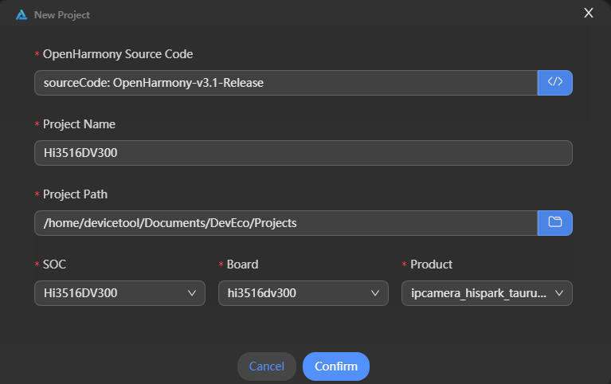

# 创建工程并获取源码

在通过DevEco Device Tool创建OpenHarmony工程时，可自动下载相应版本的OpenHarmony源码，源码类型包括OpenHarmony Stable Version、OpenHarmony Sample和HarmonyOS Connect Solution。

OpenHarmony Stable Version源码为OpenHarmony稳定版本源码，通过镜像站点获取，支持OpenHarmony-v1.1.4-LTS、OpenHarmony-v3.0.3-LTS和OpenHarmony-v3.1-Release版本。

镜像站点的源码，一般取自该稳定版本的发布时间点，因此，通过镜像站点获取的源码可能不是该版本最新源码。如果您需要获取对应版本的最新源码，请参考[从码云仓库获取源码](../get-code/sourcecode-acquire.md)，获取源码后，请参考《[HUAWEI DevEco Device Tool 使用指南](https://device.harmonyos.com/cn/docs/documentation/guide/service_introduction-0000001050166905)》的“导入OpenHarmony源码”章节，在DevEco Device Tool中导入源码。

此处以下载OpenHarmony Stable Version源码为例，说明操作过程。关于OpenHarmony Sample和HarmonyOS Connect Solution源码的下载，可参考《[HUAWEI DevEco Device Tool 使用指南](https://device.harmonyos.com/cn/docs/documentation/guide/service_introduction-0000001050166905)》。

## 前提条件

只有在Windows环境通过Remote SSH远程连接上Ubuntu环境的情况下，才可以创建OpenHarmony新工程，具体请参考[搭建开发环境](quickstart-ide-env--win.md)。否则，在DevEco Device Tool的Home界面没有“**New Project**”按钮。

## 操作步骤

OpenHarmony稳定版本源码，支持OpenHarmony-v1.1.4-LTS、OpenHarmony-v3.0.3-LTS和OpenHarmony-v3.1-Release版本。

1. 打开DevEco Device Tool，进入Home页，点击**New Project**创建新工程。

   

2. 在新工程的配置向导页，配置工程相关信息，包括：
   - **OpenHarmony Source Code**：选择需要下载的OpenHarmony源码，请选择**OpenHarmony Stable Version**下的源码版本，支持OpenHarmony-v1.1.4-LTS、OpenHarmony-v3.0.3-LTS和OpenHarmony-v3.1-Release版本。
   - **Project Name**：设置工程名称。
   - **Project Path**：选择工程文件存储路径。
   - **SOC**：选择支持的芯片。
   - **Board**：选择支持的开发板。
   - **Product**：选择产品。

   

3. 工程配置完成后，点击**Confirm**，DevEco Device Tool会自动启动OpenHarmony源码的下载。由于OpenHarmony稳定版本源码包体积较大，请耐心等待源码下载完成。

   
