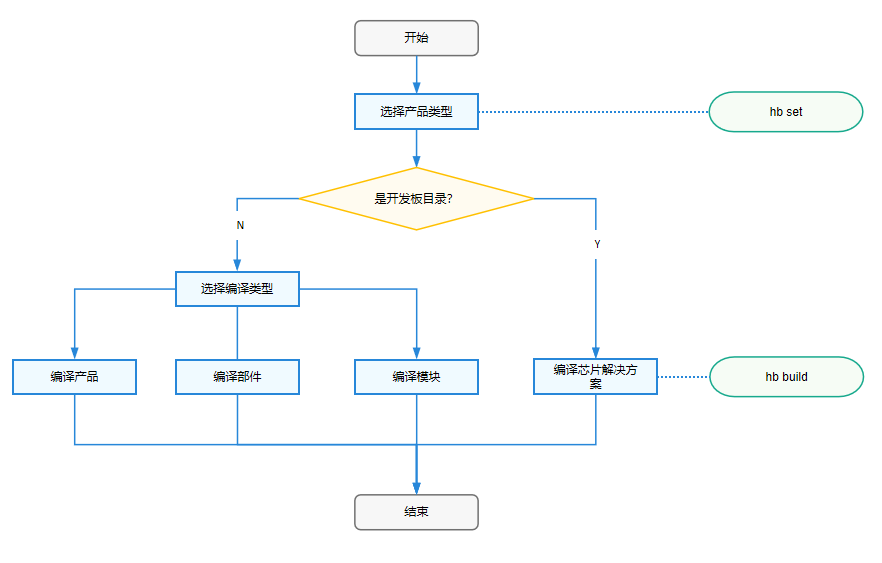

# 编译构建指导

## 概述

OpenHarmony编译子系统是以GN和Ninja构建为基座，对构建和配置粒度进行部件化抽象、对内建模块进行功能增强、对业务模块进行功能扩展的系统，该系统提供以下基本功能：

- 以部件为最小粒度拼装产品和独立编译。
- 支持轻量、小型、标准三种系统的解决方案级版本构建，以及用于支撑应用开发者使用IDE开发的SDK开发套件的构建。
- 支持芯片解决方案厂商的灵活定制和独立编译。

### 适用范围

本指导适用于轻量、小型、标准三种系统。[芯片解决方案配置规则](subsys-build-chip_solution.md#芯片解决方案配置规则)与[新增并编译芯片解决方案](subsys-build-chip_solution.md#新增并编译芯片解决方案)主要和轻量系统、小型系统相关，其他内容都是通用的。

### 基本概念及包含关系


在了解编译构建子系统的能力前，应了解如下基本概念：

- 平台：开发板和内核的组合，不同平台支持的子系统和部件不同。
- 产品：产品是包含一系列部件的集合，编译后产品的镜像包可以运行在不同的开发板上。
- 子系统：OpenHarmony整体遵从分层设计，从下向上依次为：内核层、系统服务层、框架层和应用层（详见[OpenHarmony技术架构](https://gitee.com/openharmony#技术架构)）。系统功能按照“系统 > 子系统 > 部件”逐级展开，在多设备部署场景下，支持根据实际需求裁剪某些非必要的子系统或部件。子系统是一个逻辑概念，它具体由对应的部件构成。
- 部件：对子系统的进一步拆分，可复用的软件单元，它包含源码、配置文件、资源文件和编译脚本；能独立构建，以二进制方式集成，具备独立验证能力的二进制单元。需要注意的是下文中的芯片解决方案本质是一种特殊的部件。
- 模块：模块就是编译子系统的一个编译目标，部件也可以是编译目标。
- 特性：特性是部件用于体现不同产品之间的差异。
- GN：Generate Ninja的缩写，用于产生Ninja文件。
- Ninja：Ninja是一个专注于速度的小型构建系统。
- hb：OpenHarmony的命令行工具，用来执行编译命令。

基于以上概念，编译子系统通过配置来实现编译和打包，该子系统主要包括：模块、部件、子系统、产品。

**图1** 产品、子系统、部件和模块间关系


图1体现了编译子系统的各部分关系，主要体现为：

- 子系统是某个路径下所有部件的集合，一个部件只能属于一个子系统。
- 部件是模块的集合，一个模块只能归属于一个部件。
- 通过产品配置文件配置一个产品包含的部件列表，部件不同的产品配置可以复用。
- 部件可以在不同的产品中实现有差异，通过变体或者特性feature实现。
- 模块就是编译子系统的一个编译目标，部件也可以是编译目标。

### 运作机制

编译构建可以编译产品、部件和模块，但是不能编译子系统。编译构建流程如下图所示，主要分设置和编译两步：

**图2** 编译构建流程



1. hb set: 设置要编译的产品。

2. hb build: 编译产品、开发板或者部件。编译主要过程如下：

   1. 读取编译配置：根据产品选择的开发板，读取开发板config.gni文件内容，主要包括编译工具链、编译链接命令和选项等。
   2. 调用GN：调用gn gen命令，读取产品配置生成产品解决方案out目录和Ninja文件。
   3. 调用Ninja：调用ninja -C out/board/product启动编译。
   4. 系统镜像打包：将部件编译产物打包，设置文件属性和权限，制作文件系统镜像。

### 约束限制

编译环境目前主要支持Ubuntu18.04和Ubuntu20.04（Ubuntu22.04暂不支持）。

### 环境配置

安装编译所需的程序包。 安装命令：

- 安装方式一：使用脚本，在当前工程目录执行
  ```shell
  ./build/build_scripts/env_setup.sh
  ```
  
- 安装方式二：apt-get和pip3 install命令安装
  ```shell
  apt-get update -y 
  apt-get install -y apt-utils binutils bison flex bc build-essential make mtd-utils gcc-arm-linux-gnueabi u-boot-tools python3.9.2 python3-pip git zip unzip curl wget gcc g++ ruby dosfstools mtools default-jre default-jdk scons python3-distutils perl openssl libssl-dev cpio git-lfs m4 ccache zlib1g-dev tar rsync liblz4-tool genext2fs binutils-dev device-tree-compiler e2fsprogs git-core gnupg gnutls-bin gperf lib32ncurses5-dev libffi-dev zlib* libelf-dev libx11-dev libgl1-mesa-dev lib32z1-dev xsltproc x11proto-core-dev libc6-dev-i386 libxml2-dev lib32z-dev libdwarf-dev 
  apt-get install -y grsync xxd libglib2.0-dev libpixman-1-dev kmod jfsutils reiserfsprogs xfsprogs squashfs-tools  pcmciautils quota ppp libtinfo-dev libtinfo5 libncurses5 libncurses5-dev libncursesw5 libstdc++6  gcc-arm-none-eabi vim ssh locales doxygen
  apt-get install -y libxinerama-dev libxcursor-dev libxrandr-dev libxi-dev
  # python需要安装以下模块，repo文件在上一章节约束与限制的源码获取中得到。
  chmod +x /usr/bin/repo 
  pip3 install --trusted-host https://repo.huaweicloud.com -i https://repo.huaweicloud.com/repository/pypi/simple requests setuptools pymongo kconfiglib pycryptodome ecdsa ohos-build pyyaml prompt_toolkit==1.0.14 redis json2html yagmail python-jenkins 
  pip3 install esdk-obs-python --trusted-host pypi.org 
  pip3 install six --upgrade --ignore-installed six
  #还需要安装llvm，hc-gen，gcc_riscv32，Ninja，node-v14.15.4-linux-x64，GN，如果用户使用的shell环境不是bash或者zsh的配置，则需要配置以下环境变量：
  # export PATH=/home/tools/llvm/bin:$PATH
  # export PATH=/home/tools/hc-gen:$PATH
  # export PATH=/home/tools/gcc_riscv32/bin:$PATH
  # export PATH=/home/tools/ninja:$PATH
  # export PATH=/home/tools/node-v12.20.0-linux-x64/bin:$PATH
  # export PATH=/home/tools/gn:$PATH
  # export PATH=~/.local/bin:$PATH
  ```

  **注意**：上述安装ohos-build的过程中会安装编译工具hb，但有时会出现hb安装不成功的情况，若安装不成功，则按照[hb安装](../../device-dev/quick-start/quickstart-pkg-install_tool.md#安装hb)重新安装。


## 配置规则

为了实现芯片解决方案、产品解决方案与OpenHarmony是解耦的、可插拔的，子系统、产品、部件、芯片解决方案、模块、特性和系统能力需遵循一定的规则，具体配置规则见如下链接：

- [产品配置规则](subsys-build-product.md#产品配置规则)
- [子系统配置规则](subsys-build-subsystem.md#子系统配置规则)
- [部件配置规则](subsys-build-component.md#部件配置规则)
- [模块配置规则](subsys-build-module.md#模块配置规则)
- [芯片解决方案配置规则](subsys-build-chip_solution.md#芯片解决方案配置规则)
- [特性配置规则](subsys-build-feature.md#特性配置规则)
- [系统能力配置规则](subsys-build-syscap.md#如何按需配置部件的系统能力)

## 编译构建使用指导

### 目录结构

```shell

/build                            # 编译构建主目录

├── __pycache__                   
├── build_scripts/                # 编译相关的python脚本
├── common/                       
├── config/                       # 编译相关的配置项
├── core
│   ├── gn/                       # 编译入口BUILD.gn配置
    └── build_scripts/            
├── docs                          
gn_helpers.py*                    
lite/                             # hb和preloader入口                      
misc/
├── ohos                          # OpenHarmony编译打包流程配置
│   ├── kits                      # kits编译打包模板和处理流程
│   ├── ndk                       # ndk模板和处理流程
│   ├── notice                    # notice模板和处理流程
│   ├── packages                  # 版本打包模板和处理流程
│   ├── sa_profile                # sa模板和处理流程
│   ├── sdk                       # sdk模板和处理流程，包括sdk中包含的模块配置
│   └── testfwk                   # 测试相关的处理
├── ohos.gni*                     # 汇总了常用的gni文件，方便各个模块一次性import
├── ohos_system.prop              
├── ohos_var.gni*                 
├── prebuilts_download.sh*        
├── print_python_deps.py*         
├── scripts/                      
├── subsystem_config.json         
├── subsystem_config_example.json 
├── templates/                    # c/c++编译模板定义
├── test.gni*                     
├── toolchain                     # 编译工具链配置
├── tools                         # 常用工具
├── version.gni                   
├── zip.py*                       

```


### 编译命令

首先，在源码根目录下执行prebuilts脚本进行预编译，安装编译器及二进制工具。

```shell
bash build/prebuilts_download.sh
```

接着，使用命令行方式或hb方式执行编译命令。

1.命令行方式

- 代码根目录下执行全量版本的编译命令：

  Release版本 :
  ```shell
  ./build.sh --product-name {product_name}
  ```
  Debug版本 :
  ```shell
  ./build.sh --product-name {product_name} --gn-args is_debug=true
  ```
  >  **注意：**
  > Debug全版本因镜像大小限制，全量编译可能无法烧录，建议单模块编译Debug二进制。使用如下命令单独编译模块：
  > 
  > 
  > ```
  > ./build.sh --product-name {product_name} --gn-args is_debug=true --build-target {target_name}
  > ```
  > 
  {product_name}为当前版本支持的平台。比如：hispark_taurus_standard等。

  编译完成后，结果镜像保存在 out/{device_name}/packages/phone/images/ 目录下。

- 编译命令支持选项：./build.sh 

  ```shell
  -h, --help                                        # 显示帮助信息并退出
  --source-root-dir=SOURCE_ROOT_DIR                 # 指定路径
  --product-name=PRODUCT_NAME                       # 指定产品名
  --device-name=DEVICE_NAME                         # 指定装置名称
  --target-cpu=TARGET_CPU                           # 指定cpu
  --target-os=TARGET_OS                             # 指定操作系统
  -T BUILD_TARGET, --build-target=BUILD_TARGET      # 指定编译目标，可以指定多个
  --gn-args=GN_ARGS                                 # GN参数，支持指定多个
  --ninja-args=NINJA_ARGS                           # Ninja参数，支持指定多个
  -v, --verbose                                     # 生成时显示所有命令行
  --keep-ninja-going                                # 让Ninja持续到1000000个工作失败
  --jobs=JOBS
  --export-para=EXPORT_PARA
  --build-only-gn                                   # 只做GN解析，不运行Ninja
  --ccache                                          # 可选  如果使用ccache，需要本地安装ccache
  --fast-rebuild                                    # 快速重建，默认值为False
  --log-level=LOG_LEVEL                             # 指定编译期间的日志级别'，'三个级别可选：debug, info and error，default='info'
  --device-type=DEVICE_TYPE                         # 指定设备类型，默认值为'default'
  --build-variant=BUILD_VARIANT                     # 指定设备操作模式，默认值为'user'
  ```

2.hb方式

hb是OpenHarmony的命令行工具，用来执行编译命令。以下对hb的常用命令进行说明。

**hb set**

设置要编译的产品

```shell
hb set -h
usage: hb set [-h] [-root [ROOT_PATH]] [-p]

optional arguments:
  -h, --help            show this help message and exit
  -root [ROOT_PATH], --root_path [ROOT_PATH]
                        Set OHOS root path
  -p, --product         Set OHOS board and kernel
```

- hb set 后无参数，进入默认设置流程

- hb set -root dir可直接设置代码根目录

- hb set -p设置要编译的产品

**hb env**

查看当前设置信息

```shell
hb env
[OHOS INFO] root path: xxx
[OHOS INFO] board: hispark_taurus
[OHOS INFO] kernel: liteos
[OHOS INFO] product: ipcamera
[OHOS INFO] product path: xxx/vendor/hisilicon/ipcamera
[OHOS INFO] device path: xxx/device/hisilicon/hispark_taurus/sdk_linux_4.19
```

**hb build**

编译产品、部件、模块或芯片解决方案。

```shell
hb build -h
usage: hb build [-h] [-b BUILD_TYPE] [-c COMPILER] [-t [TEST [TEST ...]]] [-cpu TARGET_CPU] [--dmverity] [--tee]
                [-p PRODUCT] [-f] [-n] [-T [TARGET [TARGET ...]]] [-v] [-shs] [--patch] [--compact-mode]
                [--gn-args GN_ARGS] [--keep-ninja-going] [--build-only-gn] [--log-level LOG_LEVEL] [--fast-rebuild]
                [--device-type DEVICE_TYPE] [--build-variant BUILD_VARIANT]
                [component [component ...]]

positional arguments:
  component             name of the component, mini/small only

optional arguments:
  -h, --help            show this help message and exit
  -b BUILD_TYPE, --build_type BUILD_TYPE
                        release or debug version, mini/small only
  -c COMPILER, --compiler COMPILER
                        specify compiler, mini/small only
  -t [TEST [TEST ...]], --test [TEST [TEST ...]]
                        compile test suit
  -cpu TARGET_CPU, --target-cpu TARGET_CPU
                        select cpu
  --dmverity            enable dmverity
  --tee                 Enable tee
  -p PRODUCT, --product PRODUCT
                        build a specified product with {product_name}@{company}
  -f, --full            full code compilation
  -n, --ndk             compile ndk
  -T [TARGET [TARGET ...]], --target [TARGET [TARGET ...]]
                        compile single target
  -v, --verbose         show all command lines while building
  -shs, --sign_haps_by_server
                        sign haps by server
  --patch               apply product patch before compiling
  --compact-mode        compatible with standard build system set to false if we use build.sh as build entrance
  --gn-args GN_ARGS     specifies gn build arguments, eg: --gn-args="foo="bar" enable=true blah=7"
  --keep-ninja-going    keeps ninja going until 1000000 jobs fail
  --build-only-gn       only do gn parse, do not run ninja
  --log-level LOG_LEVEL
                        specifies the log level during compilationyou can select three levels: debug, info and error
  --fast-rebuild        it will skip prepare, preloader, gn_gen steps so we can enable it only when there is no change
                        for gn related script
  --device-type DEVICE_TYPE
                        specifies device type
  --build-variant BUILD_VARIANT
                        specifies device operating mode
```

- hb build后无参数，会按照设置好的代码路径、产品进行编译，编译选项使用与之前保持一致。-f 选项将删除当前产品所有编译产品，等同于hb clean + hb build.

- hb build {component_name}：基于设置好的产品对应的单板、内核，单独编译部件（e.g.：hb build kv_store)。

- hb build -p ipcamera@hisilicon：免set编译产品，该命令可以跳过set步骤，直接编译产品。

- 在device/board/device_company下单独执行hb build会进入内核选择界面，选择完成后会根据当前路径的单板、选择的内核编译出仅包含内核、驱动的镜像。

**hb clean**

清除out目录对应产品的编译产物，仅保留args.gn、build.log。清除指定路径可输入路径参数：hb clean out/board/product，默认将清除当前hb set的产品对应out路径。

```shell
hb clean
usage: hb clean [-h] [out_path]

positional arguments:
  out_path    clean a specified path.

optional arguments:
  -h, --help  show this help message and exit
```

### 新增并编译不同配置

根据上一节的配置规则新增相应配置并进行编译，主要包含产品、部件、芯片解决方案和模块四个粒度。具体如下：

- [新增并编译产品](subsys-build-product.md#新增并编译产品)
- [新增并编译部件](subsys-build-component.md#新增并编译部件)
- [新增并编译模块](subsys-build-module.md#新增并编译模块)
- [新增并编译芯片解决方案](subsys-build-chip_solution.md#新增并编译芯片解决方案)

## 常见问题

- [常见编译问题和解决方法](subsys-build-FAQ.md#常见编译问题和解决方法)

## 参考信息

- [关于deps、external_deps的使用](subsys-build-reference.md#关于deps、external_deps的使用)
- [Sanitizer使用说明](subsys-build-reference.md#Sanitizer使用说明)
- [开源软件Notice收集策略说明](subsys-build-reference.md#开源软件notice收集策略说明)
- [加快本地编译的一些参数](subsys-build-reference.md#加快本地编译的一些参数)
- [查看NinjaTrace](subsys-build-reference.md#查看ninjatrace)

