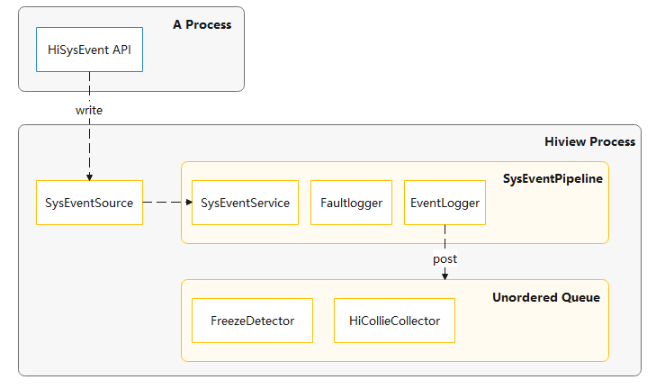

# Hiview开发指导


## 概述


### 功能简介

Hiview是一个跨平台的终端设备维测服务集，由插件管理平台和基于平台上运行的服务插件来构成整套系统。Hiview维测服务是由HiSysEvent事件驱动的，其核心为分布在系统各处的HiSysEvent桩点，格式化的事件会通过HiSysEvent打点API上报至Hiview进行处理，其处理流程如下图所示：

**图1** Hiview模块数据交互图



1. 业务进程通过调用HiSysEvent模块提供的打点接口，上报打点事件信息并将其写入节点文件。
2. Hiview进程中的SysEventSource事件源会从节点中异步读取出事件信息，并将事件分发到SysEventPipeline流水线上进行处理，其中：
   - SysEventService插件负责对事件进行校验及落盘；
   - Faultlogger插件负责处理故障相关事件；
   - EventLogger插件负责采集事件相关的日志信息。
3. 在流水线上完成事件处理后，还会把事件发送到平台订阅事件队列里，然后将事件派发到订阅插件进行处理，其中：
   - FreezeDetectorPlugin插件负责处理冻屏相关事件；
   - HiCollieCollector插件负责卡死相关事件。

### 基本概念

在进行Hiview的开发前，开发者应了解以下基本概念：

- 插件

  运行在Hiview进程中，随Hiview二进制一同交付的完成独立功能的维测、故障管理模块，具有编译时可独立拆解、运行时寄宿于平台、动态配置等特性。

- 流水线

  事件处理插件的有序集合，进入流水线的事件会按序经过流水线上的每个插件处理。

- 事件源

  一种能够生产事件的特殊插件，相较普通插件，需要能够绑定流水线、生产事件并将事件分发给流水线。

- 流水线组

  配置在相同事件源的多个流水线被称作一个流水线组。

### 运作机制

Hiview支持基于插件管理平台的插件开发，提供了插件开发的相关能力，开发者可以通过在Hiview平台上新增自己的插件，来对HiSysEvent事件进行特定业务处理。在进行插件开发前，开发者应该了解插件的相关运作原理。

#### 插件注册

插件的注册方式有三种：

| 名称               | 说明                                                         |
| ------------------ | ------------------------------------------------------------ |
| 静态注册           | 通过使用宏定义REGISTER(xxx);注册，该种注册方式的插件不能被卸载 |
| 代理注册           | 通过使用宏定义REGISTER_PROXY(xxx);注册，开机不加载运行时动态加载卸载 |
| 代理注册且开机加载 | 通过使用宏定义REGISTER_PROXY_WITH_LOADED(xxx);注册，开机加载之后再动态卸载加载 |

####  插件驱动

插件的事件驱动有两种方式——流水线驱动和订阅驱动，区别如下：

- 流水线驱动的插件需要配置在流水线上，当事件从事件源分发到流水线后，会按序流转到流水线上配置的每个插件进行处理。
- 订阅驱动的插件无需配置在流水线上，但是需要在插件启动时注册一个监听者到Hiview平台，并且插件本身需要实现事件监听处理函数。

#### 插件包加载

根据业务的需求，插件可以不用全部编译在Hiview二进制中。

Hiview支持将多个插件编译成为一个独立的插件包，以独立so的形式预置到系统中，并且一个so需要对应于一个plugin_config文件，例如libxxx.z.so，对应于xxx_plugin_config配置文件。Hiview进程在启动时，会扫描系统中的插件包so以及对应的配置文件，并对插件包中实现的插件进行加载。

对插件包做如下补充说明：

1. 插件包作为一个独立的个体在插件管理平台中运行，内部插件、流水线或者事件源都与在Hiview二进制中的插件没有功能上的差异。

2. 插件包中的插件可以插入到Hiview二进制中的流水线中。


3. 无论在何处的订阅者，根据其订阅的规则都可以收到全平台发送出来的相应事件。


## 插件开发指导


### 场景介绍

当开发者需要对事件源分发过来的HiSysEvent事件进行特定业务处理的时候，需要在Hiview平台上新增一个插件，并借助该插件进行相应业务处理，下文将具体介绍如何进行Hiview插件开发。

### 接口说明

插件开发的相关接口如下，具体的API详见接口文档。

**表1** Plugin类API接口功能介绍

| 接口名                                                       | 描述                                                         |
| ------------------------------------------------------------ | ------------------------------------------------------------ |
| virtual void OnLoad()                                        | 插件加载函数，当插件被平台加载后调用，可以用于初始化一些数据 |
| virtual void OnUnload()                                      | 插件卸载函数，当插件被平台卸载前调用，可以用于回收一些数据   |
| virtual bool ReadyToLoad()                                   | 用于在Hiview启动加载插件时判断当前插件能否被加载             |
| virtual bool OnEvent(std::shared_ptr\<Event\>& event)        | 事件处理函数，用于接收处理流水线或者平台分发过来的事件并进行业务处理 |
| virtual bool CanProcessEvent(std::shared_ptr\<Event\> event) | 用于判断事件是否能向后流转整条流水线（当插件位于流水线上的第一个时生效） |
| HiviewContext* GetHiviewContext()                            | 获取Hiview插件管理平台的上下文对象                           |

**表2** Event类API接口功能介绍

| 接口名                 | 描述                         |
| ---------------------- | ---------------------------- |
| domain_                | 事件领域                     |
| eventName_             | 事件名称                     |
| happenTime_            | 事件发生时间                 |
| jsonExtraInfo_         | Json格式的事件数据           |
| bool IsPipelineEvent() | 判断事件是否为流水线事件     |
| bool HasFinish()       | 判断事件是否还能继续往后流转 |

### 开发步骤

1. 首先，需要定义一个继承自Plugin基类的业务插件类：

   ```c++
   #include "event.h"
   #include "plugin.h"
   
   class PluginExample : public Plugin {
   public:
       bool OnEvent(std::shared_ptr<Event>& event) override;
       void OnLoad() override;
       void OnUnload() override;
   };
   ```

2. 然后，在插件类实现代码中，需要先对插件进行注册，再根据业务需要覆写实现相应的函数。

   ```c++
   #include "plugin_factory.h"
   
   // 静态注册插件
   REGISTER(PluginExample);
   
   void PluginExample::OnLoad()
   {
       ... // 在插件加载时，可以进行插件的资源初始化工作
       printf("PluginExample OnLoad \n");
   }
   
   void PluginExample::OnUnload()
   {
       ... // 在插件卸载时，可以进行插件的资源释放工作
       printf("PluginExample OnUnload \n");
   }
   
   bool PluginExample::OnEvent(std::shared_ptr<Event>& event)
   {
       ... // 在事件处理函数中，可以进行对事件进行特定业务处理
       printf("PluginExample OnEvent \n");
   
       // 例如，插件只关注某个领域的事件，并需要将这个领域的事件信息进行日志打印处理
       if (event->domain_ == "TEST_DOMAIN") {
           printf("The event data received is %s \n", event->jsonExtraInfo_);
           return true;
       }
   
       return false;
   }
   ```

3. 最后，需要将插件配置在plugin_build.json文件中，随Hiview二进制一同编译：

   ```json
   {
       "plugins": {
           "PluginExample": {
               "path": "plugins/PluginExample",
               "name": "PluginExample"
           }
       },
       "rules": [
           {
               "info": {
                   "loadorder": {
                       "PluginExample": {
                           "loadtime": 0
                       }
                   },
                   "pipelines": {
                       "SysEventPipeline": [
                          PluginExample
                       ]
                   }
               }
           }
       ]
   }
   ```


## 参考

如果您想了解更多关于Hiview特性的源码及使用信息，请参考[Hiview代码仓](https://gitee.com/openharmony/hiviewdfx_hiview)。