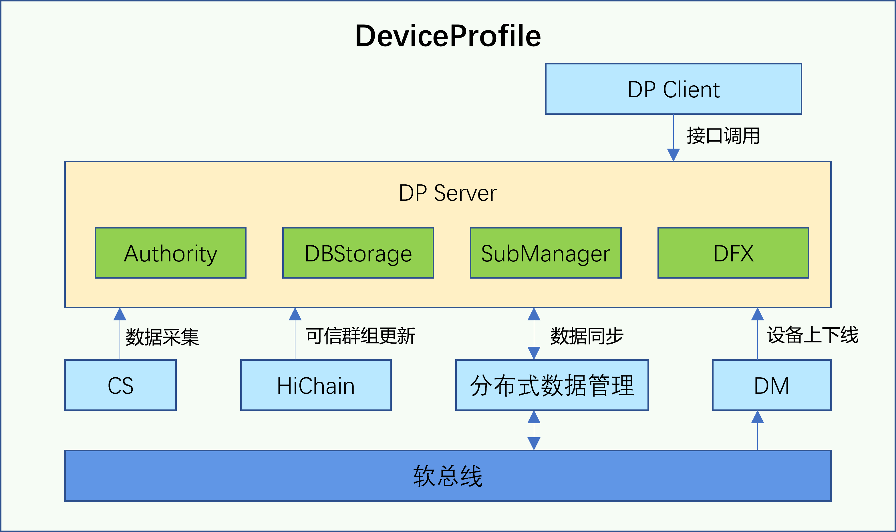

# DeviceProfile子系统<a name="ZH-CN_TOPIC_0000001128264105"></a>

-   [简介](#section11660541593)
-   [目录](#section1464106163817)
-   [约束](#section1718733212019)
-   [使用](#section10729231131110)
-   [相关仓](#section176111311166)

## 简介<a name="section11660541593"></a>

DeviceProfile是设备硬件能力和系统软件特征的管理器，典型的Profile有设备类型、设备名称、设备OS类型、OS版本号等。

DeviceProfile提供快速访问本地和远端设备Profile的能力，是发起分布式业务的基础。主要功能如下：

-   本地设备Profile的查询、插入、删除。
-   远程设备Profile的查询。
-   跨设备同步Profile。
-   订阅远程Profile变化的通知。

DeviceProfile模块组成如下图所示：

## 系统架构<a name="section13587185873516"></a>

**图 1**  DeviceProfile组件架构图<a name="fig4460722185514"></a> 



## 目录<a name="section1464106163817"></a>

DeviceProfile主要代码目录结构如下：

```
├── interfaces
│   └── innerkits
│       └── distributeddeviceprofile            // 系统内部接口
├── ohos.build
├── sa_profile                                  // said声明文件
│   ├── 6001.xml
│   └── BUILD.gn
├── services
│   └── distributeddeviceprofile
│       ├── BUILD.gn
│       ├── include
│       │   ├── contentsensor                   // CS数据采集头文件
│       │   ├── dbstorage                       // 数据库操作头文件
│       │   ├── devicemanager                   // 设备管理头文件
│       │   └── subscribemanager                // 订阅管理头文件
│       ├── src
│       │   ├── contentsensor                   // CS数据采集实现
│       │   ├── dbstorage                       // 数据库操作实现
│       │   ├── devicemanager                   // 设备管理实现
│       │   ├── subscribemanager                // 订阅管理实现
│       └── test                                // 测试用例
└── tools
    └── dp                                      // 辅助测试工具
```

## 约束<a name="section1718733212019"></a>

-   组网设备需在同一局域网中。
-   组网之前，需先完成设备绑定，绑定流程参见安全子系统中说明。

## 使用<a name="section10729231131110"></a>

### 查询Profile信息

* GetDeviceProfile参数描述

| 名称      | 类型                          | 必填 | 描述                                |
| --------- | ---------------------------- | ---- | ----------------------------------- |
| deviceId  | std::string                  | 是   | 查询指定设备的profile,空值表示查询本地 |
| serviceId | std::string                  | 是   | 查询的service id(数据记录的ID标识)    |
| profile   | ServiceCharacteristicProfile | 是   | 返回值                               |

* 代码示例

```c++
// 声明返回值
ServiceCharacteristicProfile profile;
// 执行查询接口GetDeviceProfile
DistributedDeviceProfileClient::GetInstance().GetDeviceProfile(deviceId, serviceId, profile);
std::string jsonData = profile.GetCharacteristicProfileJson();
result.append("jsonData:" + jsonData + "\n");
```

### 插入Profile信息

* PutDeviceProfile参数描述

| 名称      | 类型                          | 必填 | 描述                                |
| --------- | ---------------------------- | ---- | ----------------------------------- |
| profile   | ServiceCharacteristicProfile | 是   | 需要插入的profile信息                |

* 代码示例

```c++
// 声明并填充插入数据
ServiceCharacteristicProfile profile;
profile.SetServiceId(serviceId);
profile.SetServiceType(serviceType);
nlohmann::json j;
j["testVersion"] = "3.0.0";
j["testApiLevel"] = API_LEVEL;
profile.SetCharacteristicProfileJson(j.dump());
// 执行插入接口PutDeviceProfile
DistributedDeviceProfileClient::GetInstance().PutDeviceProfile(profile);
```

### 删除Profile信息

* DeleteDeviceProfile参数描述

| 名称      | 类型                          | 必填 | 描述                                |
| --------- | ---------------------------- | ---- | ----------------------------------- |
| serviceId | std::string                  | 是   | 删除特定serviceid的记录              |

* 代码示例

```c++
// 声明并填充插入数据
std::string serviceId = "test";
// DeleteDeviceProfile
DistributedDeviceProfileClient::GetInstance().DeleteDeviceProfile(serviceId);
```

### 同步Profile信息

* SyncDeviceProfile参数描述

| 名称      | 类型                          | 必填 | 描述                                |
| --------- | ---------------------------- | ---- | ----------------------------------- |
| syncOption| SyncOption                   | 是   | 指定同步范围和模式                    |
| syncCb    | IProfileEventCallback        | 是   | 同步结果回调                         |

* 代码示例

```c++
// 定义同步模式和范围
SyncOptions syncOption;
syncOption.SetSyncMode((OHOS::DistributedKv::SyncMode)atoi(mode.c_str()));
for (const auto& deviceId : deviceIds) {
    syncOption.AddDevice(deviceId);
}
// 执行同步接口
DistributedDeviceProfileClient::GetInstance().SyncDeviceProfile(syncOption,
    std::make_shared<ProfileEventCallback>());
```

### 订阅Profile事件（同步、变更事件）

* SubscribeProfileEvents参数描述

| 名称           | 类型                          | 必填 | 描述                                |
| -------------- | ---------------------------- | ---- | ----------------------------------- |
| subscribeInfos | SubscribeInfo                | 是   | 指定订阅的事件类型                    |
| eventCb        | IProfileEventCallback        | 是   | 订阅事件回调                         |
| failedEvents   | ProfileEvent                 | 是   | 失败事件                             |

* 代码示例

```c++
auto callback = std::make_shared<ProfileEventCallback>();
std::list<SubscribeInfo> subscribeInfos;
ExtraInfo extraInfo;
extraInfo["deviceId"] = deviceId;
extraInfo["serviceIds"] = serviceIds;

// 订阅EVENT_PROFILE_CHANGED事件
SubscribeInfo info1;
info1.profileEvent = ProfileEvent::EVENT_PROFILE_CHANGED;
info1.extraInfo = std::move(extraInfo);
subscribeInfos.emplace_back(info1);

// 订阅EVENT_SYNC_COMPLETED事件
SubscribeInfo info2;
info2.profileEvent = ProfileEvent::EVENT_SYNC_COMPLETED;
info2.extraInfo = std::move(extraInfo);
subscribeInfos.emplace_back(info2);

std::list<ProfileEvent> failedEvents;
// 执行订阅接口
DistributedDeviceProfileClient::GetInstance().SubscribeProfileEvents(subscribeInfos, callback, failedEvents);
sleep(SUBSCRIBE_SLEEP_TIME);
std::list<ProfileEvent> profileEvents;
profileEvents.emplace_back(ProfileEvent::EVENT_PROFILE_CHANGED);
failedEvents.clear();
// 解除订阅
DistributedDeviceProfileClient::GetInstance().UnsubscribeProfileEvents(profileEvents, callback, failedEvents);
```

## 相关仓<a name="section176111311166"></a>

**DeviceProfile子系统**

[device\_info\_manager](https://gitee.com/openharmony/deviceprofile_device_info_manager)