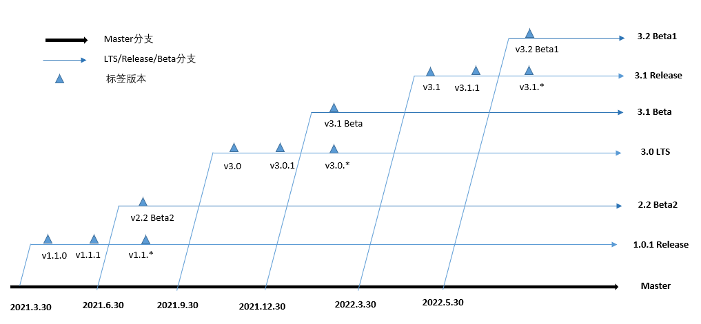

# OpenHarmony版本定义

## 分支关系

为了保障OpenHarmony社区版本的平滑演进和历史发布版本的持续稳定可靠，会定期从Master主干拉出LTS/Release/Beta等类型分支，并按照OpenHarmony生命周期定义对其进行管理。

### Master （主干分支）

Master作为OpenHarmony社区持续滚动开发的主干，积极接纳社区每个软件包主干开发分支的代码更新，将其纳入主干实时构建。

###  LTS分支（长期支持维护分支）

OpenHarmony社区LTS长期支持维护分支按照每12个月一个周期在每年的Q3季度从Master主干分支拉出来。该LTS分支在经过集中编译、构建、集成测试并最终通过社区评审发布。

### Release分支（发布分支）

OpenHarmony社区Release分支按照每12个月一个周期在每年的Q1季度从master主干分支拉出来。该分支在经过集中编译、构建、集成测试并最终通过社区评审发布。其与LTS分支的发布要求一致，但其维护周期短于LTS分支。

### Beta分支（测试分支）

OpenHarmony社区Beta分支是在社区开发和演进过程中不定期从Master主干分支拉出来。该分支仅完成集中编译、构建、基础功能验证，可用于开发调试。

### 标签版本

OpenHarmony社区基于LTS/Release分支以patch形式合入少量补丁代码，用于解决单点bug、安全漏洞、以及其他必须的适配修改，经过集成验证之后发布的稳定可靠的标签版本。

## 维护策略

### 生命周期策略

OpenHarmony对已发布的LTS和Release分支提供生命周期管理服务，分为两个部分：

#### 发布->停止主动维护：

​	Release sig团队会定期规划维护标签版本计划，用于解决单点bug、安全漏洞、以及其他必须的修改，以此确保分支持续处于稳定可用状态。

#### 停止主动维护->停止维护：

​	Release sig团队不再主动规划和发布标签版本，仅对社区安全漏洞和严重缺陷在对应分支进行修复。

### LTS/Release分支维护策略

LTS分支：分支发布之日起，提供两年主动维护，并提供1.5年被动维护。

Release分支：分支发布之日起，提供一年主动维护，并提供一年被动维护。

### 分支合入管控策略

LTS/Release分支发布后，Release sig团队负责其生命周期管理，在维护周期内，我们只接受安全问题、acts套件问题以及其他重大问题的修复及合入，对应分支的合入会严格管控。目前分支合入管控策略已生效，合入请求需要在committer审查通过后联系对应[owner](https://gitee.com/openharmony/community/blob/master/zh/BRANCHOWNER)评论approve后合入。

### 维护时间表

OpenHarmony目前已发布的LTS/Release分支的维护时间表如下:

| NO.  | 分支名        | 分支类型 | 发布时间  | 停止主动维护 | 停止维护  |
| :--- | ------------- | :------- | :-------- | :----------- | :-------- |
| 1    | 1.0.1-Release | Release  | 2021-3-30 | 2022-3-30    | 2023-3-30 |
| 2    | 3.0-LTS       | LTS      | 2021-9-30 | 2023-9-30    | 2025-3-30 |
| 3    | 3.1-Release   | Release  | 2022-3-30 | 2023-3-30    | 2024-3-30 |

### 版本计划

OpenHarmony Release sig团队定期发布和更新维护分支版本计划，详情可参考：https://gitee.com/openharmony-sig/oh-inner-release-management/blob/master/OpenHarmony-SIG-RoadMap.md

